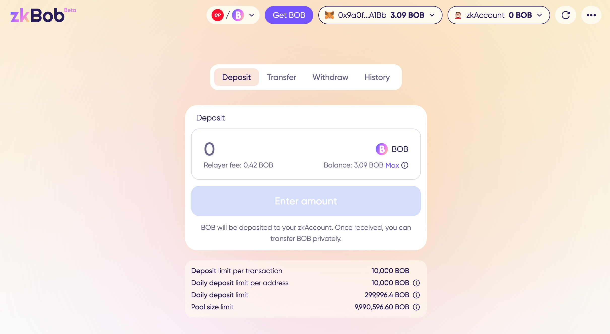

# zkBob

<figure><figcaption></figcaption></figure>


zkBob is an open-source, decentralized application available for the community.[ Learn More.](zkbob-overview/basic-concepts/open-source-and-decentralized.md)&#x20;


## Get Started

> :man: [zkBob App](https://app.zkbob.com/)\
> :man\_swimming: [Info and Instructions](zkbob-app/zkbob-app.md)\
> :person\_running:[Technical Details & Contracts](broken-reference)\
> 🔐 [Security Audit](resources/security-audit.md)\
>

## About

[zkBob](https://app.zkbob.com) is a stablecoin-based privacy application deployed on Polygon and Optimism and designed for everyday users and [common use cases](zkbob-overview/basic-concepts/use-cases/). zkBob uses [zkSNARKS](implementation/zksnarks-and-circuits/) to anonymize senders, receivers, and amounts when transferring stable funds. [Compliance features](zkbob-overview/compliance-and-security/) deter bad actors and illicit usage, giving privacy and safety back to ordinary blockchain users.

zkBob now supports multiple tokens, **including USDC on Polygon, USDC and ETH on Optimism and USDT on Tron**. Once tokens are deposited into the zkBob pool, participants can transfer any amount\* amongst themselves in a private, secure manner without needing to connect MetaMask, WalletConnect or any web3 wallet.

<figure><figcaption></figcaption></figure>

When a transfer is initiated, the amount and recipient is never disclosed or published. Transactions are routed through a [relayer](implementation/relayer-node/), abstracting gas fees while providing an efficient transfer environment.&#x20;

Deposits, transfers and withdrawals are all processed on the chain where the app is deployed, with standardized gas fees ($0.10 per tx on MATIC, variable on Optimism) paid using the supported token.

* The [zkBob application](https://app.zkbob.com/) is multichain (**Polygon, Optimism, Tron**) to utilize existing infrastructure (Uniswap v3, Aave, and native USDC), prioritize scalability, and support their commitment to zk-based solutions.

_\*zkBob introduces_ [_deposit and withdrawal limits_](zkbob-overview/deposit-and-withdrawal-limits.md) _and other_ [_compliance features_](zkbob-overview/compliance-and-security/) _to keep the application and its users safe. Transfers are limited by these pool constraints._&#x20;

## Project Landing Pages

* zkBob application: [https://zkbob.com/](https://zkbob.com/)
* Private payment links: [https://zkbob.com/payment-link](https://zkbob.com/payment-link)
*

## Newsletter & Blog

[Sign up for the zkBob Blog](https://blog.zkbob.com/) to receive the latest updates about zkBob.

