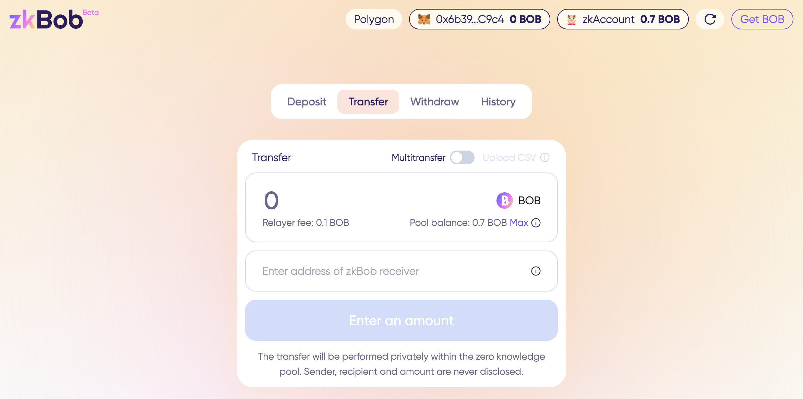

# zkBob

<figure><figcaption></figcaption></figure>

[zkBob](https://app.zkbob.com) is a stablecoin-based privacy application deployed on Polygon and designed for everyday users and [common use cases](zkbob-overview/use-cases/). zkBob uses [zkSNARKS](implementation/zksnarks-and-circuits/) to anonymize senders, receivers, and amounts when transferring stable funds. [Compliance features](zkbob-overview/compliance-and-security.md) deter bad actors and illicit usage, giving privacy and safety back to ordinary blockchain users.&#x20;

zkBob is optimized to work with the [BOB token](broken-reference), a multi-chain stable token (stablecoin) enhanced with optional privacy. Once BOB is deposited into the zkBob pool, participants can transfer any amount\* of BOB amongst themselves in a private, secure manner without needing to connect MetaMask, WalletConnect or any web3 wallet.

<figure><figcaption>
zkBob interface
</figcaption></figure>

When a transfer is initiated, the amount and recipient is never disclosed or published. Transactions are routed through a [relayer](implementation/relayer-node/), abstracting gas fees while providing an efficient transfer environment. Deposits, transfers and withdrawals are all processed on Polygon, with standardized gas fees ($0.10 per tx) paid using BOB tokens. MATIC is not needed for any of these actions, simplifying usage.

* The [zkBob application](https://app.zkbob.com/) is deployed on Polygon to utilize existing infrastructure (Uniswap v3, Aave, and native USDC), prioritize scalability, and support their commitment to zk-based solutions.
* The [BOB stablecoin](bob-stablecoin/bob-details.md) is currently available on Polygon, Optimism, BNB Chain and Ethereum mainnet with additional chains on the horizon.&#x20;

_\*zkBob introduces_ [_deposit and withdrawal limits_](zkbob-overview/deposit-and-withdrawal-limits.md) _and other_ [_compliance features_](zkbob-overview/compliance-and-security.md) _to keep the application and its users safe. Transfers are limited by these pool constraints._&#x20;

### Get Started!

> :man: [zkBob App](https://app.zkbob.com/)\
> :man\_mage: [Learn about the BOB Stablecoin](broken-reference)\
> :man\_swimming: [Info and UI Instructions](zkbob-app/zkbob-app.md)\
> :woman\_shrugging: [FAQs](zkbob-overview/faq.md)\
> :person\_running:[Technical Details and Contracts](broken-reference)

