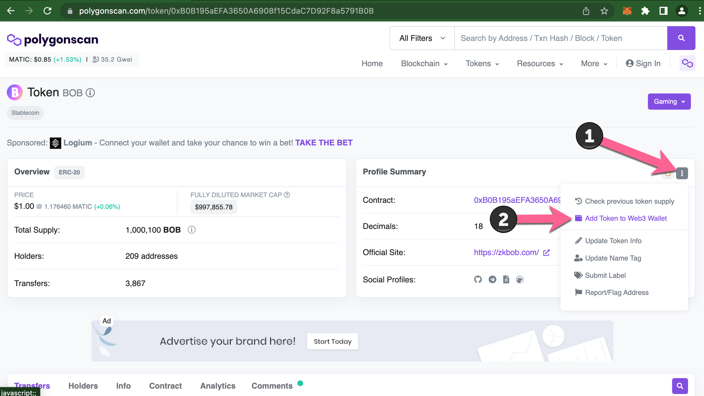
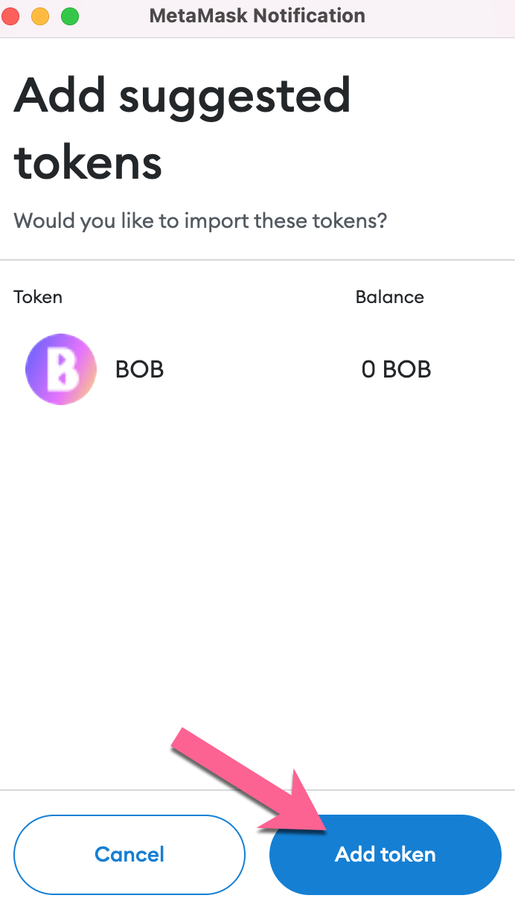

# Add BOB to Metamask

You can add BOB to Metamask through a 3rd party resource like Polygonscan or Coingecko, or add manually through the MetaMask wallet. [Written instructions are available below](./#polygonscan-written-instruction) the interactive tutorials.

## **Polygonscan**


Go to BOB token page to get started. [https://polygonscan.com/token/0xB0B195aEFA3650A6908f15CdaC7D92F8a5791B0B](https://polygonscan.com/token/0xB0B195aEFA3650A6908f15CdaC7D92F8a5791B0B)




## CoinGecko


Start on the BOB page on CoinGecko at [https://www.coingecko.com/en/coins/bob](https://www.coingecko.com/en/coins/bob)




## Manual MetaMask


BOB contract address on all chains: `0xB0B195aEFA3650A6908f15CdaC7D92F8a5791B0B`




## **Polygonscan (written instruction)**

1. Go to the BOB token page at [https://polygonscan.com/token/0xB0B195aEFA3650A6908f15CdaC7D92F8a5791B0B](https://polygonscan.com/token/0xB0B195aEFA3650A6908f15CdaC7D92F8a5791B0B)
2.  Press the 3 dot drop down menu and select **Add Token to Web3 Wallet**.

    <figure><figcaption></figcaption></figure>
3. Click **Add Token** to confirm in Metamask. BOB should now be included in your asset list.\
   

## CoinGecko (written instruction)

1. Go to the BOB page on CoinGecko at [https://www.coingecko.com/en/coins/bob](https://www.coingecko.com/en/coins/bob).
2.  Press the :fox: Add to Metamask icon.

    <figure><figcaption></figcaption></figure>
3. Click **Add Token** to confirm in Metamask. BOB should now be included in your asset list.\
   

## Add Manually with MetaMask (written instruction)

1. Open Metamask, connect to the Polygon network, go to the Assets tab, and click Import tokens.\
   
2. Enter the token contract address for BOB: `0xB0B195aEFA3650A6908f15CdaC7D92F8a5791B0B`\
   \
   The name and decimals should populate automatically. Click Add custom token.\
   \

3. Click Import tokens to confirm.\
    \

4. You should now see BOB in your list of assets.\
   \
