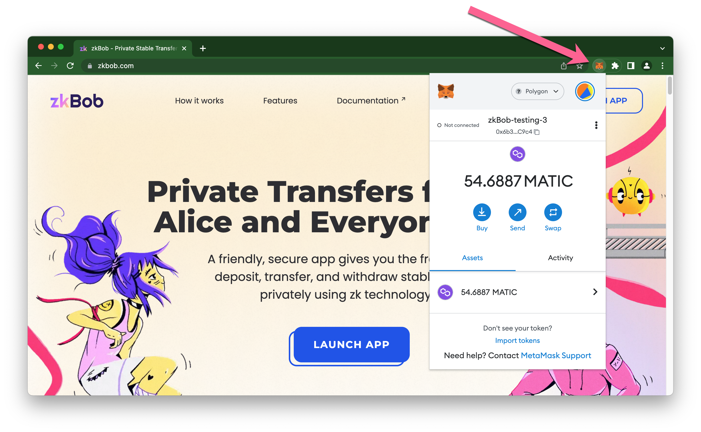
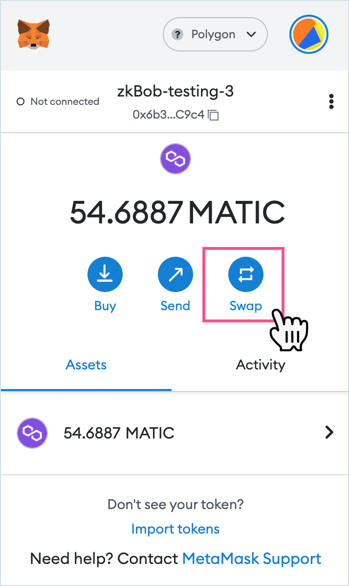

# Swap BOB with Metamask Swap


In this example we swap MATIC for BOB tokens. You can swap any supported tokens for BOB or vice versa using Metamask :fox:. BOB is also available to swap on Ethereum mainnet.


1. Open MetaMask. Login to your Account and connect to the [Polygon Network](https://wiki.polygon.technology/docs/develop/metamask/config-polygon-on-metamask/). You can initiate swaps wherever you are on the internet, you do not need to be connected to any particular site.\
   \
   \

2. Press the **Swap** Icon.\
   \
   \

3. Enter token swap details.
   1. The token from the dropdown (MATIC).
   2. The amount you would like to swap (20).
   3. Type in BOB to find and select the BOB token.\
      \
      .png>)\

4. Press **Continue,** or to double check you are using BOB, you can verify BOB on [polygonscan](https://polygonscan.com/). The BOB token contract is [0xb0b195aefa3650a6908f15cdac7d92f8a5791b0b](https://polygonscan.com/token/0xb0b195aefa3650a6908f15cdac7d92f8a5791b0b)\
   \
   \

5. Press **Review Swap**.\
   \
   .png>)\

6. If you approve of the terms, press **Swap**.\
   \
   .png>)\

7. Wait for transaction to process.\
   \
   .png>)\

8. BOB should appear automatically in the assets area of your Metamask wallet. You are now ready to interact with zkBob!\
   \
   .png>)

