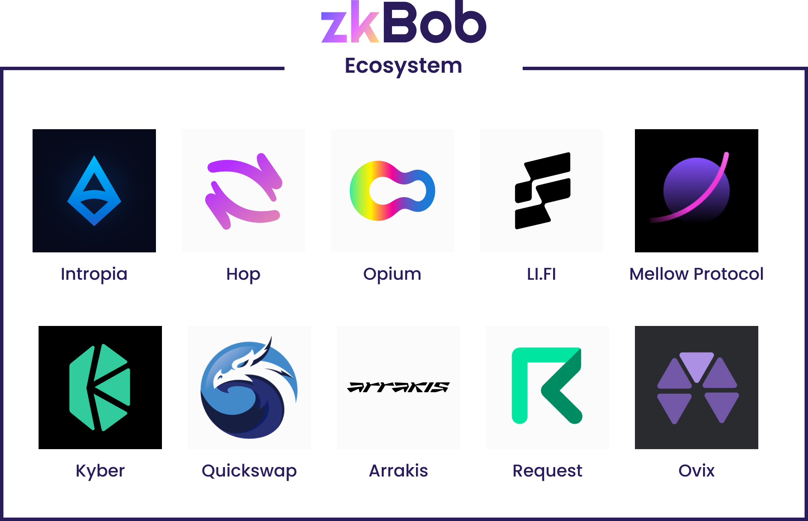

# BOB Ecosystem

<figure><figcaption></figcaption></figure>

## &#x20;BOB DeFi Protocols

Swap BOB, create non-inventory LP positions, and use BOB in a variety of DeFi contexts. Please see [BOB Markets on Coingecko](https://www.coingecko.com/en/coins/bob#markets) for specific pool details.

* [Uniswap](https://app.uniswap.org/#/swap) (Polygon, Ethereum, Optimism, BSC)
  * [Ethereum Pools](https://info.uniswap.org/#/tokens/0xb0b195aefa3650a6908f15cdac7d92f8a5791b0b)
  * [Polygon Pools](https://info.uniswap.org/#/polygon/tokens/0xb0b195aefa3650a6908f15cdac7d92f8a5791b0b)
  * [Optimism Pools](https://info.uniswap.org/#/optimism/tokens/0xb0b195aefa3650a6908f15cdac7d92f8a5791b0b)
* [Kyberswap](https://kyberswap.com/swap/ethereum/eth-to-bob) (Polygon, Ethereum, Optimism, BSC)
  * [Polygon Pool](https://analytics.kyberswap.com/elastic/polygon/pool/0xa291e2041e275376a34be41573c7b1ca7fb8b227)
  * [BSC Pool](https://analytics.kyberswap.com/elastic/bnb/pool/0x2a723e6de06833645f0d0bd06a385a5a44bfeceb)
* [Quickswap](https://quickswap.exchange/#/) (Polygon)
  * [Quickswap Farms](https://quickswap.exchange/#/farm)
  * [WETH/BOB Pool](https://quickswap.exchange/#/add/0x7ceb23fd6bc0add59e62ac25578270cff1b9f619/0xb0b195aefa3650a6908f15cdac7d92f8a5791b0b/v3)
  * [USDC/BOB Pool](https://quickswap.exchange/#/add/0x2791bca1f2de4661ed88a30c99a7a9449aa84174/0xb0b195aefa3650a6908f15cdac7d92f8a5791b0b/v3)
* [Jumper](https://jumper.exchange/) multichain bridge by Li.Fi
* [DefiLama DEX Meta-aggregator](https://swap.defillama.com/?chain=polygon\&from=0x2791bca1f2de4661ed88a30c99a7a9449aa84174\&to=0xb0b195aefa3650a6908f15cdac7d92f8a5791b0b) (Polygon, Ethereum, Optimism, BSC)
* [1inch](https://app.1inch.io/#/1/unified/swap/BOB/USDC) (Polygon, Ethereum, Optimism)
* [Paraswap](https://app.paraswap.io/#/USDC-BOB/100?network=Polygon) (Polygon, Ethereum, Optimism, BSC)
* [OKX](https://www.okx.com/web3/dex?inputChain=137\&inputCurrency=0xb0b195aefa3650a6908f15cdac7d92f8a5791b0b\&outputCurrency=0xa0b86991c6218b36c1d19d4a2e9eb0ce3606eb48\&outputChain=1) (Polygon, Ethereum, Optimism, BSC)
* [Sushiswap](https://www.sushi.com/swap) (Polygon, Ethereum, Optimism)
* [Pancake Swap](https://pancakeswap.finance/swap) (BSC)
* [Mellow Protocol Vaults](https://app.mellow.finance/products) (Polygon)
* [Rhino Defi gateway](https://rhino.fi/) (Polygon, Ethereum, BSC)&#x20;
* [Curve](https://curve.fi/#/polygon/swap) (Polygon)
* [Arrakis Vaults](https://beta.arrakis.finance/vaults) (Polygon)
* [Plasma Finance](https://apy.plasma.finance/#/hyper-dex/market) (Polygon) [Quadrat Strategy](https://apy.plasma.finance/#/quadrat/0xFd1Da9cC77f04A1E1B22a314a53D201A39373719)
* [Stable Fish](https://stable.fish/) stablecoin APY aggregator (various)
* [Embr](https://beta.embr.org/) Easy BOB swaps directly from zkbob.com
* [USDFI](https://usdfi.com/): Trade, stake & earn with $BOB pools on the USDFI DEX.

## Ecosystem Apps

BOB for stable and secure payments.

* [Request Finance](https://www.request.finance/): BOB can be selected for invoicing and payroll services.
* [BetSwirl](https://www.betswirl.com/): Betting between friends, BOB is a stablecoin option. [Learn more about the integration](https://blog.zkbob.com/betswirl/).
* [Suarmi](https://www.suarmi.com/index): Fiat on-ramp currently available for residents in Mexico, with more countries coming soon.
* [tr3butor](https://app.tr3butor.io/organization/clawfr86w0002lh08gsixtkq0): Web3 talent platform for job listings, events and more.
* [HYVE](https://hyve.works/): Job postings and freelancer payments with BOB.
* [Rabby Wallet](https://rabby.io/): BOB support for swaps
* [Peanut](https://peanut.to/): Send BOB with a simple link.
* [DappBack](https://dappback.com/zkbob): Community-building Quests

