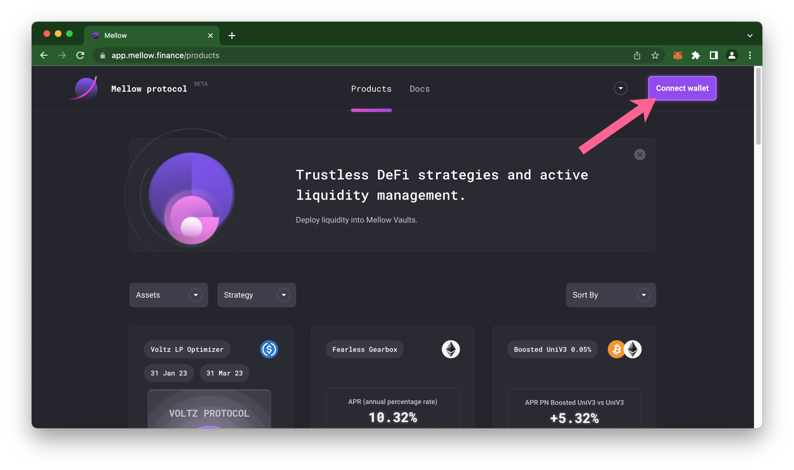
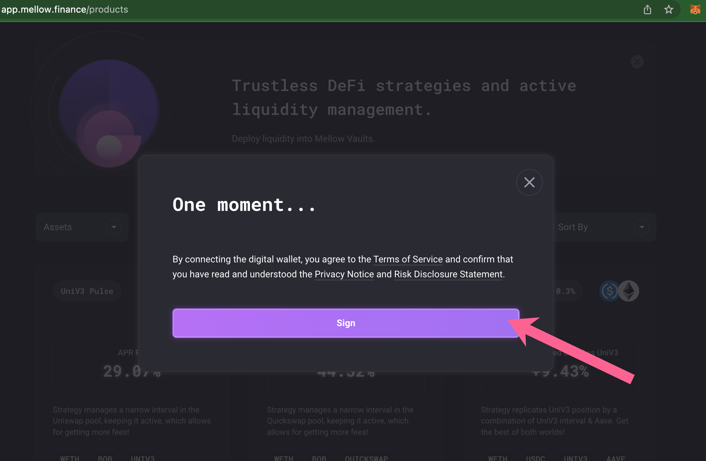
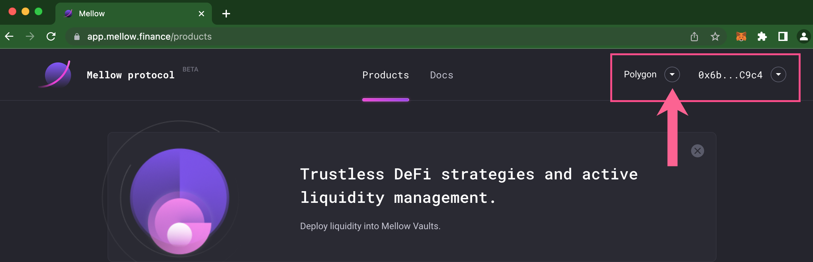
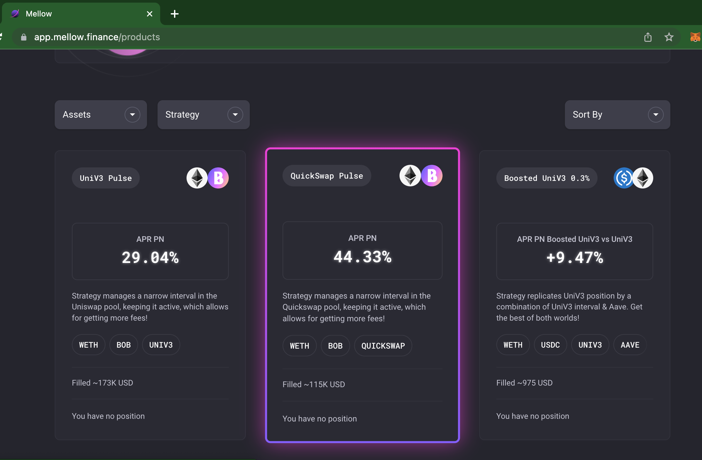
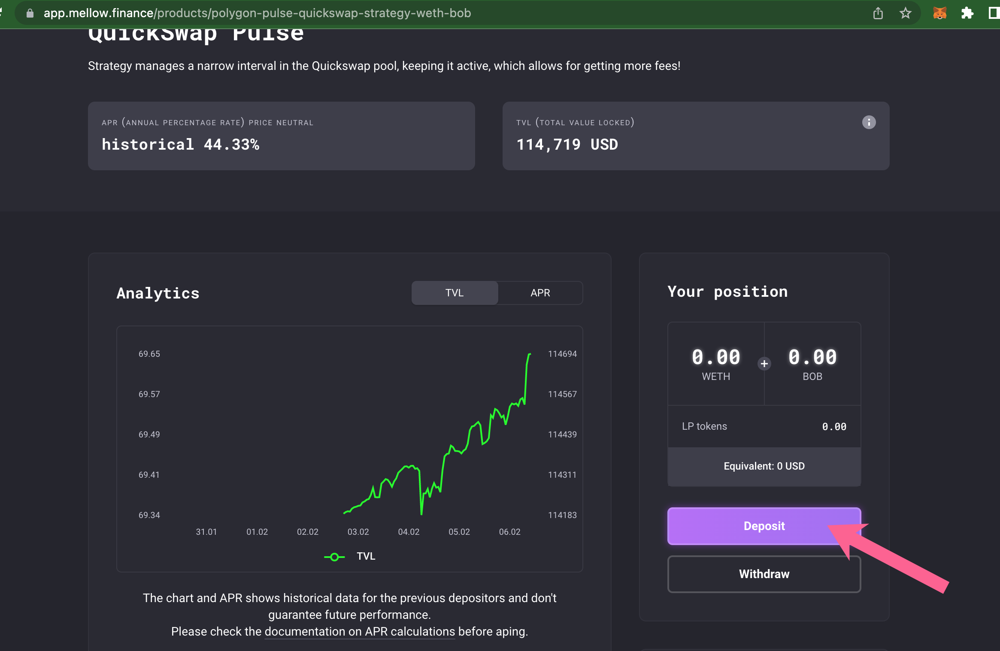
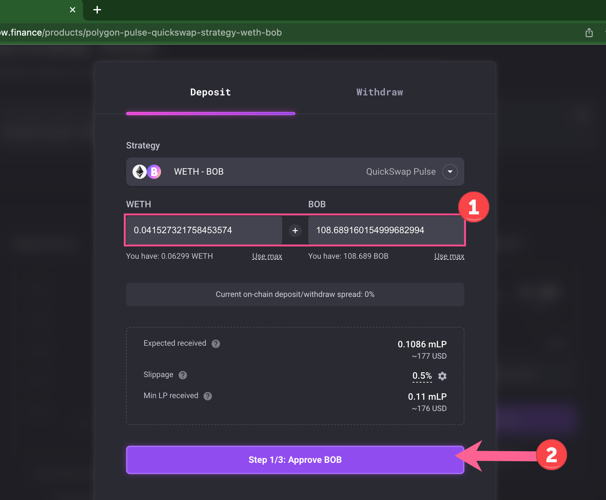
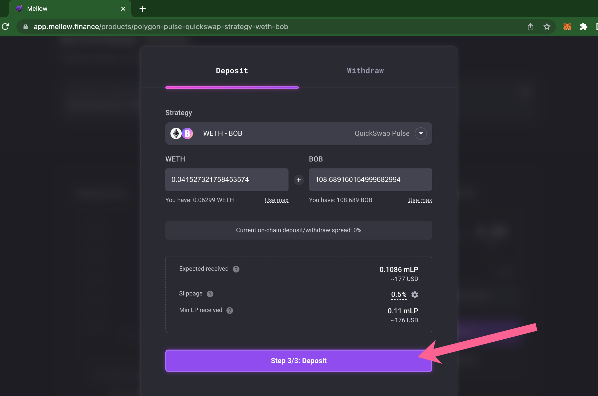
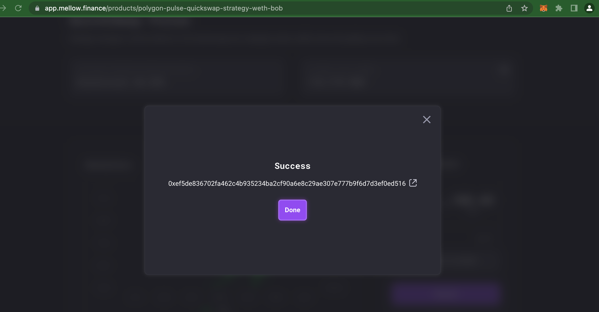
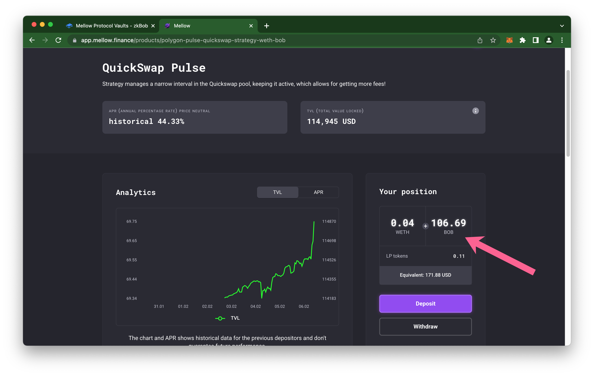

# Mellow Protocol Vaults

Mellow Protocol provides trustless DeFi strategies and convenient, automated pools for high APR earnings. BOB strategies supported on Polygon currently include a WETH/BOB vault on Uniswap and a second WETH/BOB vault on QuickSwap.

Mellow's advantages include providing a narrow liquidity range so users collect max fees, and an automated process for rebalancing when prices near the current interval margin. In addition, strategies automatically swap rewards (when applicable, such as with dQuick rewards) into WETH and seamlessly add these back into the vault.

1\) Go to [https://app.mellow.finance/products](https://app.mellow.finance/products) and press **Connect wallet**.

<figure><figcaption></figcaption></figure>

2\) Accept the Terms to continue. This is a gasless signature transaction.

<figure><figcaption>
Press Sign and complete the signature in your connected wallet account.
</figcaption></figure>

3\) Make sure your wallet and the app are set to the Polygon Network.

<figure><figcaption></figcaption></figure>

4\) Scroll down to available strategies and press one to select. In this example we choose the **QuickSwap** **BOB/WETH** strategy.

<figure><figcaption></figcaption></figure>

5\) To get started press **Deposit.**

<figure><figcaption></figcaption></figure>

6\) Select your amounts of BOB and WETH to deposit. The strategy will determine the correct balances. Press **Step 1/3 Approve BOB**.

<figure><figcaption></figcaption></figure>

7\) Approve BOB (step 1/3) and WETH (step 2/3) in your wallet. Example shows BOB permission confirmation.

.png>)

8\) **Deposit** funds and confirm in MetaMask.

<figure><figcaption></figcaption></figure>

9\) Once successful, you will see a success message along with the hash of your transaction.

<figure><figcaption></figcaption></figure>

10\) You can now view your current position and deposit more or withdraw at any time.

<figure><figcaption></figcaption></figure>

