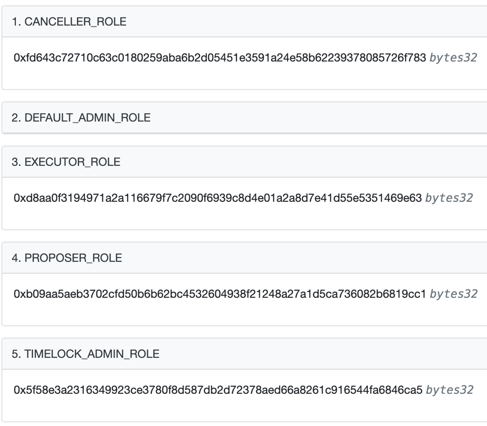
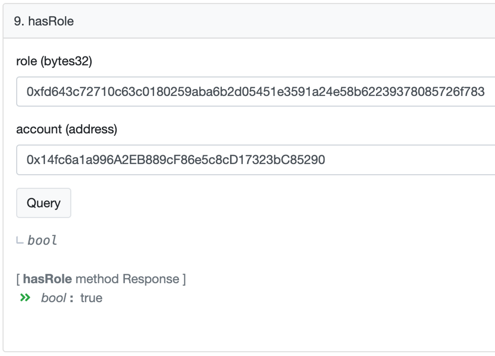
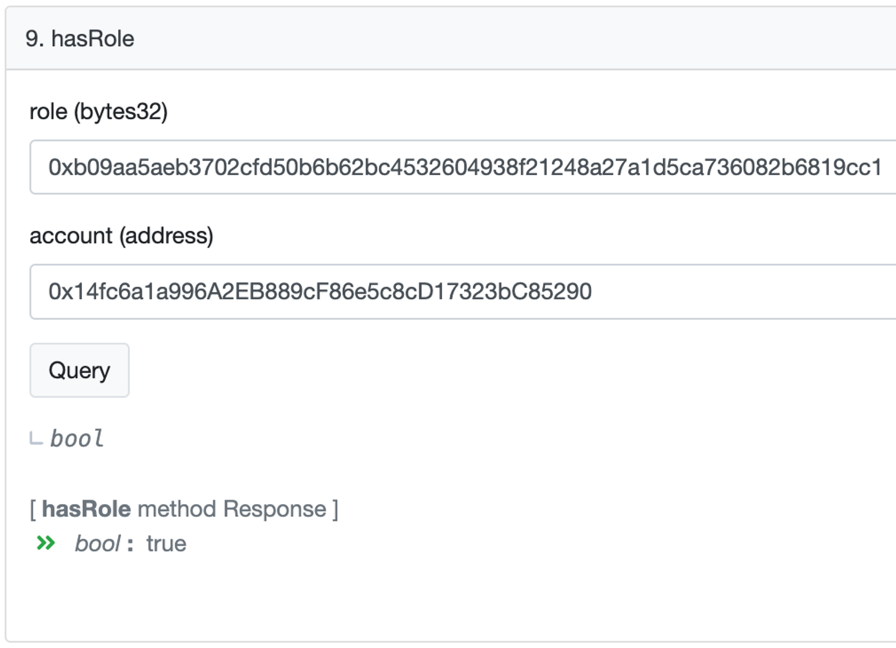
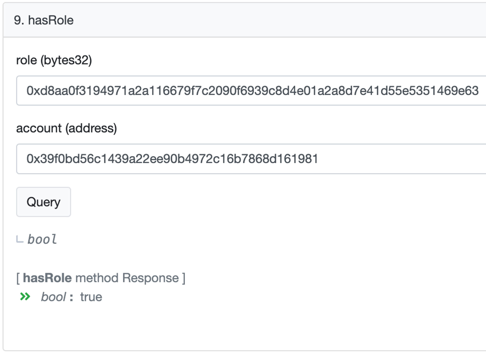

# GP 11: Add 24 hour timelock to BOB contract on Optimism


The proposal has been confirmed and executed:&#x20;

* Optimism Safe [transaction #7](https://app.safe.global/transactions/tx?safe=oeth:0x14fc6a1a996A2EB889cF86e5c8cD17323bC85290\&id=multisig\_0x14fc6a1a996A2EB889cF86e5c8cD17323bC85290\_0x514c2209a47ae17363988088d5fd9c8f8d4f43e4bf44429060254ed050ec6451)
* Optimism tx: [https://optimistic.etherscan.io/tx/0x0e70266852b15c465990068b96ab90daf37adb02eeaa6cffd7c99b5342a0d5b6](https://optimistic.etherscan.io/tx/0x0e70266852b15c465990068b96ab90daf37adb02eeaa6cffd7c99b5342a0d5b6)


## Proposal objective

With the addition of zkBob on Optimism and increased BOB usage, this proposal enacts a 24 hour timelock for all admin and owner controlled actions on the BOB token contract on Optimism.&#x20;

A timelock provides additional security and transparency, and serves to increase confidence for third-party applications looking to integrate BOB.

**Timelock-bound actions include:**

1. Token contract upgradeability
2. Token ownership transfer
3. Addition/removal of additional/existing token minters
4. Updating recovery/blocklist admins

## Proposal details

The OpenZeppelin Timelock contract implementation is proposed for this integration. [https://github.com/OpenZeppelin/openzeppelin-contracts/blob/master/contracts/governance/TimelockController.sol](https://github.com/OpenZeppelin/openzeppelin-contracts/blob/master/contracts/governance/TimelockController.sol)

* The only address allowed to submit delayed proposals is the BOB Governance Multisig on Optimism. [`0x14fc6a1a996A2EB889cF86e5c8cD17323bC85290`](https://optimistic.etherscan.io/address/0x14fc6a1a996A2EB889cF86e5c8cD17323bC85290)
* The only address allowed to execute delayed proposals following the timelock is the BOB Deployer EOA. [`0x39f0bd56c1439a22ee90b4972c16b7868d161981`](https://optimistic.etherscan.io/address/0x39f0bd56c1439a22ee90b4972c16b7868d161981)
* The minimum enforced delay in the timelock contract is set to 24 hours.
* The BOB protocol governance body is capable of changing the above configuration at any time, however any change is also subject to the existing timelock restrictions since the only admin of the timelock contract is the contract itself.

## Proposal breakdown

### Optimism

The transaction [#7](https://app.safe.global/transactions/tx?safe=oeth:0x14fc6a1a996A2EB889cF86e5c8cD17323bC85290\&id=multisig\_0x14fc6a1a996A2EB889cF86e5c8cD17323bC85290\_0x514c2209a47ae17363988088d5fd9c8f8d4f43e4bf44429060254ed050ec6451) in the Safe on Optimism contains 2 actions:

#### **Action 1**

Transfer proxy ownership and upgradeability rights on the BOB token contract to the timelock contracts [`0xbe7D4E55D80fC3e67D80ebf988eB0E551cCA4eB7`](https://optimistic.etherscan.io/address/0xbe7D4E55D80fC3e67D80ebf988eB0E551cCA4eB7)

The action is executed by calling `setAdmin` on the BOB token contract [`0xB0B195aEFA3650A6908f15CdaC7D92F8a5791B0B`](https://optimistic.etherscan.io/address/0xb0b195aefa3650a6908f15cdac7d92f8a5791b0b)

**Action 2**

Transfer token ownership rights on the BOB token contract to the Timelock contracts [`0xbe7D4E55D80fC3e67D80ebf988eB0E551cCA4eB7`](https://optimistic.etherscan.io/address/0xbe7D4E55D80fC3e67D80ebf988eB0E551cCA4eB7)

The action is executed by calling `transferOwnership` (the method selector is `0xf2fde38b`) on the BOB token contract [`0xB0B195aEFA3650A6908f15CdaC7D92F8a5791B0B`](https://optimistic.etherscan.io/address/0xb0b195aefa3650a6908f15cdac7d92f8a5791b0b)

## Additional verification

#### Timelock contract settings

[In the “Read Contract” view on Etherscan](https://optimistic.etherscan.io/address/0xbe7D4E55D80fC3e67D80ebf988eB0E551cCA4eB7#readContract) execute the following requests:

1\) Check the roles ids: &#x20;

<figure><figcaption></figcaption></figure>

2\) Check that the Timelock contract \[[`0xbe7D4E55D80fC3e67D80ebf988eB0E551cCA4eB7`](https://optimistic.etherscan.io/address/0xbe7D4E55D80fC3e67D80ebf988eB0E551cCA4eB7)] has the admin role\

<figure><figcaption></figcaption></figure>

3\) Check that BOB Governance Multisig on Optimism \[[`0x14fc6a1a996A2EB889cF86e5c8cD17323bC85290`](https://optimistic.etherscan.io/address/0x14fc6a1a996A2EB889cF86e5c8cD17323bC85290)]  has the proposer and canceler roles:

<figure><figcaption></figcaption></figure>

<figure><figcaption></figcaption></figure>

4\) Check that BOB Deployer EOA \[[`0x39f0bd56c1439a22ee90b4972c16b7868d161981`](https://optimistic.etherscan.io/address/0x39f0bd56c1439a22ee90b4972c16b7868d161981)] has the executor role:

<figure><figcaption></figcaption></figure>

## Timelock operations simulation

Governance operations with the contracts can be verified using the following script -[https://gist.github.com/k1rill-fedoseev/931f56f89c5bca1cbfada30c8d074220](https://gist.github.com/k1rill-fedoseev/931f56f89c5bca1cbfada30c8d074220)

&#x20;&#x20;
