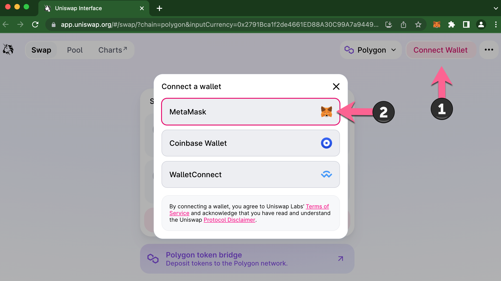
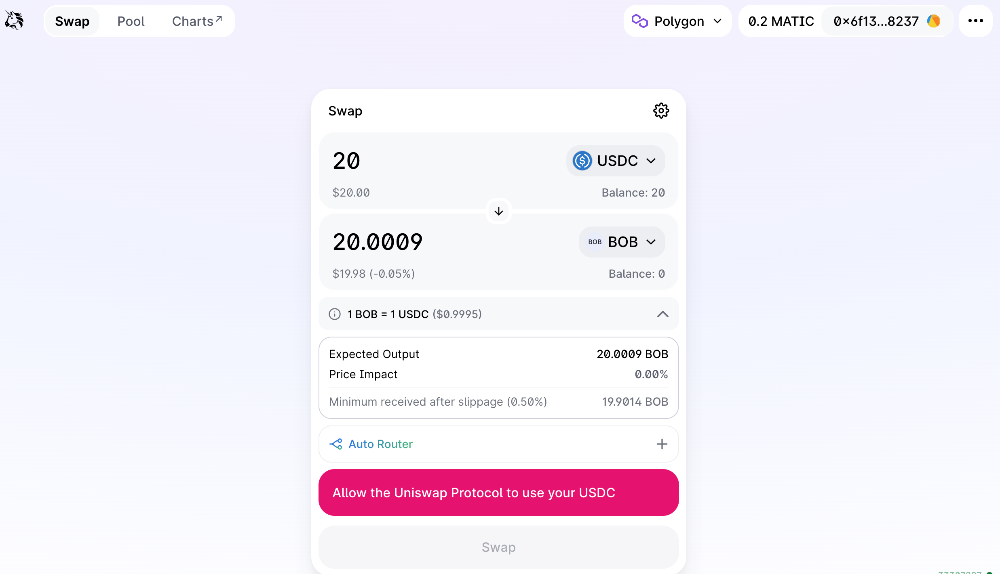
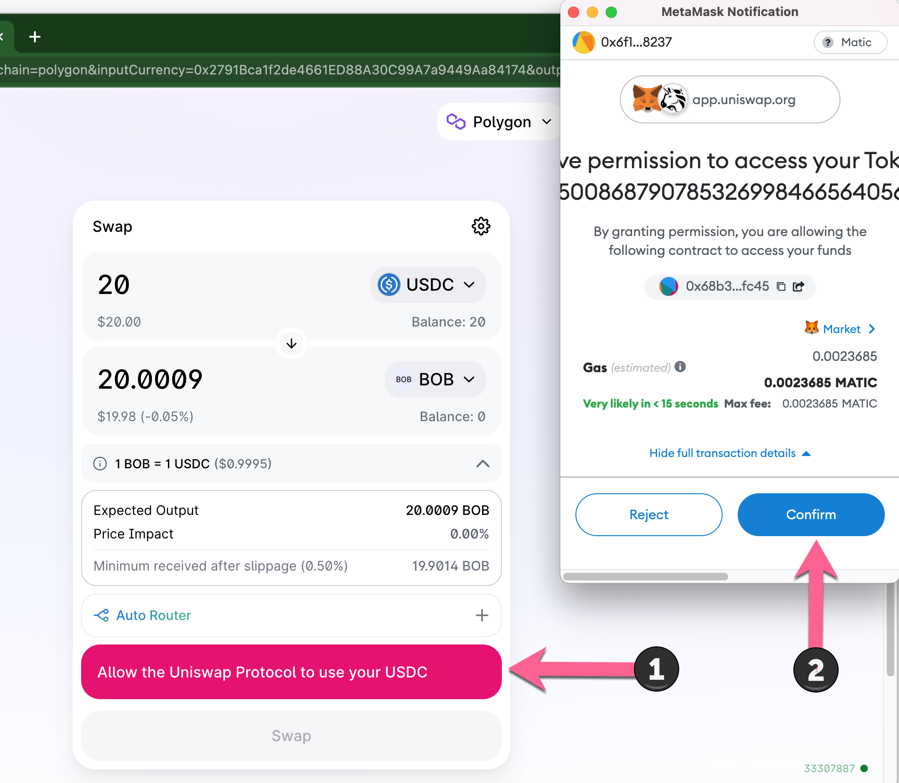
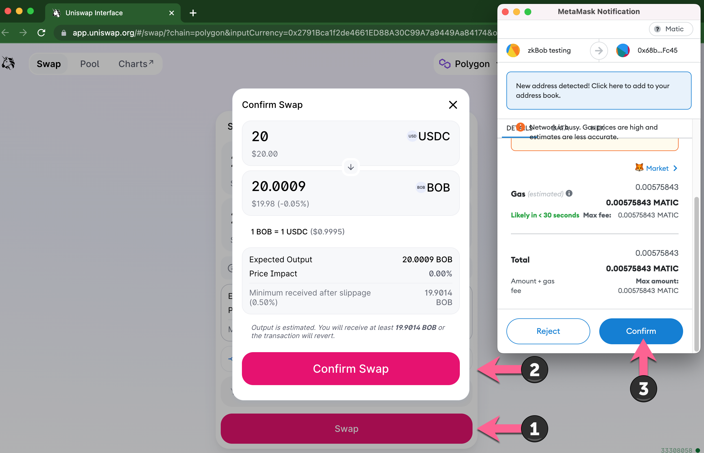
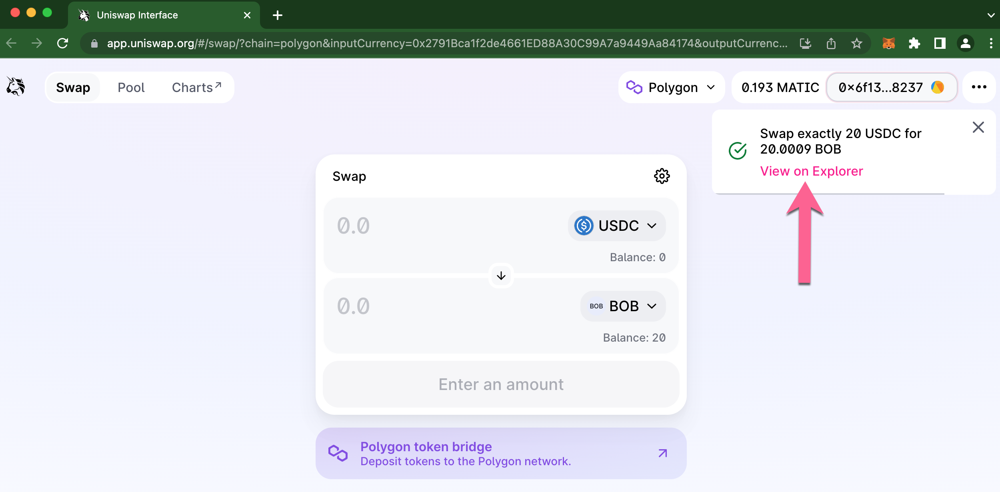
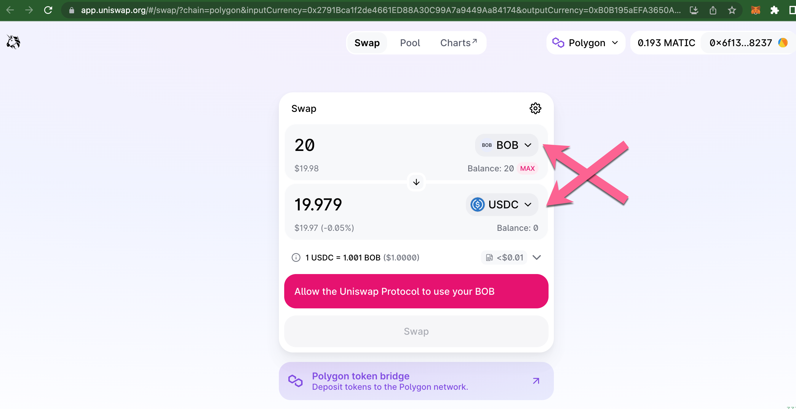

# Get BOB on Uniswap v3


A quick tutorial on acquiring BOB using USDC on Polygon. You can swap with other tokens of your choice and use Uniswap on Ethereum or Optimism to swap BOB.


## Prerequisites

* **Wallet Account:** Web3 wallet such as Metamask connected to the Polygon Network. [Additional instructions](https://thedefiant.io/how-to-connect-metamask-to-polygon)
* **USDC on Polygon**. You can get USDC on Polygon in a variety of ways:
  * Trade via a DEX like [Uniswap](https://app.uniswap.org/) or [1inch](https://app.1inch.io/#/137/classic/swap/MATIC/USDC) or a CEX like [Coinbase](https://blog.coinbase.com/send-and-receive-crypto-on-multiple-networks-starting-with-polygon-and-solana-e03d8480fe54) or [Crypto.com](https://crypto.com/)
  * Purchase directly via an onramp like [Moonpay](https://www.moonpay.com/buy), [Ramp](https://ramp.network/buy/?defaultAsset=USDC) or [Transak](https://transak.com/)
  * Bridge from Ethereum (or another chain) using the [Polygon Bridge](https://wallet.polygon.technology/bridge/) or other 3rd party bridges like [Hop](https://app.hop.exchange/) or [Connext](https://bridge.connext.network/).
* **MATIC**: You will need a small amount of MATIC on Polygon to pay transaction fees for the trade. You can purchase, trade or bridge in numerous ways mentioned above.

## Get BOB


These instructions provide an example using USDC to acquire BOB. You can choose to swap with other tokens as long as there is enough liquidity.  You can also swap from BOB back to USDC or another token of your choice.


1\) Go to the BOB/USDC [Uniswap v3 Pool](https://zkbob.page.link/getBOB).

2\) If you are connected to a different network, you will see Unknown in the token field.&#x20;

1. Press network dropdown.
2. Change network to Polygon. The fields will populate with the correct token pair (USDC & BOB)

<figure><figcaption></figcaption></figure>

<figure><figcaption></figcaption></figure>

3\) If you haven't already, connect your web3 wallet.&#x20;


If your web3 wallet is connected to a different network, you may need to switch your network back to Polygon to continue.


<figure><figcaption></figcaption></figure>

4\) Enter amount of USDC to swap for BOB. You will see the amount of BOB you will receive for the trade.

<figure><figcaption></figcaption></figure>

5\) Press **Allow the Uniswap Protocol to use your USDC**. You must allow the contract to spend your USDC.&#x20;


You can choose to keep this allowance for as long as you like, and subsequent transactions with USDC can be processed without requiring this transaction. You can also choose to [revoke](https://revoke.cash/) at any time, and reset permissions the next time you want to exchange USDC for BOB.


<figure><figcaption></figcaption></figure>

6\) Swap assets.

* Press **Swap**
* **Confirm Swap** in Uniswap App
* **Confirm** in Metamask.

<figure><figcaption></figcaption></figure>

7\) Once confirmed, click **View on Explorer** to see your transaction details.

<figure><figcaption></figcaption></figure>

<figure><figcaption></figcaption></figure>

8\) You can now use BOB in the [zkBOB application](https://app.zkbob.com/). To trade back to USDC, simply switch the tokens and follow the process above.

<figure><figcaption></figcaption></figure>

