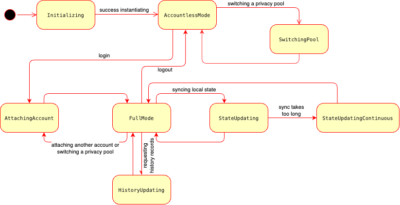

# Client Library Status

The `ZkBobClient` object can be in various states throughout its lifecycle. To enable the application to understand what is happening in the library and respond appropriately to changes in its state, the set of states are introduced and organized into a state machine.

<figure><figcaption><p>The client library state machine</p></figcaption></figure>

You can use your own callback to get the status changes in time. You can set it on client instantination or later with the object's field `stateCallback` of type [ClientStateCallback](../common-types.md#client-library-state-callback). You can also remove it to stop status monitoring.

```typescript
public stateCallback?: ClientStateCallback;
```

The following routines are introduced to monitor the client's state.

## <mark style="background-color:green;">Getting the Client State</mark>

```typescript
getState(): ClientState
```

### Returns

[ClientState](../common-types.md#client-library-state-callback) enum member.

### Example

```typescript
const st = zkClient.getState();
if (st == ClientState.StateUpdating || st == ClientState.StateUpdatingContinuous) {
   console.log('Please wait while local state becomes up-to-dated');
}
// output: Please wait while local state becomes up-to-dated
```

## <mark style="background-color:green;">Getting the Client Continuous State Progress</mark>

```typescript
getProgress(): number | undefined;
```

### Returns

`number` which represents progress for continuous states (from 0.0 to 1.0) or `undefined` for non-continuous states.

### Example

```typescript
const st = zkClient.getState();
const pr = zkClient.getProgress();
if (st == ClientState.StateUpdating) {
   const progressStr = (pr !== undefined ? `(${(pr * 100.0).toFixed(1)}%)` : '');
   console.log(`Please wait while local state becomes up-to-dated ${progressStr}`);
}
// output: Please wait while local state becomes up-to-dated (42.0%)
```
