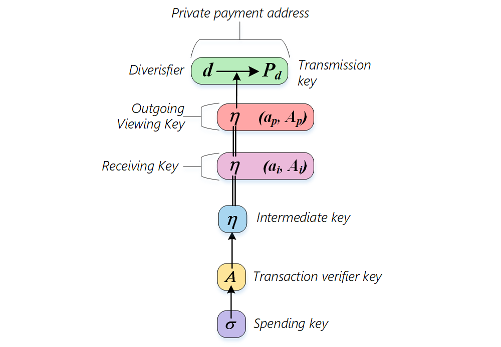

# zkBob Keys

zkBob is based on complex cryptography. There are several keys needed for private transactions. The relationship between these keys is presented in the scheme below.

* **Spending key (**$$\sigma$$**)** is the top secret key. It is used to derive other keys and to sign transactions. At a high level it is just a random 256-bit number which should be stored securely on the client side. The simplest way to get a spending key is to produce a random number.  But in a production client software implementation more complex approaches should be used (e.g. [hierarchical deterministic wallets](https://github.com/bitcoin/bips/blob/master/bip-0044.mediawiki)). Concrete approaches for spending key derivation by a client are not discussed here.
* **Transaction verifier key (**$$A$$**)** is used for transaction signature verification. It's derived from the spending key and multiplied by the generator point in the JubJub elliptic curve field: $$A = \sigma G$$
* **Intermediate key (**$$\eta$$**)** is derived from the $$A$$ key by the[ $$Poseidon$$ hash function](../untitled/the-poseidon-hash.md):$$\eta = Hash(A.x)$$. It iss used in several cases:
  * to calculate the account[ nullifier](../transaction-overview/the-nullifiers.md)
  * to obtain the account balance and transaction history
  * to decrypt incoming notes
* **Receiving key** is used to decrypt incoming notes in the memo block. It is a combination of the intermediate key and ephemeral key generated for each note.
* **Outgoing viewing key** is used to decrypt the whole memo block in the transaction which is initiated by itself.
* **Private payment address** $$(d, P_d)$$ - is a set of random diversifiers $$d$$ and point $$P_d = \eta G_p = \eta \text{ToSubGroupHash}_{E(F_r)}(d)$$

**TODO:**

* [x] Different types of keys and their purposes
* [ ] Keys derivation
* [ ] Getting a private address
* [ ] Keys usage in the different scenarios
