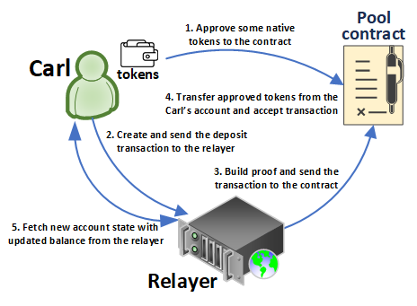
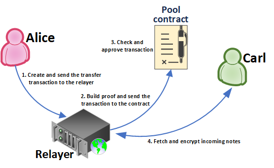
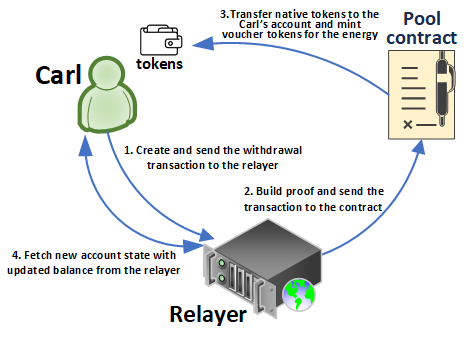

# Transaction Types

The current protocol implementation supports three transaction types: deposit, transfer and withdrawal. Each type has a numeric code included in the transaction calldata.




A deposit transaction delivers external funds to the user's account. It is assumed the user initiating the deposit transaction has made a prior token approval to the zkBob contract.

The deposit transaction has no input and output notes. The deposit amount is added to the output account balance to account for incoming funds.

The deposit transaction is checked on the contract side. Approved tokens should be successfully transferred to the contract address to finalize the transaction and update the Merkle tree.&#x20;

The user must include a deposit signature field to the transaction. This field contains an account nullifier signed by the client's private key from the native chain. The contract extracts the client public address via the `ecrecover` Solidity function.

#### Transaction specific:

* Tx type = 0
* has no output notes
* `token_amount` field contains deposit amount (a positive value)
* `energy_amount` field equals 0
* Output account balance is increased to the deposit amount
* `depositSignature` field exists




This transaction moves an amount of funds to one or more internal (zkBob) receivers. The transfer transaction does not change the receiver's account balance immediately. Instead one or more payment notes are generated and sent inside the transaction's memo block.

The transfer transaction emits an output account and output notes to push them into the Merkle tree

#### Transaction specific:

* Tx type = 1
* Output notes are acceptable in the memo block
* `token_amount` field equals 0
* `energy_amount` field equals 0
* Output account balance is decreased by the transfer amount




A withdrawal transaction move funds from the zkBob account to the external destination point. Destination address is specified in the `memo.receiver` field (a chain-specific address).

Each withdrawal transaction must zero out the account energy (XP) value. This value is converted into a voucher token which will be minted to the destination address. So `energy_amount` should be less than or equal to zero.

The withdrawal amount is specified in the `token_amount` field. This amount is transferred to the destination address when the transaction is processed.


#### Native Coin Redirection

Withdrawal transaction supports the native coin redirection mechanism. When the relayer sends a native coin to the contract within the withdrawal transaction (`memo.native_amount` should be equal to coin amount), the contract should send native coins to the destination address.


#### Transaction specific:

* Tx type = 2
* has no output notes
* `token_amount` contains token withdrawal amount (less than or equal to zero)
* `energy_amount` contains voucher token mint amount (less than or equal to zero)
*   memo block contains extra fields: `memo.native_amount` and `memo.receiver`

    * `memo.native_amount` contains native coin amount to withdraw
    * `memo.receiver` contains receiver for output payments



