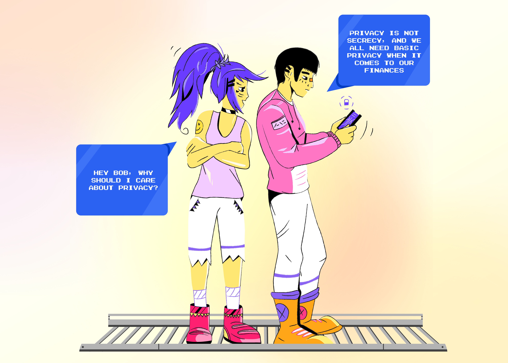
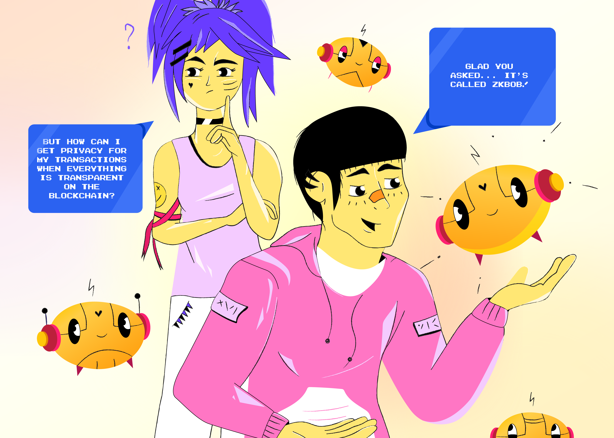

# Hackathon

<figure><figcaption></figcaption></figure>

## Intro

Privacy is normal. We are all entitled to privacy in many aspects of our lives, and this includes our finances. It is normal to keep details such as how much money you have, how much money you make, and how you choose to spend your money private. This can be difficult on-chain.

Enter zkBob. zkBob is a privacy application which anonymizes transfers between users. The BOB stablecoin lets users exchange value in a stable, predictable manner. zkSnarks prove certain actions have occurred without revealing details about who completed the action or the amount transferred. Compliance features deter bad actors and illicit usage. zkBob gives privacy back to the everyday user.

zkBob API has just been released in beta. For the hackathon, we want you to explore new use cases for private transactions using the zkBob API and BOB stablecoin. For example:

* Donation platform where donors maintain anonymity
* Fundraising platform with internal KYC while maintaining public privacy
* DAO accounting application
* Private payment-splitting application for friend groups
* Wallet integration for private payments - integrate BOB payments into an open source wallet
* Tip bot/extension (telegram bot, twitter bot, browser extension)
* Food delivery service with private payments
* \*Extra credit: Direct library integration, direct deposits
* Your idea here!!!

## Get Started

<figure><figcaption></figcaption></figure>

* **Get an API Key & BOB:** Join the telegram at [https://t.me/+sMbZvmVzYmQ3ODlk](https://t.me/+sMbZvmVzYmQ3ODlk) to request your API key. The API key is used to generate and interact with zkBob accounts. You will receive 10 BOB into the account to use for testing and demonstration.
* **HackMD:** Explore the HackMD with API documentation and a sequence diagram of API calls.
* **Explore API Methods:** Use Swagger and Postman links to view available methods for shielded account interaction. Note that the current API does not include deposit and withdrawal functionality, only proving mechanisms related to transfers. Deposits and withdrawals may be performed manually.

## References Table

