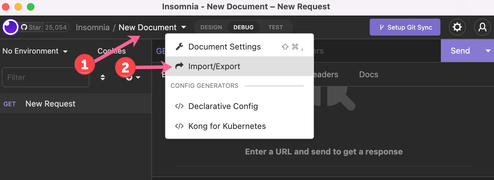
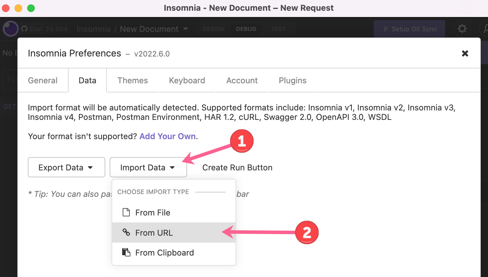
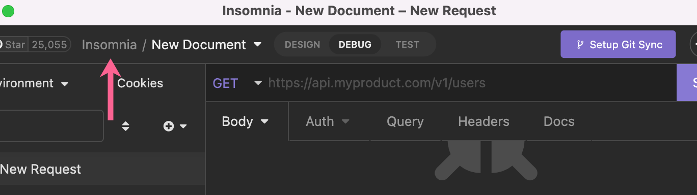
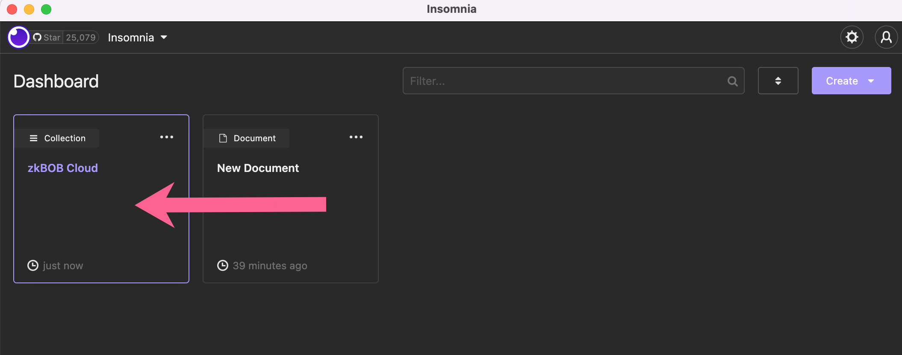
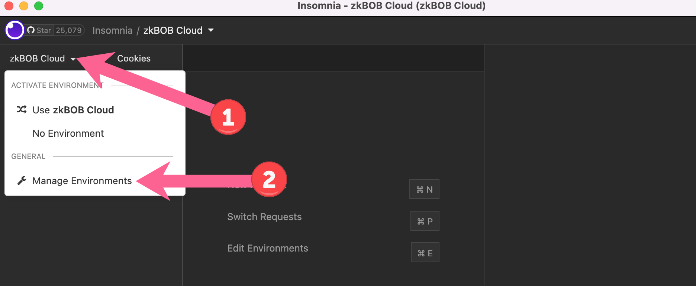
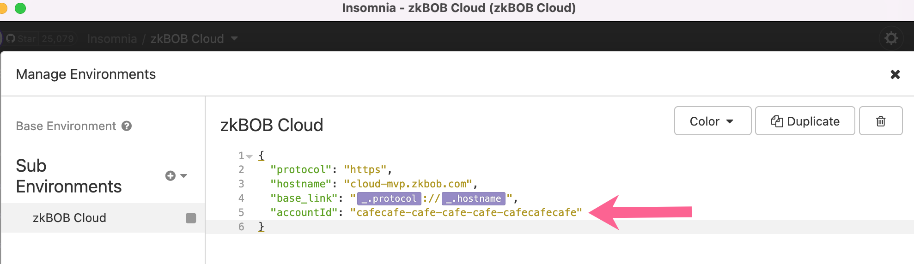
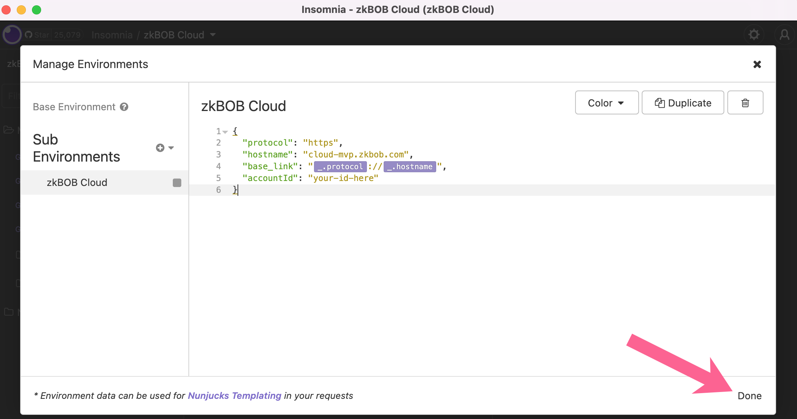
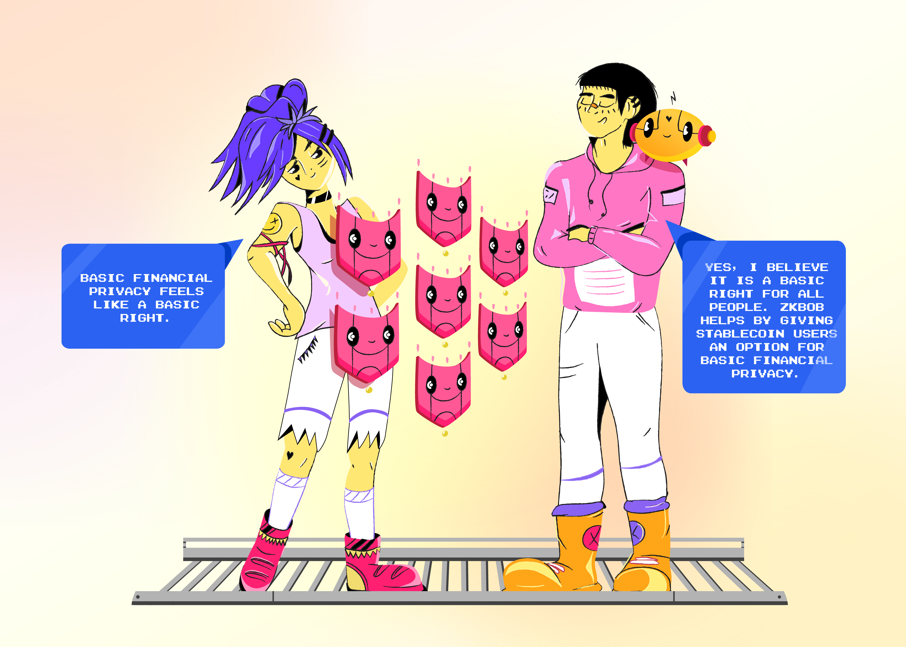

# Hackathon


* [zkBob Intro](hackathon.md#intro)
* [zkBob API & Cloud Wallet](hackathon.md#zkbob-api-and-cloud-wallet)
  * [Use case ideas](hackathon.md#use-case-examples)
  * [API key](hackathon.md#api-key)
  * [Receiving address](hackathon.md#receiving-address)
  * [Notes](hackathon.md#notes)
* [Get Started](hackathon.md#get-started)
* [References](hackathon.md#references-table)
* [Payment Flow and Scenarios](hackathon.md#common-payment-flow-and-scenarios)
* [Prizes](hackathon.md#prizes)


<figure><figcaption></figcaption></figure>

## Intro

Privacy is normal. We are all entitled to privacy in many aspects of our lives, and this includes our finances. It is normal to keep details such as how much money you have, how much money you make, and how you choose to spend your money private. This can be difficult on-chain.

Enter zkBob. zkBob is a privacy application which anonymizes transfers between users. The BOB stablecoin lets users exchange value in a stable, predictable manner. zkSnarks prove certain actions have occurred without revealing details about who completed the action or the amount transferred. Compliance features deter bad actors and illicit usage. zkBob gives privacy back to the everyday user.&#x20;

zkBob UI is developed as a client side application which generates zkproofs on a user's machine. This is ideal from a security and privacy standpoint, however it can introduce some obstacles for application developers.  To simplify zkBob interactivity and reduce friction for users and application developers, we have released the zkBob API and cloud wallet into beta.&#x20;

## zkBob API and Cloud Wallet

With the API, developers do not need to use a client SDK to manage crytpographic keys, client application state, and other complexities. Users do not need to secure keys entirely on their own or wait for cryptographic proof generation.&#x20;

The hosted version of the zkBob REST API and cloud wallet greatly expands the possibilities for interaction. The cloud wallet is currently in an experimental and custodial state, this first iteration is developed specifically for hackathons to give devs an opportunity to experience and build zk-enhanced use cases. We welcome your feedback as you hack!

For the hackathon, we want you to explore new use cases for private transactions using the zkBob API and BOB stablecoin.&#x20;

### Use Case Ideas

* Donation platform where donors maintain anonymity
* Fundraising platform with internal KYC while maintaining public privacy
* DAO accounting application
* Private payment-splitting application for friend groups
* Wallet integration for private payments - integrate BOB payments into an open source wallet
* Tip bot/extension (telegram bot, twitter bot, browser extension)
* Food delivery service with private payments
* BOB powered vending machine/POS
* \*Extra credit: Direct library integration, direct deposits
* Your idea here!!!

### API Account Key

In the ZkBob Cloud Wallet every developer has their own secret api key (`accountId`) used to manage funds. The key is kept on the server and given individually to each team, either requested through discord or in-person at our booth. Each key will also contain a BOB balance. [See below](hackathon.md#get-started) for more info on receiving an API key.

### **Receiving Address**

Since all payments are settled on a public blockchain privacy can be complicated. To avoid obvious correlations between txs we use special generated receiving addresses that can’t be linked in any way to the account. Using a new receiving address for every incoming transaction is recommended to eliminate any possibility of deanonymizing the recipient.

### **Notes**

Balance management is not as complex as it seems. There are notes and accounts — the difference is similar to physical paper notes in your wallet and your accounts at the bank. Most of the time this doesn’t matter, but there is one edge case when it’s important. **Due to technical restrictions the user cannot spend more than 3 notes in one operation.** If the user needs to do this there will be one or more additional technical transactions to accumulate the balance to the account prior to the transfer itself.

## Get Started

<figure><figcaption></figcaption></figure>

* **Get an API Key & BOB:** Request your API key (`accountId`) either through the _#sponsor-zkbob_ channel on EthGlobal discord [https://discord.gg/ethglobal](https://discord.gg/ethglobal) or come see us in person at the zkBob booth!  Then join the telegram at [https://t.me/+sMbZvmVzYmQ3ODlk](https://t.me/+sMbZvmVzYmQ3ODlk) to ask any questions. The API key `accountId` is used to interact with the zkBob cloud wallet. You will receive 10 BOB into your account to use for testing, functionality and demonstration purposes. It can be transferred to other accounts you may create using the [zkBob UI.](https://app.zkbob.com/)
* **Explore API Methods:** Use the Insomnia collection to explore zkBOB Cloud API methods.
  * Download Insomnia ([https://insomnia.rest/download](https://insomnia.rest/download))&#x20;
  * Import collection
    * Click New Document ->Import/Export\
      
    * Click Import Data -> From url\
      
    * Enter url: [https://tinyurl.com/zkBobIndia](https://tinyurl.com/zkBobIndia)&#x20;
    * Click Insomnia to view Collections and select the zkBOB Cloud collection.\
      \
      
  * Replace default `accountId` with your API key`accountId` &#x20;
    * In the zkBOB Cloud Collection click on zkBOB Cloud -> Manage Environments.\
      
    * Replace the default `accountId` "`cafecafe-cafe-cafe-cafe-cafecafecafe`" with the `accountId` you receive from the zkBob team.\
      
    * Click **Done** to save with your `accountId`.\
      
* View [common scenarios below.](hackathon.md#common-payment-flow-and-scenarios)
* _Note that the current API does not include deposit and withdrawal functionality, only proving mechanisms related to transfers._

## References&#x20;

|                                     |                                                                                                                                                                                                                                                                                                                                                                                                                                                                                         |
| ----------------------------------- | --------------------------------------------------------------------------------------------------------------------------------------------------------------------------------------------------------------------------------------------------------------------------------------------------------------------------------------------------------------------------------------------------------------------------------------------------------------------------------------- |
| REST API url                        | [https://cloud-mvp.zkbob.com](https://cloud-mvp.zkbob.com)                                                                                                                                                                                                                                                                                                                                                                                                                              |
| Production Insomnia collection JSON | 
<a href="https://tinyurl.com/zkBobAtIndia">https://tinyurl.com/zkBobAtIndia</a>  <a href="https://files.gitbook.com/v0/b/gitbook-x-prod.appspot.com/o/spaces%2F-MjSwkv4zokqCUebt-98%2Fuploads%2FSk47MvzGVM6WPAHN7Efp%2FzkBOB-prod-ETHIndia-hackathon-v1.1.json?alt=media&#x26;token=f4e3f2b7-21b6-48c0-89d0-6ddfb059608c">Alternate link</a>
                                                                                                                               |
| Staging Insomnia collection JSON    | 
<a href="https://files.gitbook.com/v0/b/gitbook-x-prod.appspot.com/o/spaces%2F-MjSwkv4zokqCUebt-98%2Fuploads%2FSjKsJ3D42Y8hyypLhZWa%2FzkBOB-staging-ETHIndia-hackathon-v0.2.json?alt=media&#x26;token=a494d980-ed8c-451b-9abf-435f48e71202">explore methods</a> Note: This will not work with dummy <code>accountId</code>, but allows you to see available methods. <strong>If desired you can request a staging <code>accountId</code> through discord / telegram.</strong>
 |

## Common Payment Flow & Scenarios

This is a typical payment process flow. Here you see example relationships between Alice and Charlie, but any transactional relationship can be created here. Charlie can use a self-custodial ZkBob wallet (through the zkBob UI at [https://app.zkbob.com/)](https://app.zkbob.com/), or they both can share a single ZkBob cloud account.

<figure><figcaption></figcaption></figure>

### Scenario #1 shielded transfer from Charlie (zkBob Cloud) to Alice (zkBob UI)

_Alice has not yet created a zkBob account through the UI._

1. Alice creates an account using the zkBob UI at [https://app.zkbob.com/](https://app.zkbob.com/)
2. Alice [generates a new receiving address](../zkbob-app/generate-a-secure-address.md) through the UI.
3. Charlie gets an API key `accountId` for zkBob Cloud. He checks his account by sending a GET request to `https://cloud-mvp.zkbob.com/account?id=accountId` .
4. Alice DMs her receiving address to Charlie. Charlie makes a transfer to Alice's shielded address by sending a POST request to `https://cloud-mvp.zkbob.com/transfer` . It responds with the transfer id.
5. Charlie monitors the transaction status by sending a GET request to  `https://cloud-mvp.zkbob.com/transactionStatus?requestId=transferId`
6. Charlie views the outgoing transfer details by sending a GET request to  `https://cloud-mvp.zkbob.com/history?id=accountId`
7. Alice checks her account in the UI to see that her account balance has changed. She checks the history tab to see the incoming transfer.

### Scenario #2 shielded transfer from Alice (zkBob UI) to Charlie (zkBob Cloud)

_Alice has already created an account through the UI and has some shielded BOB in her account. Charlie already has a zkBob Cloud api key (_`accountId`_)_

1. Charlie generates a shielded address by sending a GET request to `https://cloud-mvp.zkbob.com/generateAddress?id=accountId`
2. Charlie DMs the shielded address to Alice. Alice [makes a transfer](../zkbob-app/transfers/) to Charlie's shielded address using the UI. Alice waits for transfer execution and checks the history tab to see the status of the transfer.
3. Charlie checks the incoming transfer details by sending a GET request to  `https://cloud-mvp.zkbob.com/history?id=accountId` . It may require some time before new details appear.
4. Charlie gets the new balance of her account by sending a GET request to `https://cloud-mvp.zkbob.com/account?id=accountId` .

## Prizes

For the EthIndia hackathon, 5 prizes of $2000 BOB ($2000 USD equivalent) will be awarded to the top 5 projects utilizing the zkBob API. Creativity, innovation, and implementation will be considered during judging.

<figure><figcaption></figcaption></figure>


Learn more about how zkBob works in this conversation about privacy between zkBob and Alice.

