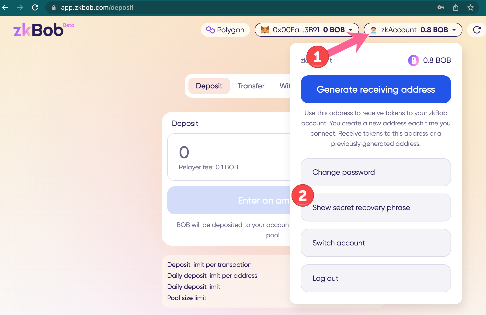
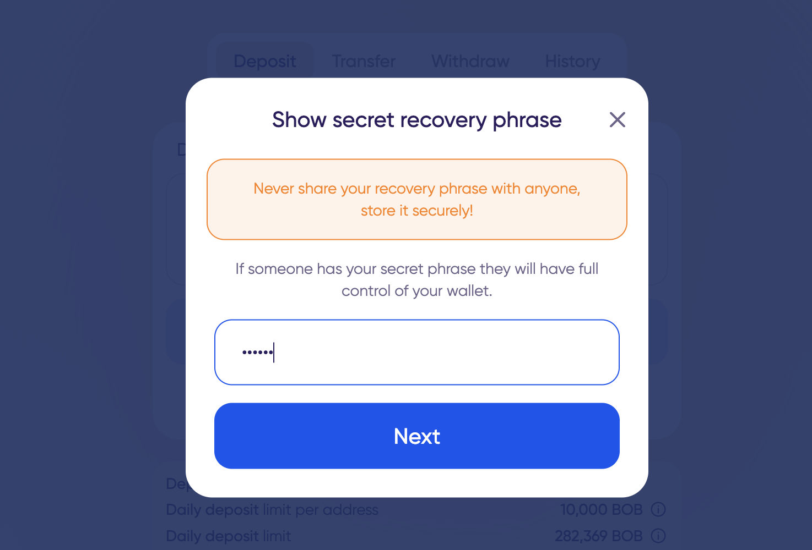
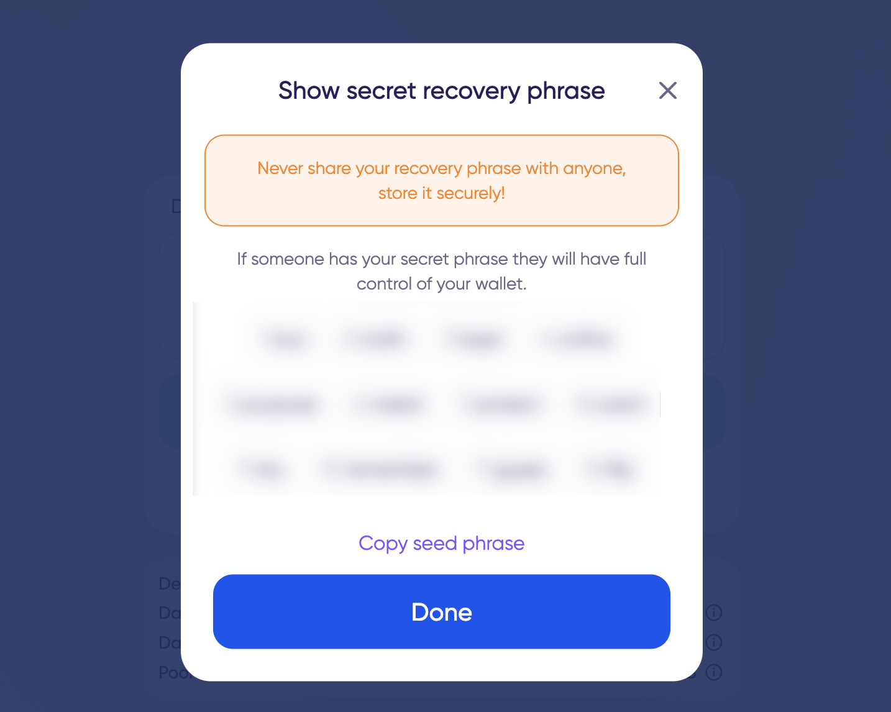
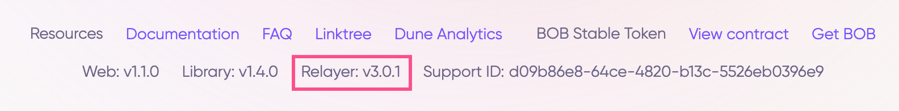

# January 16, 2023

## Latest Component Releases

* Relayer [v3.0.1](https://github.com/zkBob/zeropool-relayer/releases/tag/v3.0.1)
* JS Library [v1.4.0](https://github.com/zkBob/zkbob-client-js/releases/tag/1.4.0)
* Core Library [v1.0.0](https://github.com/zkBob/libzeropool/releases/tag/1.0.0)
* UI (private) [v1.1.0 ](https://github.com/zkBob/zkbob-ui/releases/tag/v1.1.0)

## Updates

* [Secret recovery phrase view and backup](january-16-2023.md#secret-recovery-phrase-view-and-backup)
* [Support improvements](january-16-2023.md#support-improvements)
* [Relayer fallback option](january-16-2023.md#relayer-fallback)

## Secret recovery phrase view and backup

The secret recovery phrase (also known as a seed phrase) can be used to recover your zkAccount. This seed phrase is created when you create your account, and is unique to your zkAccount. If you [create your account using MetaMask or WalletConnect](../../zkbob-app/account-creation/#metamask-walletconnect), the seed phrase for your zkBob zkAccount will be different than your MetaMask account seed phrase.

To view and copy your secret phrase, click on zkAccount -> Show secret recovery phrase button.


For safety you should write down your phrase on paper and keep in a safe physical location. It is not advised to copy the phrase onto your computer or to the cloud or any other connected digital medium.


<figure><figcaption>
zkAccount -> Show secret recovery phrase
</figcaption></figure>

<figure><figcaption>
Enter password
</figcaption></figure>

<figure><figcaption>
Write down seed phrase and click Done to exit
</figcaption></figure>

## Support Improvements

Support ID was introduced in the previous update. Now the Support ID is forward to the relayer, allowing for additional troubleshooting. The relayer version is also displayed in the footer alongside other components and Support ID.

<figure><figcaption></figcaption></figure>

## Relayer Fallback Option

If the relayer discovers the current RPC node is not working properly, it will switch to a fallback endpoint to continue providing service to the end user.

