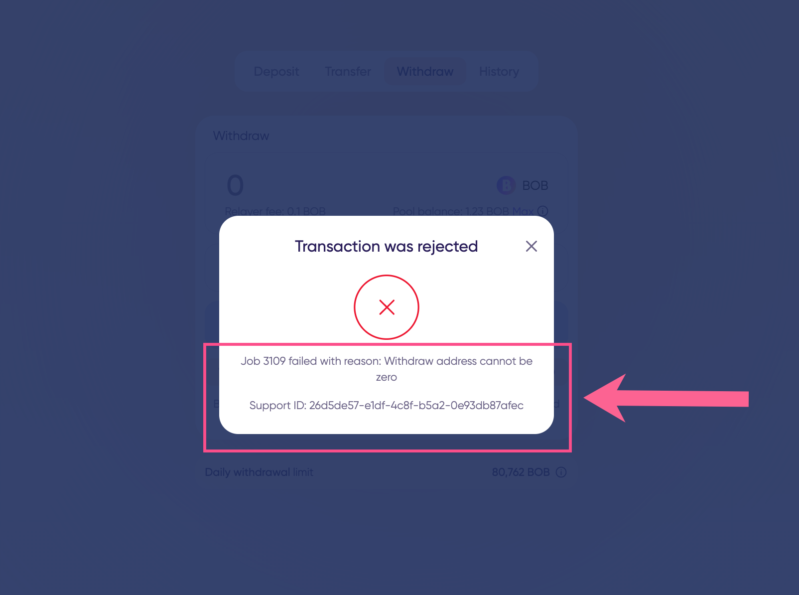

# January 2, 2023

## Primary Updates

### [Li.Fi](http://li.fi) widget integration

The new [Li.Fi](http://li.fi) integration lets you swap assets on different chains to BOB on Polygon directly from the zkBob application. The widget shows the best routes and automates the swapping and bridging processes.


Example using Li.Fi widget to swap MATIC for BOB


### Support improvements with Support ID

We’ve made it easier to get help even when there are no on-chain traces remaining. A unique support ID is now displayed in app footer. If you encounter issues, share this ID along with your request [sent to canny](https://bobstablecoin.canny.io/) to help us troubleshoot any problems.

<figure><figcaption>
Support ID can be used for troubleshooting
</figcaption></figure>

### Faster sync for all clients

* We implemented a CDN to serve account history, speeding up the download and decryption sync processes for all users.
* We fixed several bugs impacting parallel execution of WASM code on M1, resulting in improvements to app startup and data population.

### Self-healing feature

The client application now automatically determines if something went wrong with local state and tries to fix it, resulting in fewer manual resets.

## Minor technical updates

* Add Safari support. Mobile will be optimized in a future release.
* Rejected transactions are now also shown in the history tab

## Component Update Details

* Relayer release **v2.2.0**\
  [https://github.com/zkBob/zeropool-relayer/releases/tag/v2.2.0](https://github.com/zkBob/zeropool-relayer/releases/tag/v2.2.0)
* UI release **v1.0.0**\
  [https://github.com/zkBob/zkbob-ui/releases/tag/v1.0.0](https://github.com/zkBob/zkbob-ui/releases/tag/v1.0.0)
* JS library release **v1.2.1**
  * [https://github.com/zkBob/zkbob-client-js/releases/tag/1.2.0](https://github.com/zkBob/zkbob-client-js/releases/tag/1.2.0)
  * [https://github.com/zkBob/zkbob-client-js/releases/tag/1.2.1](https://github.com/zkBob/zkbob-client-js/releases/tag/1.2.1) (includes hotfix)
* Core library **v1.0.0**:\
  [https://github.com/zkBob/libzeropool/releases/tag/1.0.0](https://github.com/zkBob/libzeropool/releases/tag/1.0.0)
