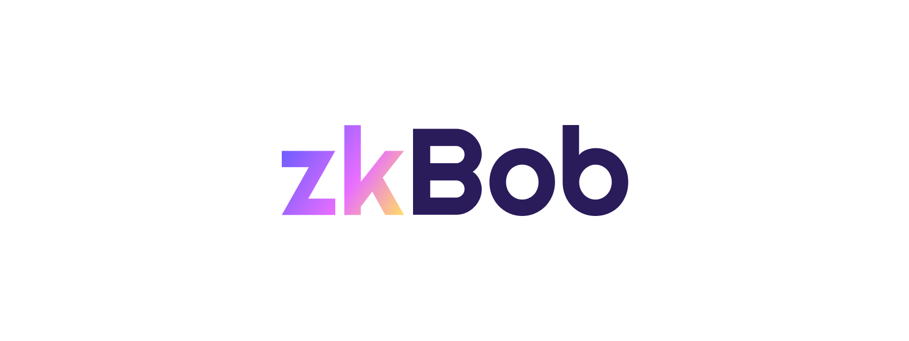

# Visual Assets

## zkBob Logos

<figure><figcaption></figcaption></figure>


zkBob Logos


## BOB Stable Token

<figure><figcaption></figcaption></figure>


BOB images


<figure><figcaption>
SVG image
</figcaption></figure>

<figure><figcaption>
PNG image
</figcaption></figure>
