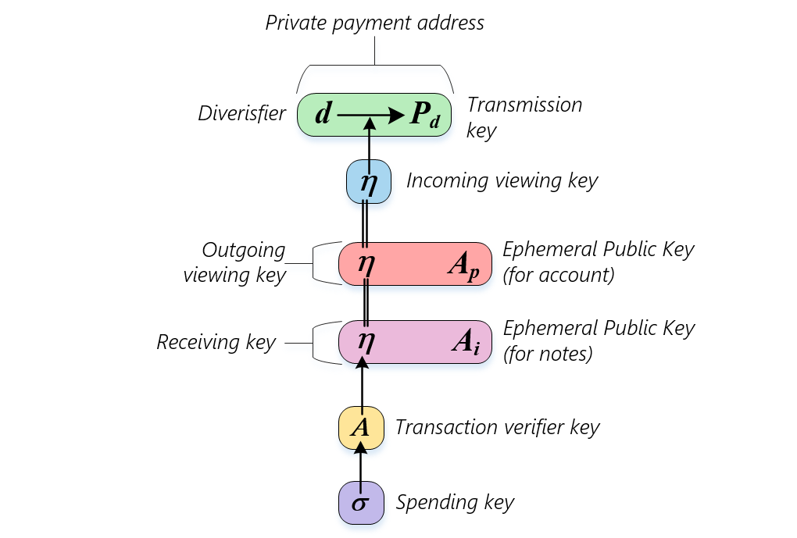

# zkBob Keys

zkBob solution based on complex cryptography. There are several keys needed for private transactions. The keys relationship presented on the scheme below.

* **Spending key \(**$$\sigma$$**\)** is the top secret key. It is used to derive intermediate keys and to sign transactions.
* **Transaction verifier key \(**$$A$$**\)** is used for transaction signature verification. It's derived from the spending key with multiplying by the generator point in the elliptic curve JubJub field: $$A = \sigma G$$
* **Incoming viewing key \(**$$\eta$$**\)** is derived from the $$A$$ key by the $$Poseidon$$ hash function:$$\eta = Hash(A.x)$$. It's used in several cases:
  * to calculate account[ nullifier](transaction-overview/the-nullifiers.md)
  * to obtain the account balance and transaction history
  * to decrypt incoming notes
* **Private payment address** $$(d, P_d)$$ - is a set of random diversifier $$d$$ and point $$P_d = \eta G_p = \eta \text{ToSubGroupHash}{E(F_r)}(d)$$\)
* **Ephemeral keys** is used to derive shared secret for the memo block encryption

**TODO:**

* [x] Different types of keys and their purposes
* [ ] Keys derivation
* [ ] Getting a private address
* [ ] Keys usage in the different scenarios

