# Account Creation

There are 2 ways to create a zkBob shielded account.&#x20;

1. [**MetMask/WalletConnect**](./#metamask-walletconnect). The application collects a signature locally on your browser - not on the blockchain. It uses the private key from your web3 wallet to derive a secure zkBob account address.
2. [**Use a secret recovery phrase**](./#seed-phrase). The application generates a secret recovery phrase (also known as a seed phrase) for you to store securely. You can use this seed phrase to restore your account and/or password as needed from any computer.


Initial account creation can take several minutes depending on transaction volume in the pool. Please be patient while your account is created!&#x20;



Once you've created your account, you can [generate a receiving address](../generate-a-secure-address.md) to receive a transfer, or [make a deposit](../deposits.md) if you have BOB.&#x20;


## Access Account Screen

If this is the first time you have accessed the app, you will be auto-directed to the create zkAccount screen after [acknowledging the terms](../acknowledge-terms.md). Otherwise, press **Get Started** or the **zkAccount button** at the top to reach the  zkAccount creation screen.

<figure>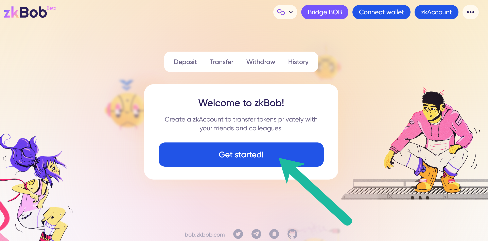<figcaption>
Press either button
</figcaption></figure>

<figure>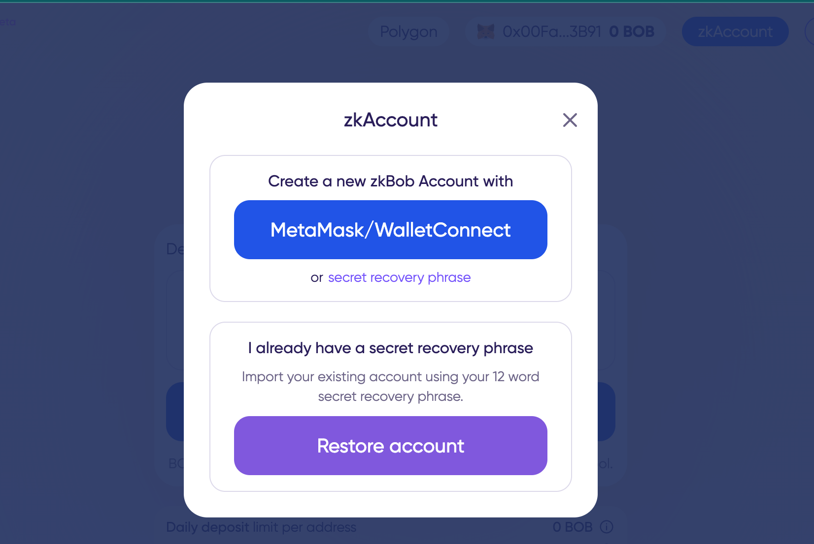<figcaption>
Create a new zkBob Account
</figcaption></figure>

## MetaMask/WalletConnect

1\) Press the **zkAccount** button on the home screen. If your MetaMask or other web3 wallet is not yet connected to the application, you will be prompted to connect. If your web3 wallet is already connected 🦊, [skip to the next section](./#web-3-wallet-connected).

<figure>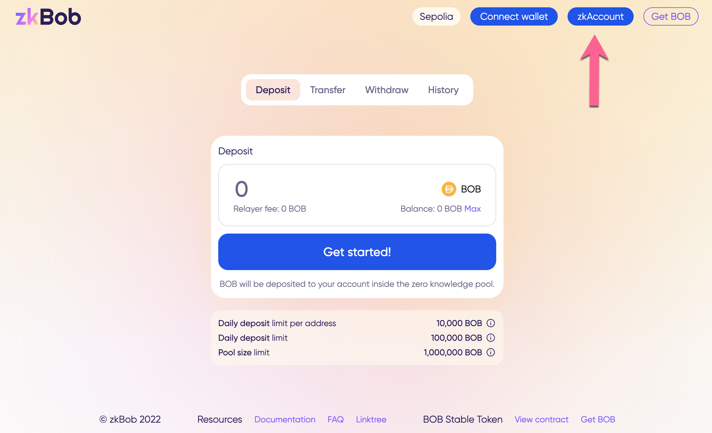<figcaption></figcaption></figure>

2\) Press **MetaMask/Wallet Connect**

<figure>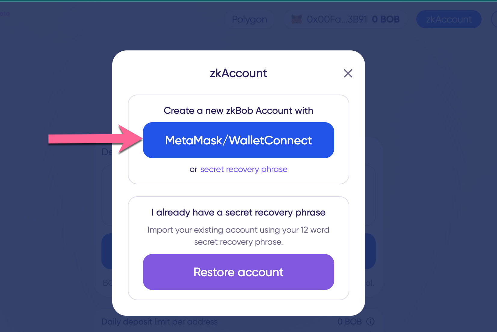<figcaption></figcaption></figure>

3a) Press **Connect wallet**.

3b) Select Wallet type.

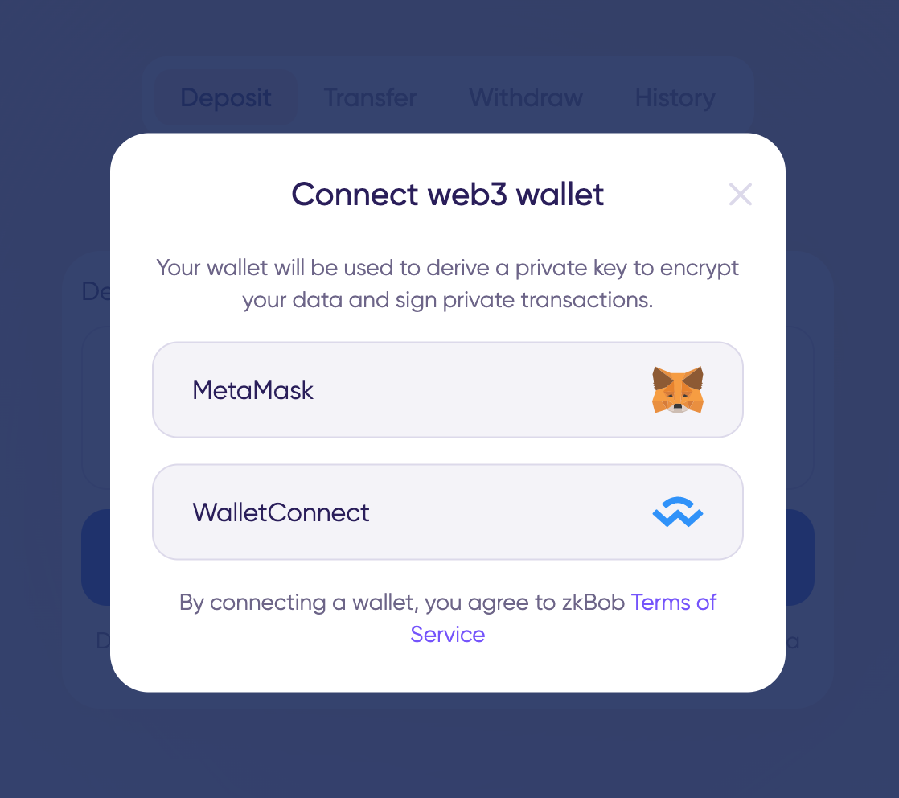

3c) Follow prompts to connect and switch networks if needed. Once connected you be redirected to the home screen and your 🦊 wallet and balance displayed. Click the **zkAccount** button to continue.

<figure>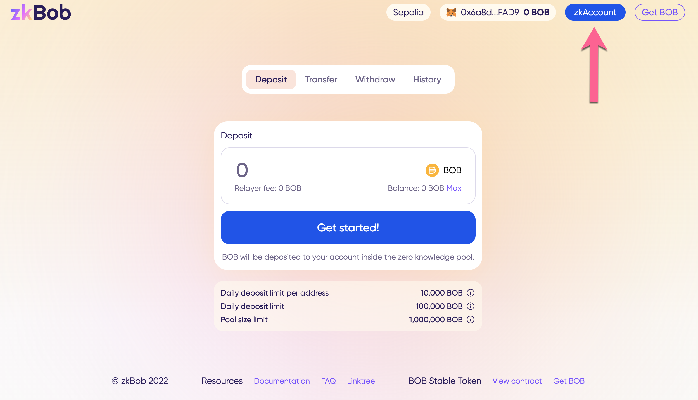<figcaption></figcaption></figure>

### MetaMask/WalletConnect already connected

3\) Select Wallet Key in the popup box.

<figure><figcaption></figcaption></figure>

4\) Generate Key (this is a no-cost message, key is stored locally).&#x20;

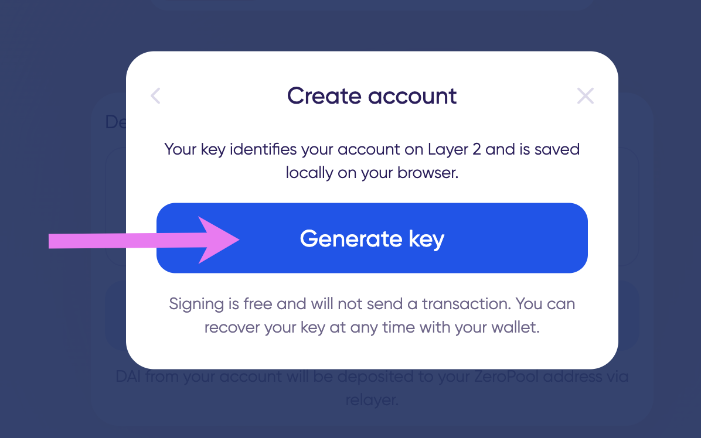

5\) Sign message in MetaMask. Make sure to double check that Origin is the correct URL. [More info here](metamask-web3-wallet-warning.md).

<figure>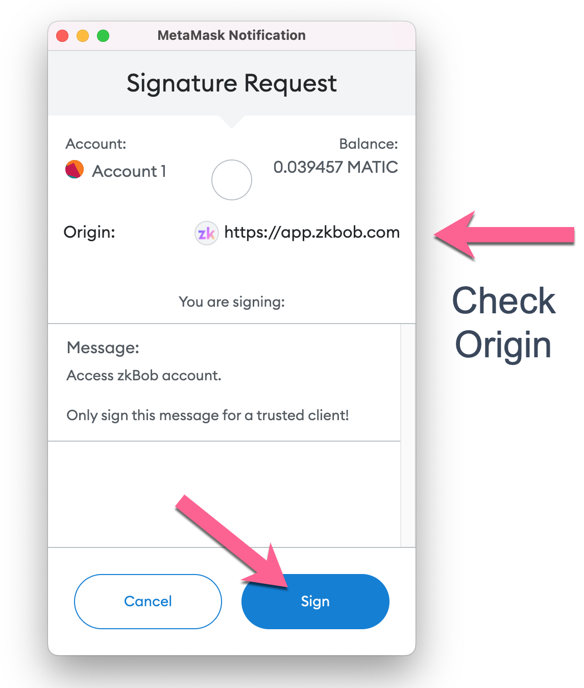<figcaption></figcaption></figure>

6\) Create and Re-enter password. This password is used to access the application, and can be regenerated using your wallet if needed.

6\) You will see the **Loading zkAccount** message while your account is created. Initial account creation can take several minutes depending on transaction volume in the pool. \
\
Once the account is created, you should now have 2 connected accounts, your web 3 wallet address 🦊 and your zkAccount, which is **auto-named beginning with zk.**

<figure>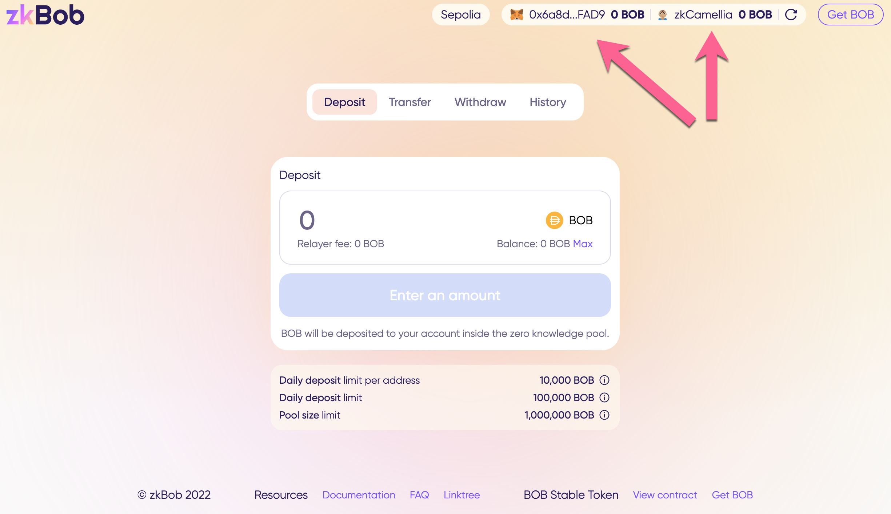<figcaption></figcaption></figure>

## Secret Recovery Phrase


Also known as a seed phrase, you can create a new secret recovery phrase for your zkBob account. Be sure to store it securely off-line. If lost, there is no way to recover your account.


1\) Select **secret recovery phrase** in the popup box.

<figure>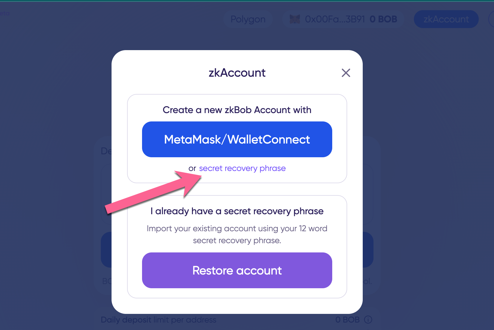<figcaption></figcaption></figure>

2\) View and write down your phrase somewhere safe (offline). It is not wise to use the copy feature or keep your seed phrase on the computer.&#x20;

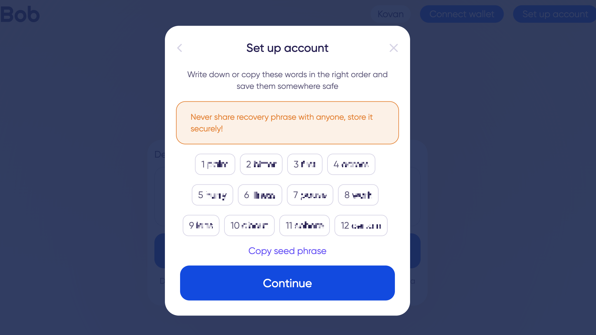

3\) Re-enter your phrase by clicking on the words in order. Click **Verify** when you are done.

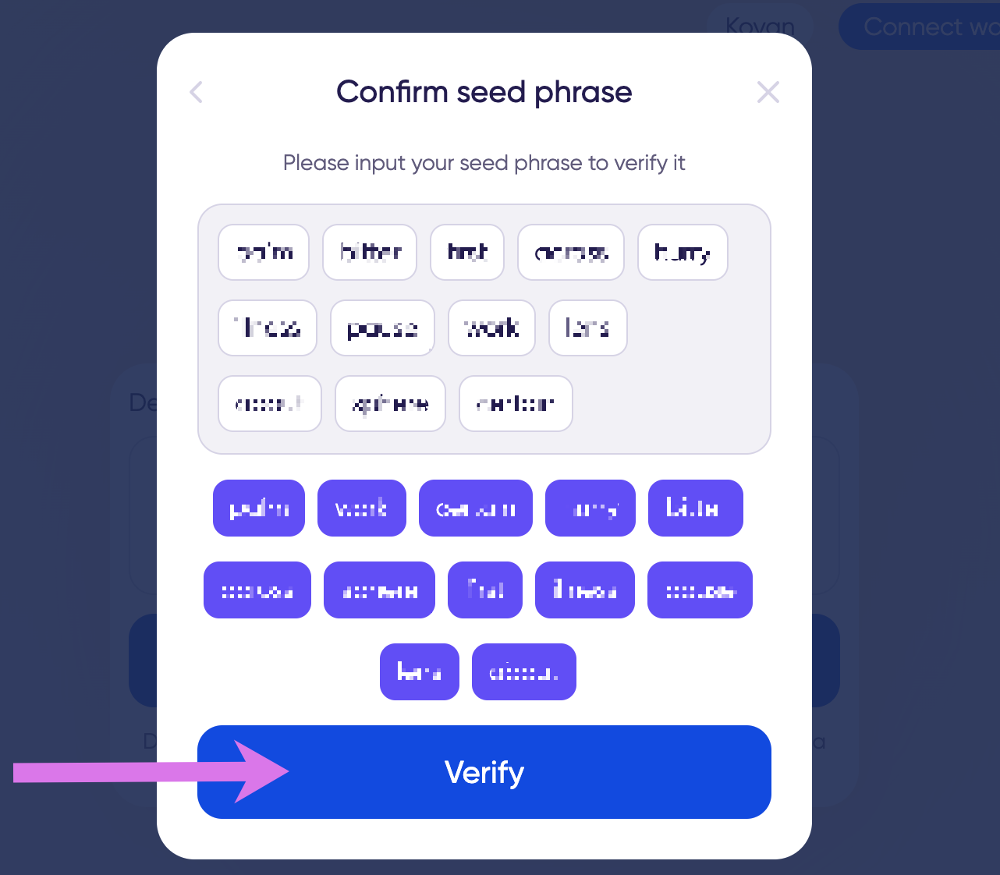

4\) Create and confirm a password to use for accessing your account. You will enter this password each time the page refreshes and to access your account. You can create a new password if needed using your seed phrase.

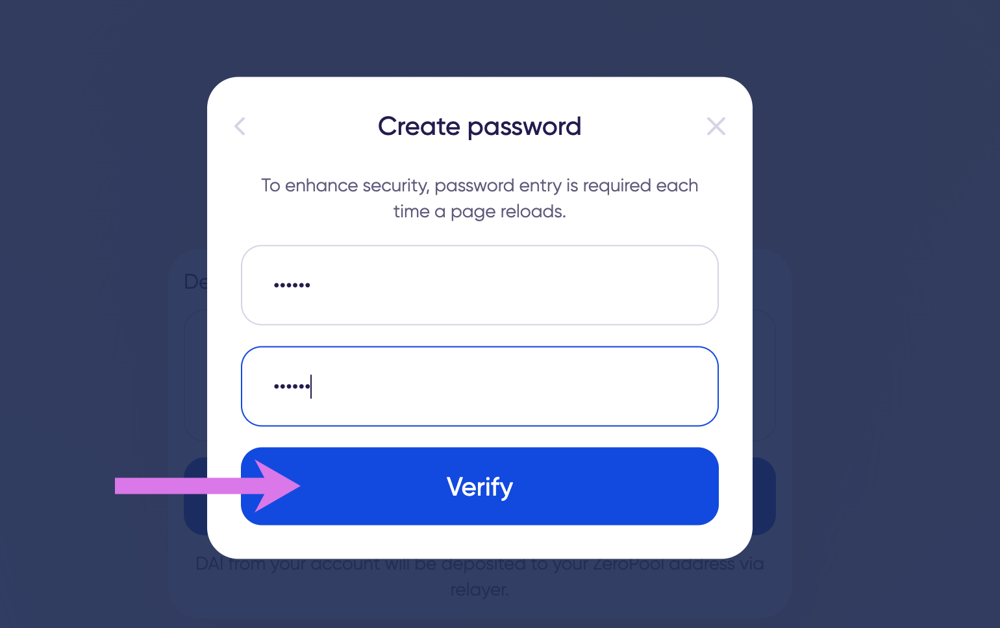

5\) You will see the **Loading zkAccount** message while your account is created. Initial account creation can take several minutes depending on transaction volume in the pool. Once created, you will see your new account name. **This name is auto-generated, beginning with zk**. You can use this account to receive transfers and withdraw to a different `0x` address without ever connecting a web3 wallet.

<figure>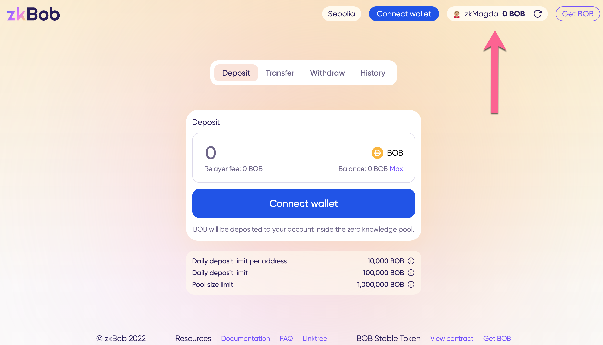<figcaption></figcaption></figure>


If you want to [deposit funds](../deposits.md) to your zkAccount, [connect your 0x wallet](./#web3-wallet).



If you want to receive a transfer, [generate a receiving address](../generate-a-secure-address.md).



When using the same computer/browser for future zkBob sessions, you can access your account with only your password (assuming local storage has not been cleared). \
\
If you change browsers/computers or clear local storage, re-enter your seed phrase and create a new password to restore the account.



Next:&#x20;

* [Make a Deposit](../deposits.md)
* [Receive a Transfer](../transfers/)
* [Withdraw Funds](../withdrawals.md)

