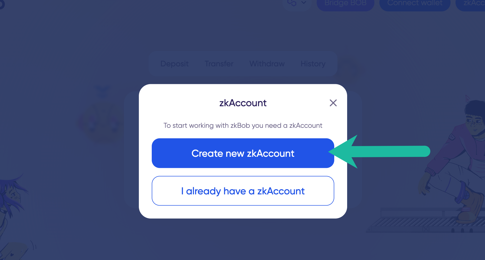
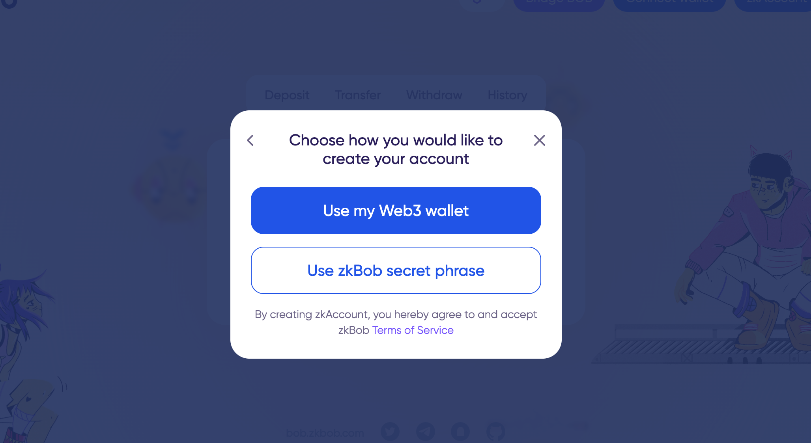
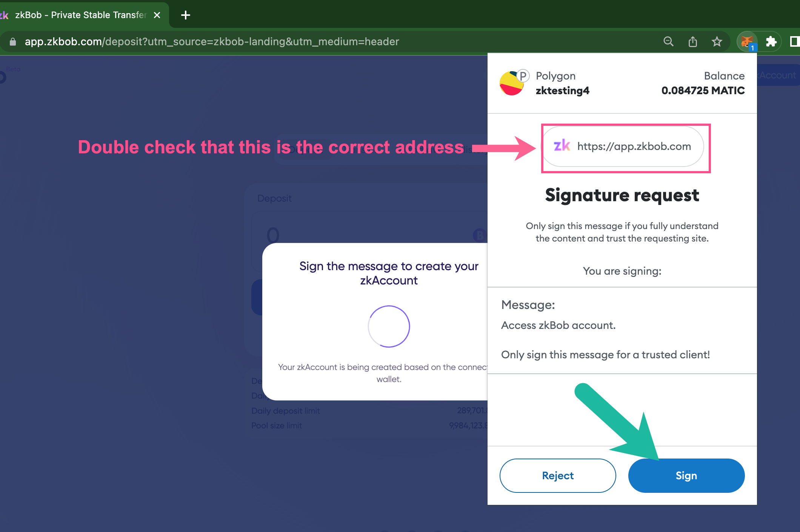
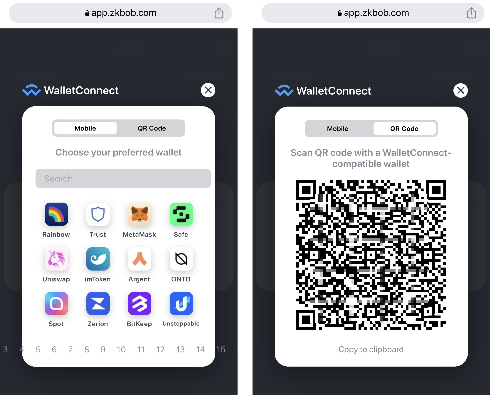
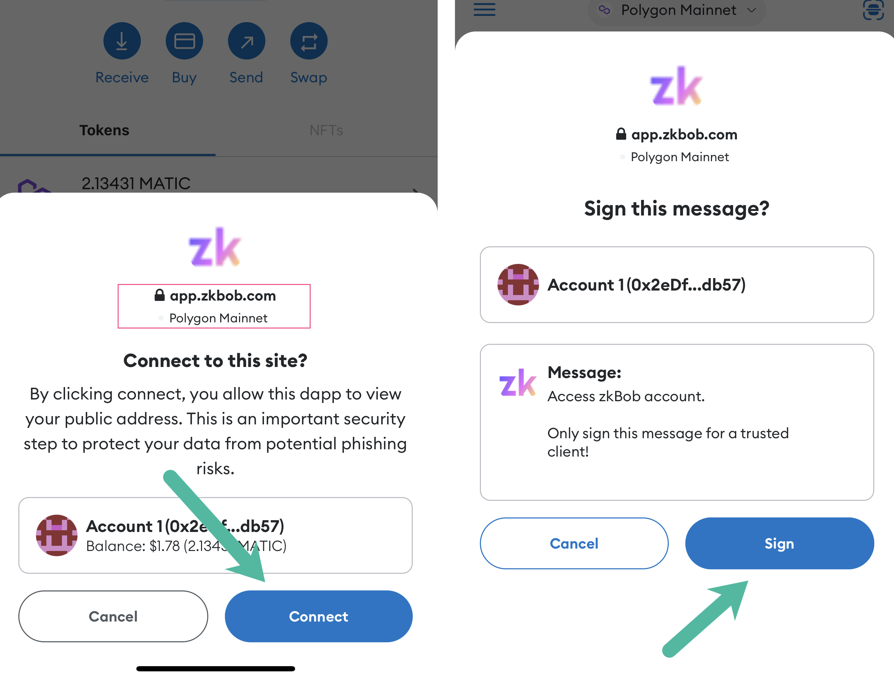
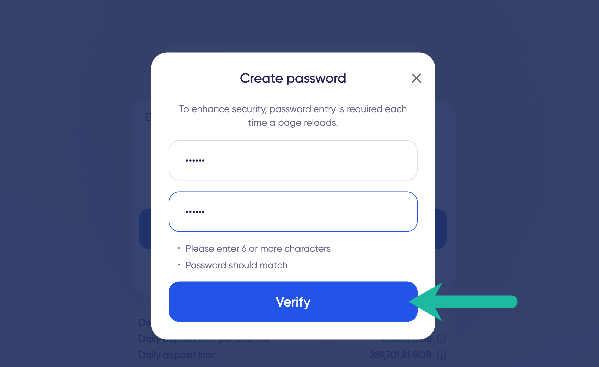
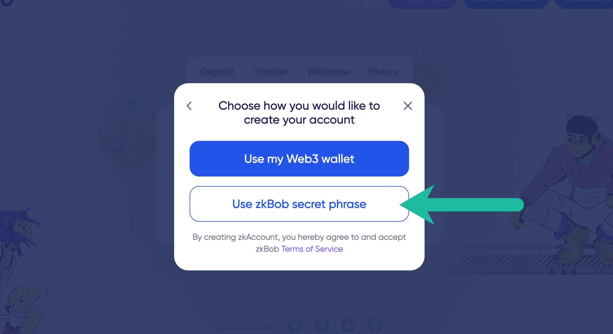
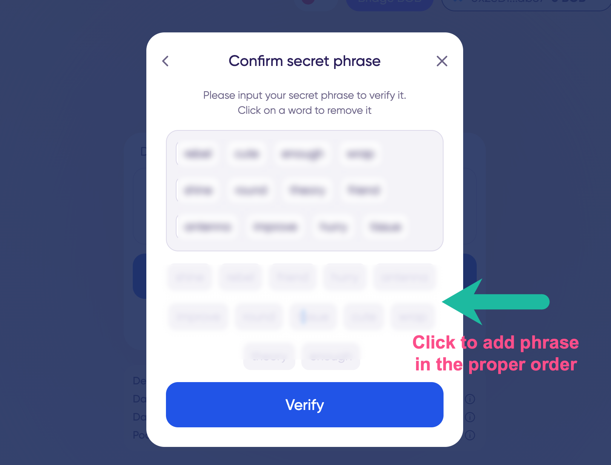

# Account Creation


When you arrive at [app.zkbob.com](https://app.zkbob.com) follow the prompts to get started!


## 1. Get started

Press the **Get started** button**.**

<figure><figcaption></figcaption></figure>

## **2. Create a new zkAccount**

CIick **Create new zkAccount**. If you already have a zkAccount, select I already have a zkAccount and follow the instructions here.

<figure><figcaption></figcaption></figure>

## **3. Choose account creation method**

Choose to use your web3 wallet (like MetaMask or others through WalletConnect) or create a standalone zkBob secret phrase.  With the web3 wallet method, you will connect your web3 wallet to the application to create an account. With the secret phrase, you do not need to connect your wallet, but will need to securely save your phrase**.**

1. **Web3 wallet**. The application collects a signature locally on your browser - not on the blockchain - using your MetaMask or WalletConnect connected wallet. It uses the private key from your web3 wallet to derive a secure zkAccount address.
2. **Use a secret phrase**. The application generates a secret phrase for you to store securely. You can use this secret phrase to restore your account and/or password as needed from any computer. **With this method, you are responsible for securely saving your secret phrase**.

<figure><figcaption></figcaption></figure>

Account creation methods are described below. The [**web3 wallet method** ](./#metamask-walletconnect)is described first; then the [**secret phrase method**](./#secret-recovery-phrase) is described.

## Web3 Wallet

### 1) Select **Use my Web3 wallet**

<figure><figcaption>
Be sure to read the Terms of Service before creating your account.
</figcaption></figure>

### 2) Select **MetaMask** or **WalletConnect**.&#x20;

With WalletConnect you can use a variety of web3 wallets to connect to zkBob.

<figure><figcaption></figcaption></figure>

### 3a) **MetaMask**

Connect your wallet and sign the message to create a zkAccount using your wallet's private key.&#x20;


**Note**: Be sure to [double check the address is correct](metamask-web3-wallet-warning.md) (https://app.zkbob.com) to prevent phishing.


<figure><figcaption></figcaption></figure>

### 3b) **WalletConnect**&#x20;

Select a wallet or scan the QR to connect your wallet and complete the signature request.


**Note:** Be sure to [double check the address is correct](metamask-web3-wallet-warning.md) (https://app.zkbob.com) to prevent phishing.


<figure><figcaption>
Connect to WalletConnect with a preferred wallet or by scanning the QR
</figcaption></figure>

<figure><figcaption>
Connect your wallet and Sign the message (be sure to check you are connecting to app.zkbob.com)
</figcaption></figure>

### 4) **Create and re-enter a password**.&#x20;

This password is used to access the application and is stored locally. You can create a new password at any time using your connected wallet. Press **Verify** to proceed.

<figure><figcaption></figcaption></figure>

### 5) Account Created

You will see a **Loading zkAccount** message while your account is created. Initial account creation can take up to a minute depending on transaction volume in the pool. \
\
Once the zkAccount is created, you will see 2 connected accounts. You are ready to start interacting with zkBob!

1. Your web3 wallet (MetaMask or WalletConnect).
2. Your zkAccount.

<figure><figcaption></figcaption></figure>


Once you've created your account, you can [generate a receiving address](../generate-a-secure-address.md) to receive a transfer, or [make a deposit](../deposits.md) if you have BOB on Polygon or Optimism.


## Use zkBob Secret Phrase


Also known as a seed phrase, you can create a new secret phrase specifically for your zkBob account. You will use this secret phrase to recover your account if needed. Be sure to store it securely off-line. If lost, there is no way to recover your account.


### 1) Use secret phrase

Select **Use zkBob secret phrase** in the popup box.

<figure><figcaption></figcaption></figure>

### 2) View and write down your phrase somewhere safe (offline).&#x20;

It is not wise to keep the secret phrase on your computer.&#x20;

<figure><figcaption></figcaption></figure>

### 3) Confirm your phrase&#x20;

Clicking on the words in the correct order. Click **Verify** when you are done.

<figure><figcaption></figcaption></figure>

### 4) **Create and re-enter a password**

This password is used to access the application and is stored locally. You can create a new password at any time using your connected wallet. Press **Verify** to proceed.

<figure><figcaption></figcaption></figure>

### 5) Account Created

You will see the **Loading zkAccount** message while your account is created.  Once created, you can use this account to receive transfers and withdraw to a different `0x` address without ever connecting a web3 wallet.

<figure><figcaption></figcaption></figure>


If you want to [deposit funds](../deposits.md) to your zkAccount, [connect your 0x wallet](./#web3-wallet).



If you want to receive a transfer, [generate a receiving address](../generate-a-secure-address.md).



**Note:** When using the same computer/browser for future zkBob sessions, you can access your account with just your password (assuming local storage has not been cleared). \
\
If you change browsers/computers or clear local storage, re-enter your secret phrase (or connect your web3 wallet if you used that method) and create a new password to restore the account.



Next:&#x20;

* [Make a Deposit](../deposits.md)
* [Receive a Transfer](../transfers/)
* [Withdraw Funds](../withdrawals.md)

