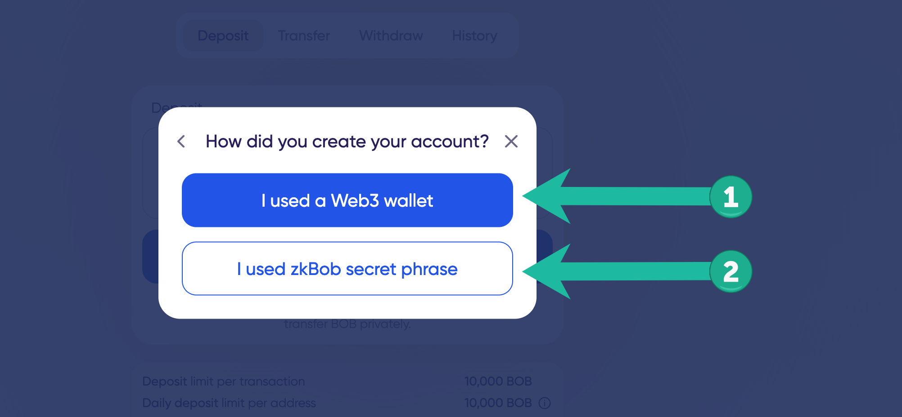

# Login to an existing account


When you arrive at [app.zkbob.com](https://app.zkbob.com) follow the prompts to get started!


## 1. Get started

Press the **Get started** button**.**

<figure><figcaption></figcaption></figure>

## 2. I already have a zkAccount

<figure><figcaption></figcaption></figure>

## 3. How did you create your account?

1. [**Web3 wallet**](login-to-an-existing-account.md#3.1-web3-wallet)**:** You created your previous account by connecting MetaMask or WalletConnect to the application to generate your zkAccount.
2. [**zkBob secret phrase**](login-to-an-existing-account.md#3.2-zkbob-secret-phrase): You created a standalone secret phrase to create your account and have this secret phrase written down somewhere safe.

<figure><figcaption></figcaption></figure>

## 3.1 Web3 Wallet

You will see a prompt to connect your wallet. [**Starting from step 2**](./#2-select-metamask-or-walletconnect.), continue through the Account Creation flow to reconnect your web3 wallet, sign a message, create a password and proceed to the application.

<figure><figcaption></figcaption></figure>

## 3.2 zkBob Secret Phrase

Enter the existing seed phrase and wrote down in a secure location during initial zkAccount creation.

<figure><figcaption></figcaption></figure>

\Follow the remaining flow from the[ Account Creation section](./#4-create-and-re-enter-a-password) to create a new password and connect to the application.

