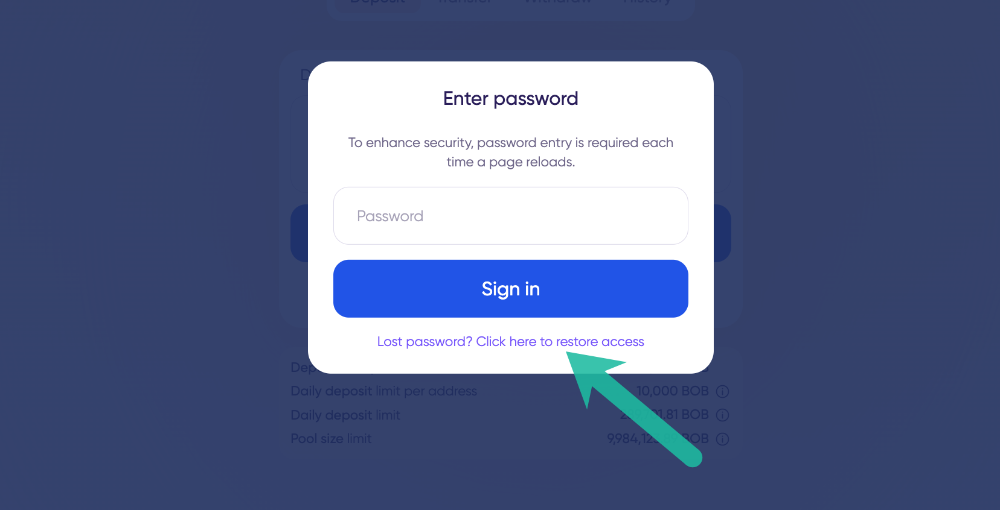

# Lost Password

Passwords for zkBob are saved in local storage to provide a quick path to accessing an account. If you clear local storage, connect on a new device, or lose your password you can easily create a new password.

To create a new password and access your account press **Lost password? Click here to restore access**.

<figure><figcaption></figcaption></figure>

You will be directed to the zkAccount setup screen. Follow the [login to an existing account prompts](login-to-an-existing-account.md) to restore your account with a new local password.

<figure><figcaption></figcaption></figure>

