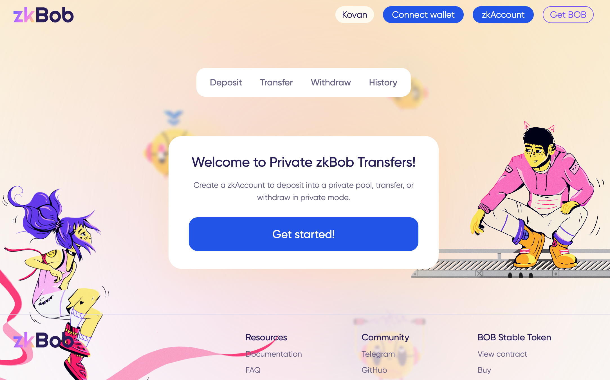
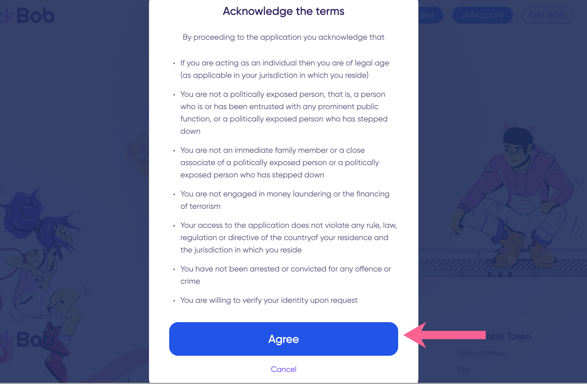

# Acknowledge Terms

The first time you visit the zkBob application you will be asked to acknowledge the terms of your usage. You will see a welcome screen, press the **Get started!** button to continue.

<figure><figcaption></figcaption></figure>

On the second screen read through and press **Accept** if you are willing to accept the terms and proceed. See the [compliance section](../zkbob-overview/compliance-and-security.md) for more on your terms of usage. You can also read more in the [FAQs](../zkbob-overview/faq.md) regarding who should and who should not use zkBob.

<figure><figcaption></figcaption></figure>

Next, [create your account](account-creation/).
