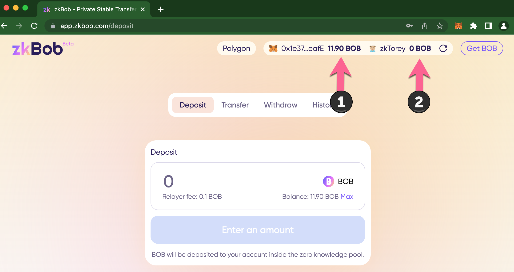
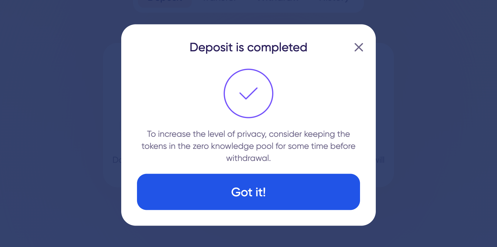
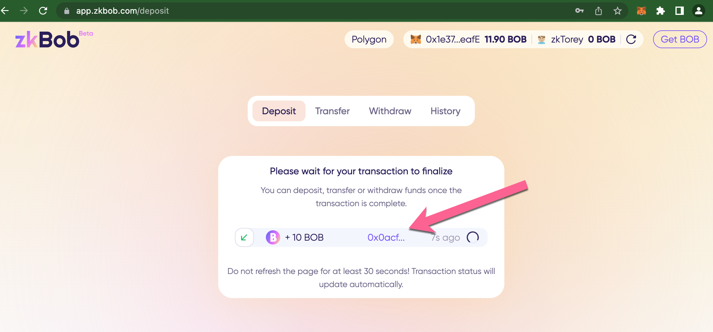
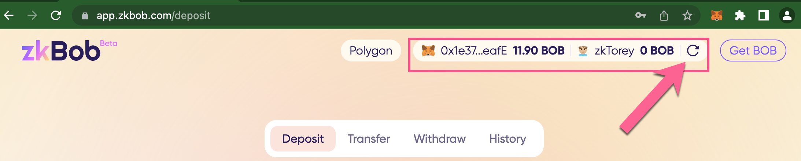
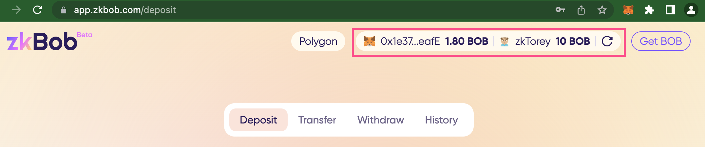
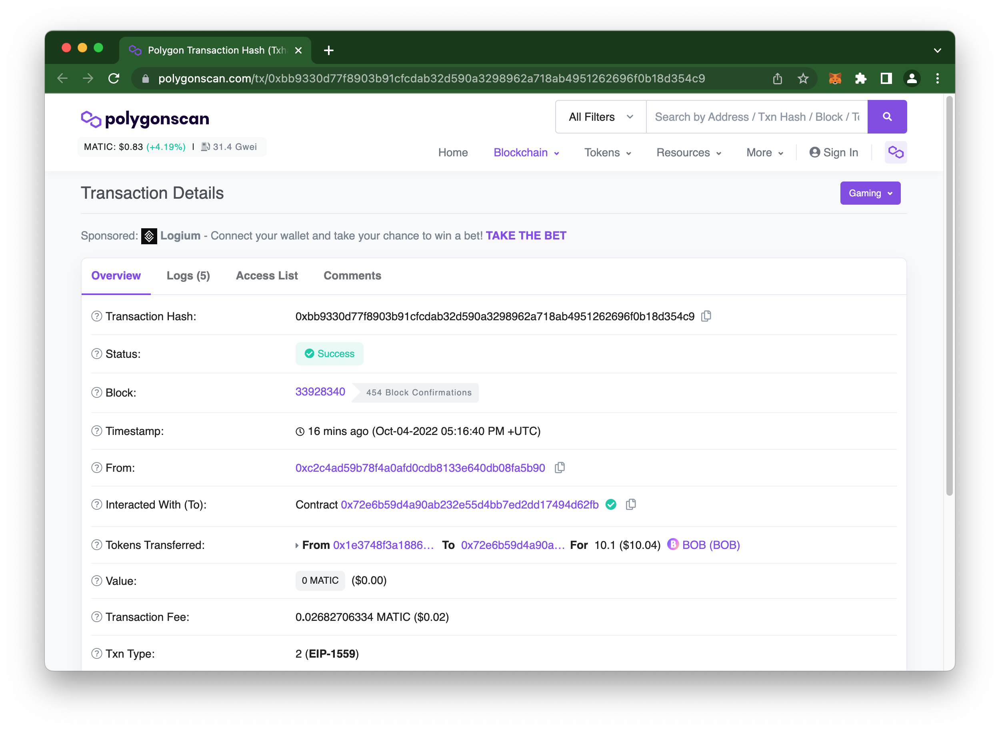

# Deposits


Examples are performed with BOB on Polygon. However, **the BOB pool is now a USDC pool on Polygon**. You can also follow the instructions to deposit BOB or ETH on Optimism.


Deposits to the zkBob pool involve moving the supported token (USDC on Polygon, ETH or BOB on Optimism) from a web3 wallet address (MetaMask/WalletConnect) into a zkAccount. You can use the UI to easily connect a wallet and deposit into your zkAccount.

1\) Check your [accounts are connected](account-creation/).

1. Web3 wallet address (MetaMask, WalletConnect)
2. zkAccount

_If you have previously setup your zkBob account using the Metamask/WalletConnect method, but the accounts are not instantly connected,_ [_follow the prompts_ ](account-creation/#metamask-walletconnect-already-connected)_to reconnect your account._

<figure><figcaption></figcaption></figure>

2\) You should have some amount of tokens available to deposit. Enter the amount and press **Deposit**.&#x20;


Note that a 0.10 fee is added to any amount you deposit to pay the relayer fee. If you deposit 10 USDC 10 USDC is added to your zkAccount and an additional 0.10 USDC is deducted from your 0x address to pay the relayer. The total cost for this tx is 10.1 USDC.


<figure><figcaption></figcaption></figure>

3\) A proof is generated on your local machine. Next, sign the Metamask notification to allow the contract to use your tokens, and wait for the relayer to complete the deposit.

<figure><figcaption></figcaption></figure>

4\) Your deposit is complete! Once the transaction is finalized you can transfer to another zkAddress in the pool or withdraw.&#x20;

<figure><figcaption></figcaption></figure>

5\) Return to the application. You will see the pending transaction, and can click through to view on Polygonscan.

<figure><figcaption></figcaption></figure>

6\) View updated balances.


Note: It may take several minutes to update the pool state. If your balances do not update (in the case below the MM address has not yet updated) you can refresh your wallet balances **from within the application**. This is easier than refreshing the page itself -  you will need to re-enter your password to access the app if you do a page refresh.


<figure><figcaption>
<em>Before refresh</em>
</figcaption></figure>

<figure><figcaption>
<em>After refresh</em>
</figcaption></figure>

_Tx details on Polygonscan :_ [_https://polygonscan.com/tx/0xbb9330d77f8903b91cfcdab32d590a3298962a718ab4951262696f0b18d354c9_](https://polygonscan.com/tx/0xbb9330d77f8903b91cfcdab32d590a3298962a718ab4951262696f0b18d354c9)

<figure><figcaption></figcaption></figure>

