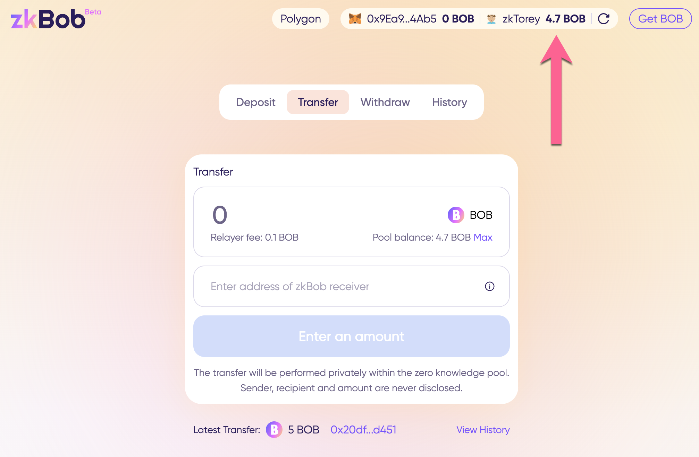

# Generate a Receiving Address

If you are receiving funds from another zkBob user, you will want to send them a secure address. A new secure receiving address can be generated for each transfer.&#x20;

**It is not possible to link different private addresses to one another or to the primary account.** Only the account owner can confirm ownership of a private address.

Each  zkAddress is encoded in base58 format. For example `5fkW3dXTvA8Kizt1EbuRyjWofuqR4Ud1YTjGgY1r8nGosDeSaUreq6bwfF61jWL`

Any previously generated address can be used indefinitely, so if you provide an address to one party and then generate a new address to provide to a second party, both can be used to receive token transfers.

## Generate a zkAddress to receive a transfer

_Generate and send a zkAddress to the sender through any private channel._&#x20;

1\) Press the zkAccount button (your account should already be connected to initiate this process).

<figure><figcaption></figcaption></figure>

2\) Press **Generate receiving address**.

<figure><figcaption></figcaption></figure>

3\) Copy generated address and send to your friend via a private channel of your choice.

<figure><figcaption></figcaption></figure>

4\) Wait for receipt of the transfer. If your zkBob application remains open, you may need to refresh the page to see the changes. It is recommended to refresh from within the application (next to your zkAddress) rather than using the browser refresh.

<figure><figcaption></figcaption></figure>

Once the transfer is received, you can check the history tab to see the transaction, and press the tx hash for more details.

