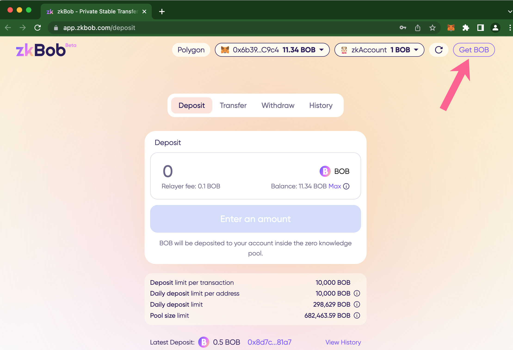

# Get BOB

## 1) Use the Li.Fi widget to swap and bridge assets



## 2) Follow the linktree links to get BOB.

1.  Click Get BOB

    <figure><figcaption></figcaption></figure>
2.  Select **Other options**.

    <figure><figcaption></figcaption></figure>
3.  A new tab will open at [https://linktr.ee/getbob](https://linktr.ee/getbob).

    <figure><figcaption></figcaption></figure>
4. Select your preferred option to get BOB. Once you have BOB in your wallet, return to the zkBob app to deposit and use.

\

