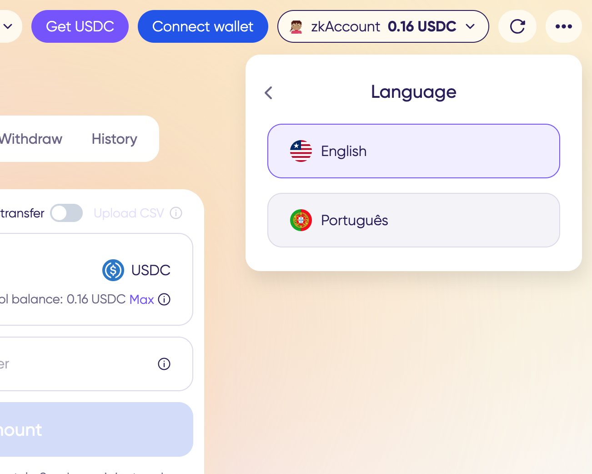
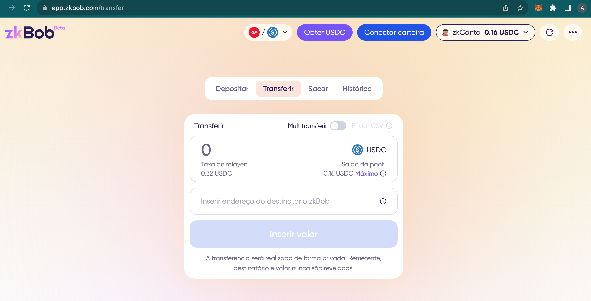

# Português

To access the Português interface:

1\) Click the 3 dots to access More about zkBob.\
2\) Select the English language icon.

<figure><figcaption></figcaption></figure>

3\) Select Português from the dropdown list.

<figure><figcaption></figcaption></figure>

4\) The zkBob UI will be updated to Português for all operations.

<figure><figcaption></figcaption></figure>
