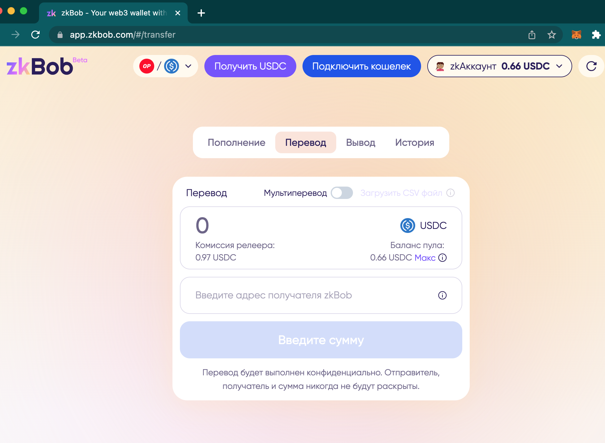

# Русский


RU Translation added by community member [maxvell3337](https://github.com/maxvell3337) in [https://github.com/zkBob/docs/issues/15](https://github.com/zkBob/docs/issues/15)


### To access the Русский interface&#x20;

1\) Click the 3 dots to access More about zkBob.\
2\) Select the English language icon.

<figure><figcaption></figcaption></figure>

3\) Select Русский from the dropdown list.

<figure><figcaption></figcaption></figure>

4\) The zkBob UI will be updated to Русский for all operations.

<figure><figcaption></figcaption></figure>

