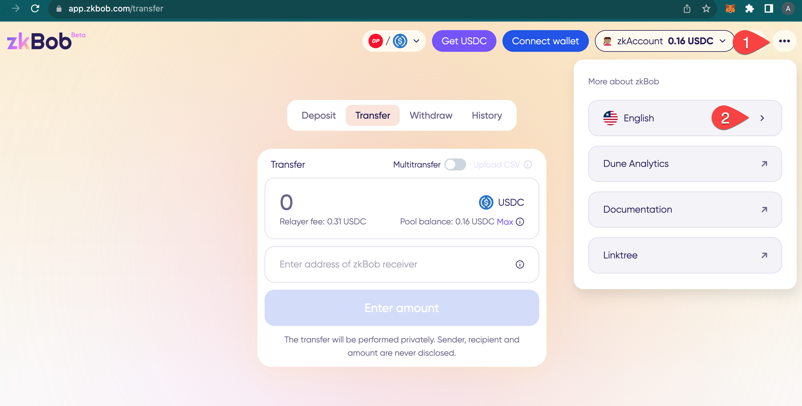
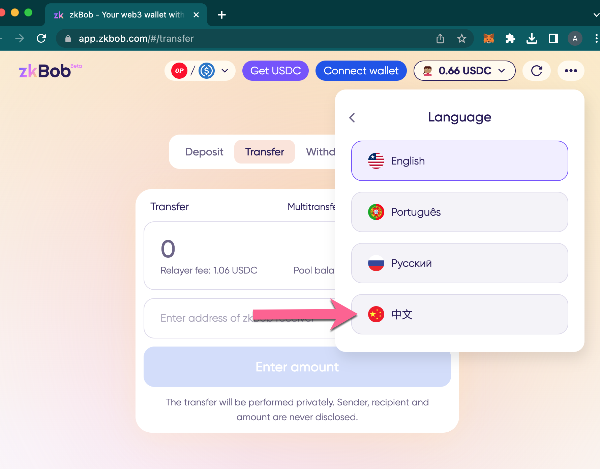
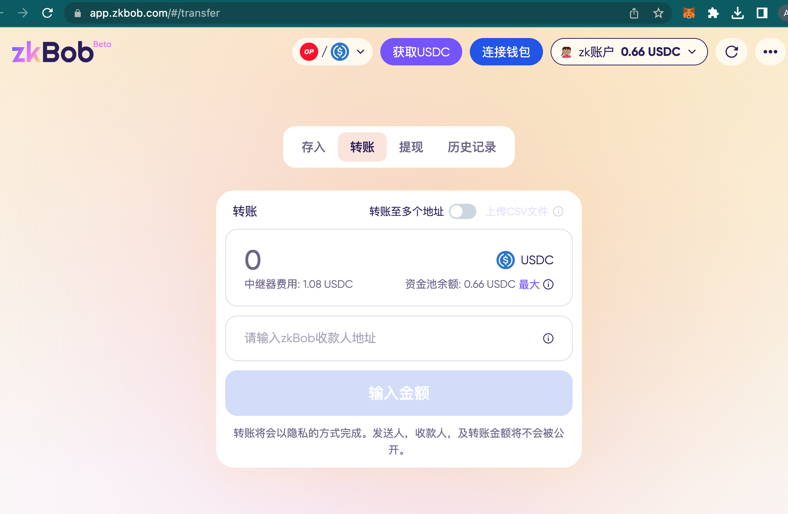

# 中文


ZH-CN Translation added by community member [**Yondcutie**](https://github.com/Yondcutie)  in [https://github.com/zkBob/docs/issues/16](https://github.com/zkBob/docs/issues/16)


### To access the 中文 interface:

1\) Click the 3 dots to access More about zkBob.\
2\) Select the English language icon.

<figure><figcaption></figcaption></figure>

3\) Select 中文 from the dropdown list.

<figure><figcaption></figcaption></figure>

4\) The zkBob UI will be updated to 中文 for all operations.

<figure><figcaption></figcaption></figure>
