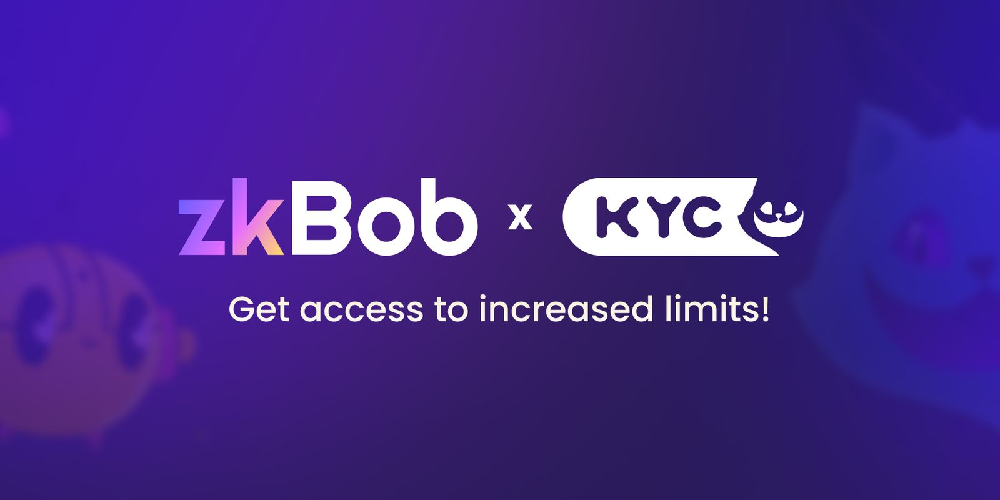

# Optional KYC

<figure><figcaption></figcaption></figure>

Optional KYC is now implemented with zkBob! You can [mint a BAB token on Binance](https://www.binance.com/en/support/faq/how-to-mint-binance-account-bound-bab-token-bacaf9595b52440ea2b023195ba4a09c) and use it to increase your deposit limits on zkBob thanks to the Know your Cat protocol.&#x20;

Instructions for the KYC (Know Your Cat) protocol with zkBob are [available on the zkBob Blog](https://blog.zkbob.com/zkbob-x-kyc-know-your-cat/).

Learn more about the integration here ⬇️


