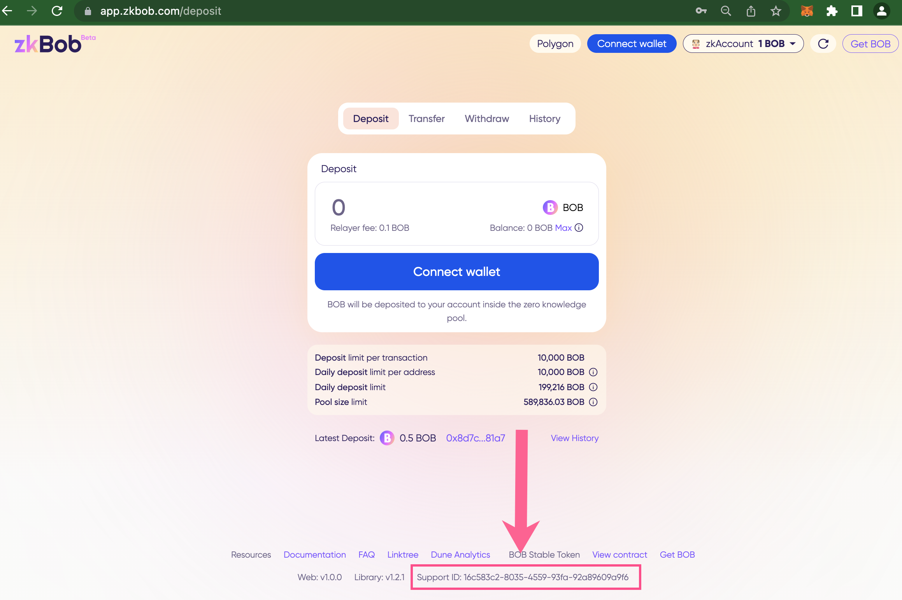

# Support ID

Due to the anonymous nature of transactions within the zkBob pool, it is difficult to troubleshoot and resolve issues surrounding any failed transactions. Errors within the application can then result in lost funds for users who cannot be identified.&#x20;

To remedy this, we issue a session-based Support ID,  a random uuid string randomly generated for each user’s session. This unique Support ID is created and sent to the relayer along with any actions completed during a single session. The support team can then follow the transaction thread to determine where and why the error occurred and help users recover funds when appropriate.&#x20;

If a transaction is rejected or another error occurs, an error will appear along with the Support ID. Copy this info and [submit a help request on Canny](support-id.md#if-you-receive-an-error-while-using-zkbob) for troubleshooting purposes.

<figure><figcaption>
Transaction rejected - copy whole error and submit on canny
</figcaption></figure>

<figure><figcaption>
Support ID is also listed in the footer of the zkBob application
</figcaption></figure>

## If you receive an error while using zkBob

Contact us [in Discord](https://discord.gg/zkbob) and we will help you troubleshoot the problem.

