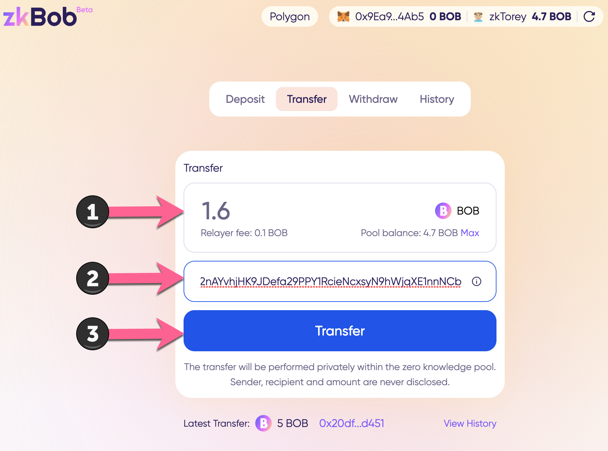
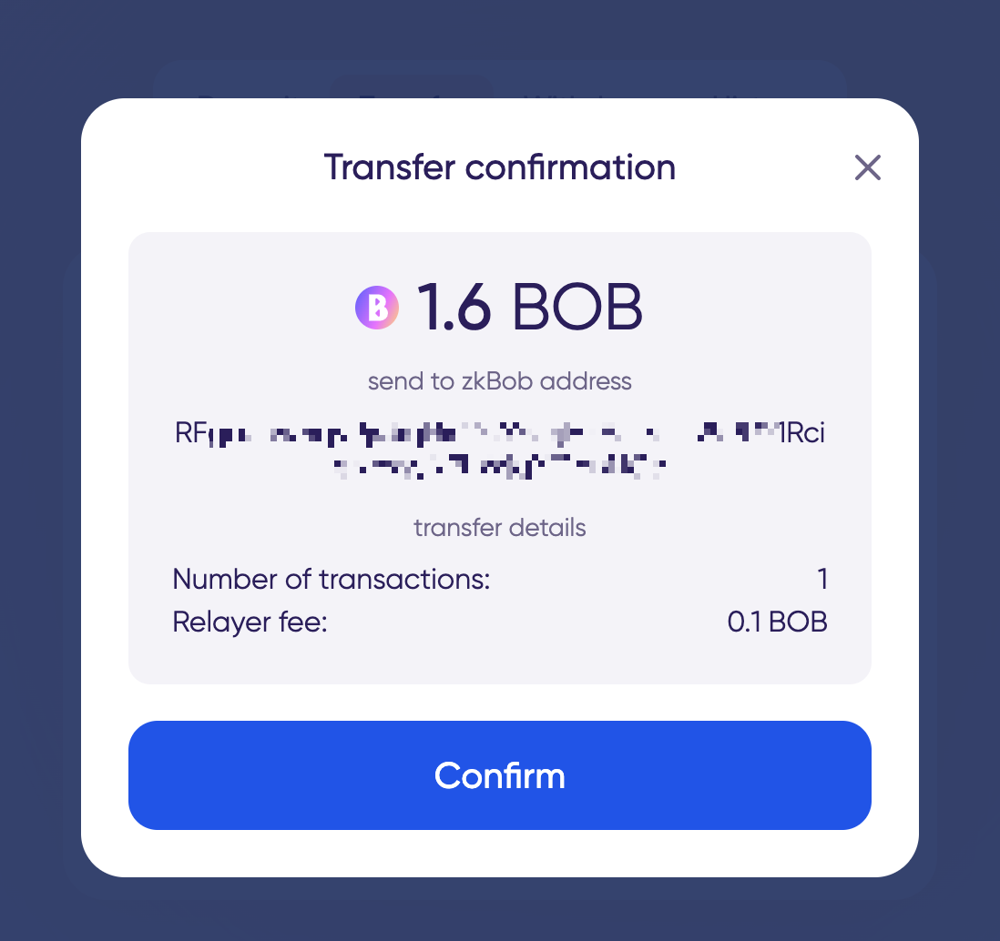
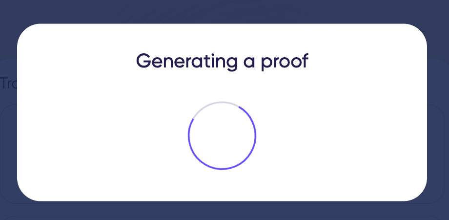
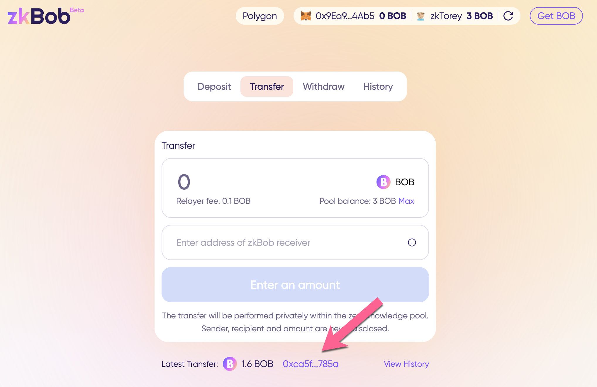

# Transfers

Transfers are made within the zkpool between zkAccounts. You do not transfer to an 0x account, but rather to another zkAccount holder's generated receiving address. Typically, the receiver will send you a [generated receiving address](../generate-a-secure-address.md) via a private channel, invoice, or some other private method.&#x20;

This also means you do not need to connect MetaMask, WalletConnect or any other web3 wallet. Transfers occur within the application with no need for outside wallet connections.

zkAccount addresses are not fixed. You can generate a new address for each incoming transaction. **It is not possible to link different private addresses to one another or to the primary account.** Only the account owner can confirm ownership of a private address.

Each created address is encoded in base58 format. For example `5fkW3dXTvA8Kizt1EbuRyjWofuqR4Ud1YTjGgY1r8nGosDeSaUreq6bwfF61jWL`

Any previously generated address can be used indefinitely, so if you send an address to one party and then generate a new address to send to another party, both can be used to receive token transfers.

See [Receiving a Transfer](./#receiving-a-transfer) for instructions on generating a zkAccount address.


The minimum transfer amount is 0.05 BOB. A 0.10 fee is added to each transfer.


## Sending a Transfer

1\) Check your zkAccount is connected (you will see zk_AccountName_ and an amount of BOB if it is connected). Since you will not be depositing funds, it is your choice whether or not to connect your MetaMask/WalletConnect wallet.

<figure><figcaption></figcaption></figure>

2\) Enter information and initiate the transfer.

1. Amount to transfer.
2. Receiver's zkAddress.
3. Press **Transfer.**


Receiver should send you a generated address from the application _\<see_ [_Receiving a Transfer_](./#receiving-a-transfer)_>_


<figure><figcaption></figcaption></figure>

3\) **Confirm** transfer details.

<figure><figcaption></figcaption></figure>

4\) Wait for proof generation and transfer completion. Transfers cost 0.10 BOB per transfer.


Do not refresh during the transfer process. This typically takes less than 1 minute but can be longer during times of high network congestion.


.png>)

Once completed you will see the latest transfer in the app. You can also check the History tab to see transfer details. Click the transaction hash to view the private tx in Polyscan.

<figure><figcaption>
Latest transfer
</figcaption></figure>

<figure><figcaption></figcaption></figure>

Tx details in Polyscan: [0xca5f18509ae64f4e24def56453afbce8edb86ff2f4146bbe5db1205002ed785a](https://polygonscan.com/tx/0xca5f18509ae64f4e24def56453afbce8edb86ff2f4146bbe5db1205002ed785a)

<figure><figcaption></figcaption></figure>

## Receiving a Transfer

Generate and send a zkAddress to the sender to receive a shielded transfer.

1\) Press the zkAccount button.

<figure><figcaption></figcaption></figure>

2\) Press **Generate receiving address**.

<figure><figcaption></figcaption></figure>

3\) Copy generated address and send to your friend via a private channel of your choice.

<figure><figcaption></figcaption></figure>

4\) Wait for receipt. If your zkBob application remains open, you can refresh using the refresh button next to your zk account. If you refresh the browser itself, you will need to re-enter your password.

Once received, check the history tab to see the transaction, and press the tx hash for more details.

