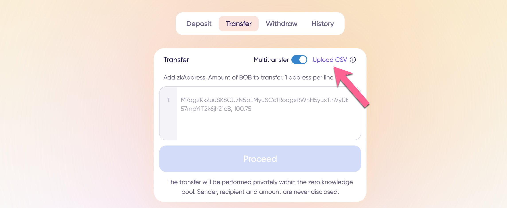

# Multitransfers


Examples are performed with BOB on Polygon. However, **the BOB pool is now a USDC pool on Polygon**. You can also follow the instructions to deposit BOB or ETH on Optimism.


Multitransfer allows multiple transfers to be processed in a single transaction. There are no limits to the number of transfers, and the entire process can be completed with a single proof and a single 0.10 relayer fee.  Each transfer adds an additional note to the zkproof, which can slightly increase proof generation time. Other than that, multitransfer is as smooth and seamless as an ordinary zkBob transfer!


💡 Learn more about how multitransfers sets zkBob apart as a privacy solution i[n this mirror post](https://mirror.xyz/0x6132eB883e88CD4E007552b871A6444Bfc34E837/mjYXeD7a005fdCu6dKdohfrSpcqpsuetW6djT46bDFk).


## Get Started

1\) To start a multitransfer, go to the **Transfer tab** and toggle the multitransfer switch.&#x20;

<figure><figcaption></figcaption></figure>

2\) The interface will change to allow entry of multiple zkAddresses and amounts. You can either add manually or by uploading a csv.\
\
**Manually**: Add in the zkAddress along with the amount to transfer, 1 per line. The format should be ZKADDRESS, AMOUNT

Press Proceed to continue.

<figure><figcaption></figcaption></figure>

**CSV:** If preferred, you can add directly from a CSV. Click Upload CSV and select a completed csv file from your computer (ZKADDRESS, AMOUNT  one  per line). The information will automatically populate into the box on the app.

<figure><figcaption></figcaption></figure>

<figure><figcaption></figcaption></figure>

<figure><figcaption></figcaption></figure>

3\) Next, check the details (Click view all).

<figure><figcaption>
 
</figcaption></figure>

<figure><figcaption></figcaption></figure>

4\) If all looks good close the modal and click **Confirm multitransfer**.&#x20;

<figure><figcaption></figcaption></figure>

5\) The application will generate a proof and your transaction will process. Once completed you can see details about multitransfers in your transaction history.

<figure><figcaption></figcaption></figure>

<figure><figcaption></figcaption></figure>
