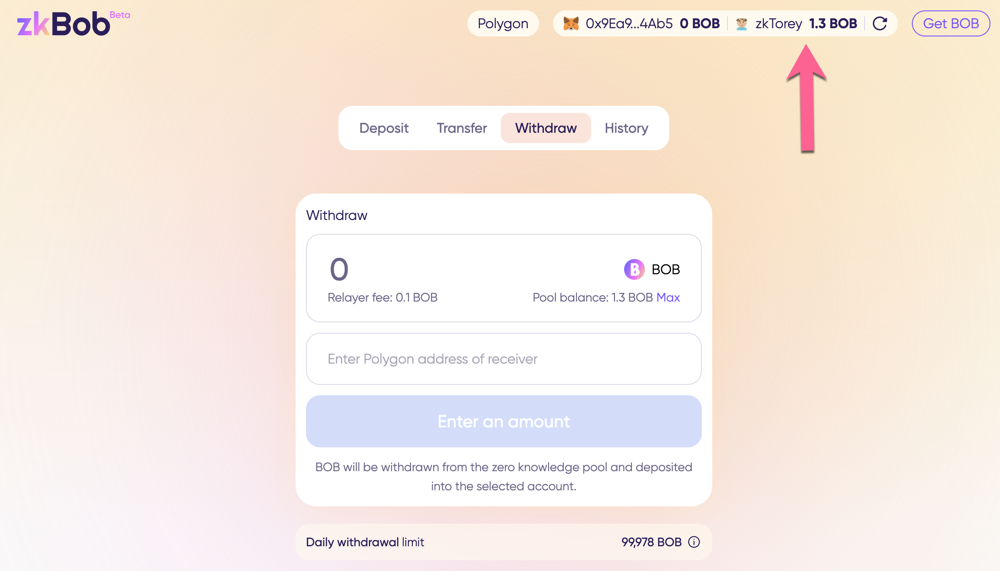
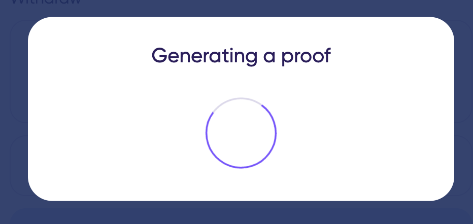
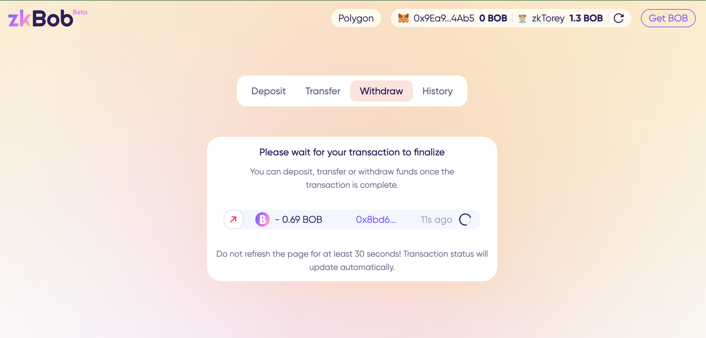
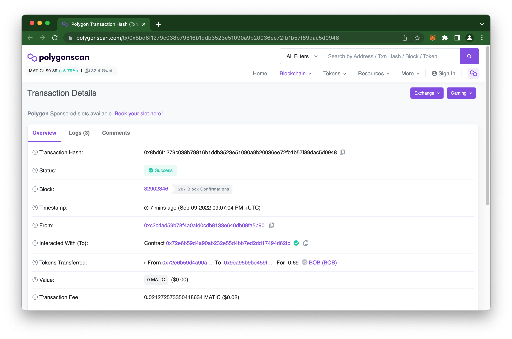

# Withdrawals

Withdrawals to move assets from the zkpool to an 0x address on Polygon. You can specify any account to receive the funds, and do not need to connect your wallet to complete a withdrawal. This can be a newly generated address or any address you prefer.


When you withdraw 10.0 or more BOB to a receiving address on Polygon with a 0 MATIC balance, 0.1 MATIC will be automatically deposited to that address. This allows you to use an address immediately to swap or send BOB without needing to get MATIC. The faucet is not currently available on the Optimism instance.

**Typically this will work quickly, however faucet requests for 0.1 MATIC can be delayed in case of high network activity and gas price spikes.**


1\) Connect your zkAccount.

<figure><figcaption></figcaption></figure>

2\) Specify details.

1. Amount of tokens to withdraw.
2. Receiver's 0x address.
3. Press **Withdraw.**

<figure><figcaption></figcaption></figure>

3\) **Confirm** to proceed with the withdrawal.

<figure><figcaption></figcaption></figure>

4\) Application will generate a proof and confirm the withdrawal.

.png>)

5\) Close the modal and wait for the withdrawal to finalize. Until the transaction is complete your balances may not reflect accurate amounts.

<figure><figcaption></figcaption></figure>

Once the transaction is finalized you will see your latest withdrawal in the app, and can click on the History tab to view all transactions. Click on the hash to view details on Polyscan.

<figure><figcaption></figcaption></figure>

Polyscan tx: [0x8bd6f1279c038b79816b1ddb3523e51090a9b20036ee72fb1b57f89dac5d0948](https://polygonscan.com/tx/0x8bd6f1279c038b79816b1ddb3523e51090a9b20036ee72fb1b57f89dac5d0948)

<figure><figcaption></figcaption></figure>
