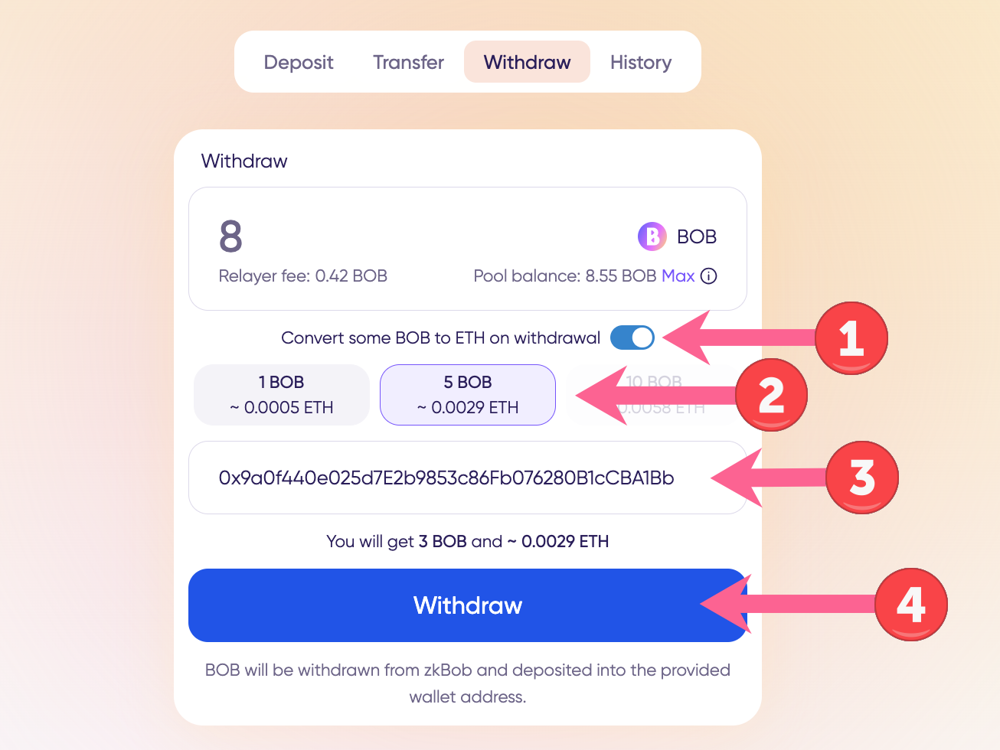
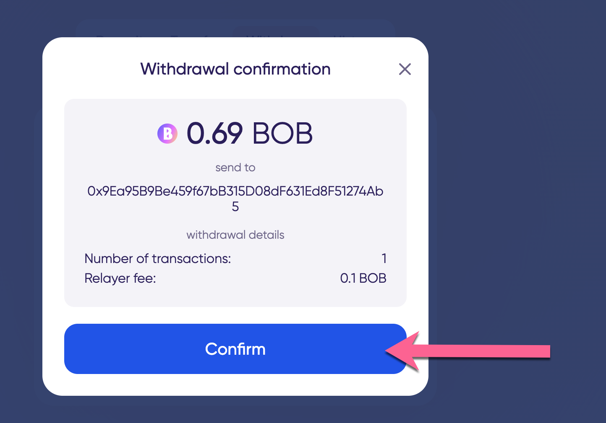

# Native Token Conversion


Examples are performed with BOB on Polygon. However, **the BOB pool is now a USDC pool on Polygon**. You can also follow the instructions to deposit BOB or ETH on Optimism.


You may want to withdraw BOB to a new address on Polygon or Optimism. To use this address immediately, it helps to have some native tokens sent along with BOB to cover any gas fees.

The native token conversion feature lets you convert 1, 5, or 10 BOB into native tokens (MATIC on Polygon, ETH on Optimism) during the withdrawal process.

## Token Conversion Withdrawal Process

Go to the Withdraw tab in the application and enter the amount you'd like to withdraw.

1. Toggle the switch to convert some BOB to ETH (or MATIC) on withdrawal.
2. Select the amount to convert. You can choose 1 BOB, 5 BOB, or 10 BOB if you are withdrawing enough to cover these amounts.
3. Enter the address you want to withdraw to. This can be a newly created address or any existing `0x` address.
4. Click Withdraw.

<figure><figcaption></figcaption></figure>

## Complete the Withdrawal

A popup with details will allow you to confirm and complete the transaction. Relayer fees (dynamic fees on Optimism, 0.1 fee on Polygon) are paid with BOB during the withdrawal process and you will not need to sign a transaction in any connected wallet. It may take a minute to create the proof and initiate the withdrawal from the zero knowledge pool.

<figure><figcaption></figcaption></figure>

