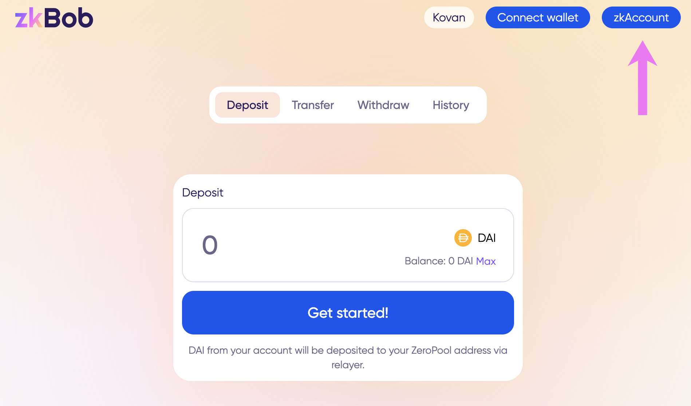
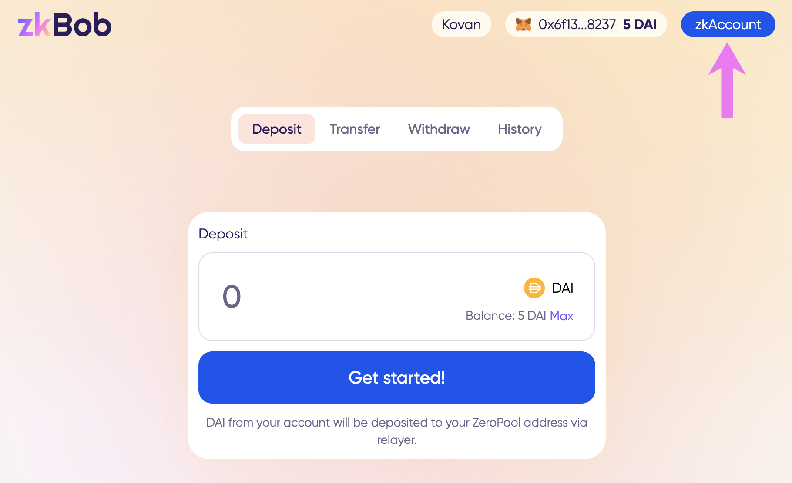
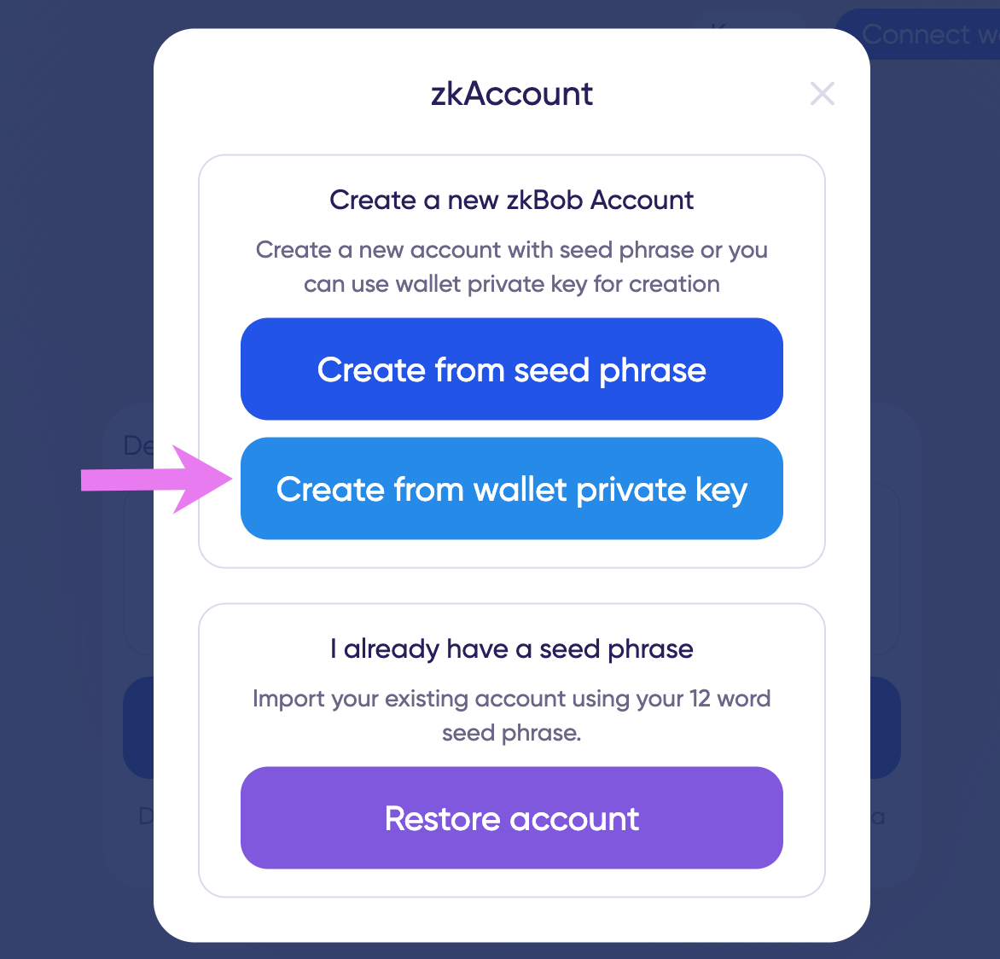

# Account Creation


All actions are performed on a test application running on Kovan testnet. Instructions will be updated when app is live in production.


There are 2 ways to create a zkBob shielded account.&#x20;

1. ****[**Use a seed phrase**](./#seed-phrase). The application generates a seed phrase for you to store securely. You can use this seed phrase to restore your account as needed from any computer.
2. ****[**Use a web3 wallet**](./#web3-wallet) **(MetMask/WalletConnect)**. The application collects a signature locally on your browser - not on the blockchain. It uses the private key from your web3 wallet to derive a secure zkBob account address.

## Seed Phrase

1\) Press the **zkAccount** button on the home screen.

2\) Select **Create from seed phrase** in the popup box.

3\) View and write down your phrase somewhere safe (offline). It is not recommended to use the copy feature or keep your seed phrase on the computer.&#x20;

4\) Re-enter your phrase by clicking on the words in order. Click **Verify** when you are done.

5\) Create and confirm a password to use for accessing your account. You will enter this password each time the page refreshes and to access your account.

5\) Your zkBob account is created! The name of the account is auto-generated, beginning with zk. You can use this account to receive transfers and withdraw to another 0x address without ever connecting a web3 wallet.


If you want to [deposit funds](../deposits.md) to your zkAccount, [connect your 0x wallet on Gnosis Chain](./#web3-wallet).



When using the same computer/browser for future zkBob sessions, you can access your account with only your password (assuming local storage has not been cleared). If you change browsers/computers or clear local storage, re-enter your seed phrase and create a new password to restore the account.


## Web3 Wallet

1\) Press the **zkAccount** button on the home screen. If your MetaMask or other web3 wallet is not yet connected to the application, you will be prompted to connect. If your web3 wallet is already connected 🦊, [skip to the next section](./#web-3-wallet-connected).

2a) Click **Connect wallet**.

2b) Select Wallet type.

2c) Follow prompts to connect and switch to Gnosis Chain network if needed. Once connected you be redirected to the home screen and your 🦊 wallet and balance displayed.  Click the **zkAccount** button to continue.

### Web 3 Wallet Connected

3\) Select Wallet Key in the popup box.

4\) Generate Key (this is a no-cost message, key is stored locally).&#x20;

5\) Sign message in MetaMask. __ Make sure to double check that Origin is the correct URL. [More info here](metamask-web3-wallet-warning.md). _(need updated screenshot with correct URL once app is out of testing phase)._

6\) Create and Re-enter password.

6\) You should now have 2 connected accounts, your web 3 wallet address 🦊 and your zkAccount, which is auto-named beginning with zk...

.png>)


Next:&#x20;

* [Make a Deposit](../deposits.md)
* [Receive a Transfer](../transfers.md)
* [Withdraw Funds](../withdrawals.md)

