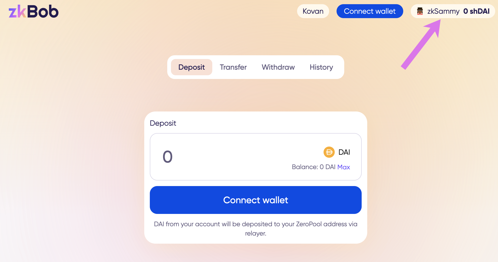

# Account Creation

There are 2 ways to create a zkBob shielded account.&#x20;

1. ****[**Use a seed phrase**](./#seed-phrase). The application derives a seed phrase for you to store securely. You will use this seed phrase to restore your account as needed.
2. **Use a web3 wallet (MetMask/WalletConnect)**. The application collects a signature and uses the private key from your web3 wallet to derive a zkBob account address.

## Seed Phrase

1\) Press the **Set up Account** button on the home screen.

2\) Select **Create from seed phrase** in the popup box.

3\) View and write down your phrase somewhere safe (offline). It is not recommended to use the copy feature or to keep your seed phrase on the computer.&#x20;

4\) Re-enter your phrase by clicking on the words in order. Click Verify when you are done.

5\) Create and confirm a password to use for accessing your account. You will enter this password each time the page refreshes and to access your account.

5\) Your zkBob account is created! The name of the account is auto-generated, beginning with zk.


Next, connect your 0x wallet on Gnosis Chain to deposit funds to your zkAccount.



When using the same computer/browser for future zkBob sessions, you can access your account using only your password (assuming local storage has not been cleared). If you change browsers/computers or clear local storage, you will re-enter your seed phrase and create a new password to restore the account.


## Web3 Wallet

steps

