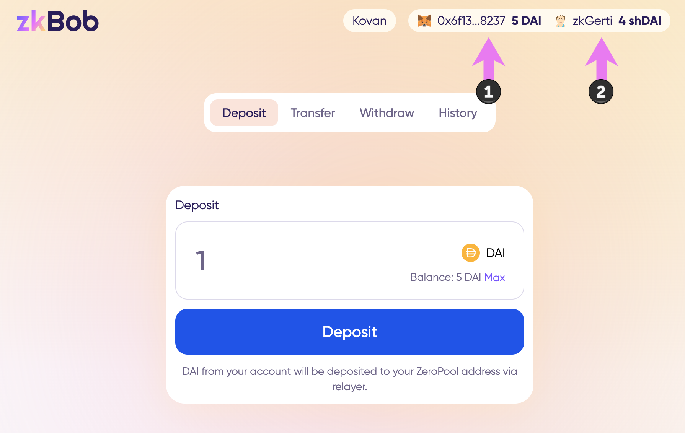
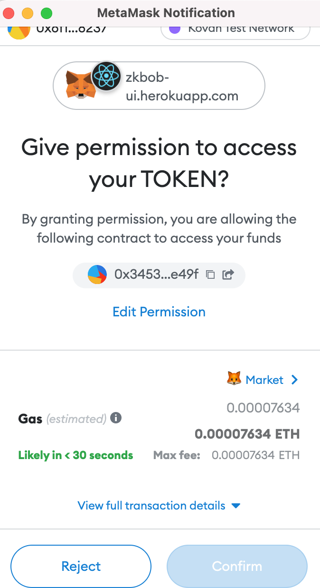
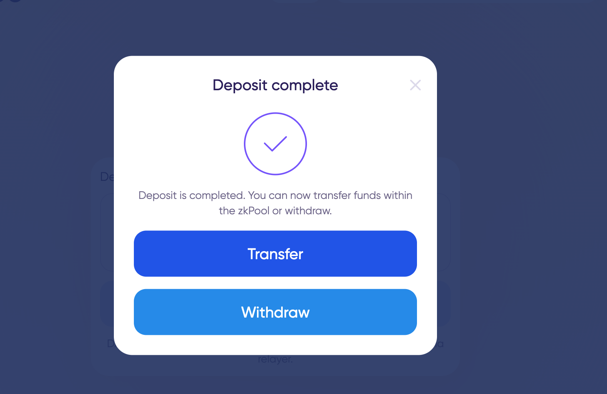
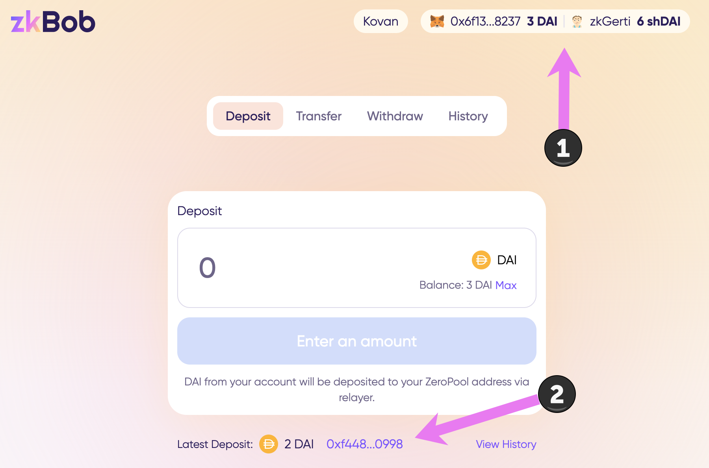
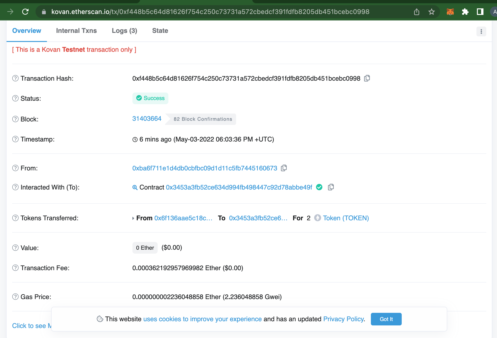

# Deposits


All actions are performed on a test application running on Kovan testnet. Instructions will be updated when app is live in production.


Deposits to the zkBob pool involve moving assets from a web3 wallet address into a zkAccount. You can use the UI to easily connect a wallet and deposit into a zkAccount.

1\) Check your [accounts are connected](account-creation/).

1. Web3 wallet address
2. zkAccount

_If you have previously setup your zkBob account with the private key method from a wallet, but the accounts are not instantly connected,_ [_follow the prompts_](account-creation/#web-3-wallet-connected) _to reconnect your account._

2\) You should have some amount of tokens available to deposit and a small amount of the native token (ie Kovan ETH) for gas. Select the amount and press **Deposit**.

3\) Approve the contract to access the token and make a deposit in MetaMask.

4\) Wait for several prompts as access is approved and a proof is generated. Next, sign the message and wait for the relayer to complete the deposit.

.png>)

5\) Your deposit is complete! You can now transfer to another zkAddress in the pool or withdraw.&#x20;

7\) Return to the application.


Note: It may take several minutes to update the pool state. If your balances do not update you can refresh the page, but you will need to re-enter your password to access the app.


1. View new balances reflected in the app.
2. Click to check transaction details.

* Tx details in Etherscan: [0xf448b5c64d81626f754c250c73731a572cbedcf391fdfb8205db451bcebc0998](https://kovan.etherscan.io/tx/0xf448b5c64d81626f754c250c73731a572cbedcf391fdfb8205db451bcebc0998)

