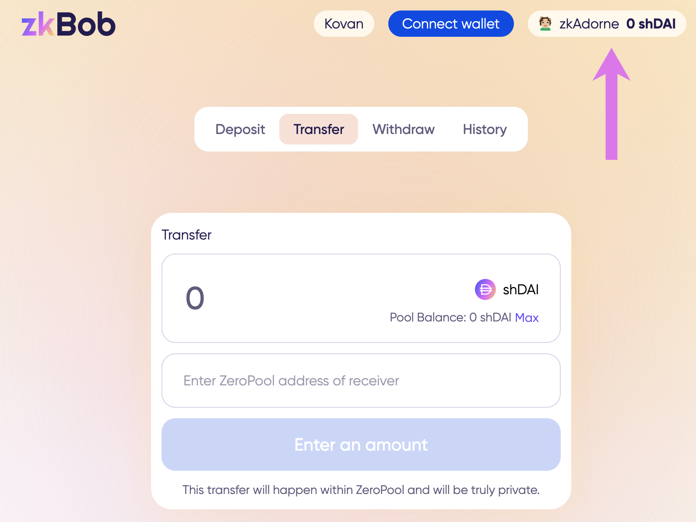
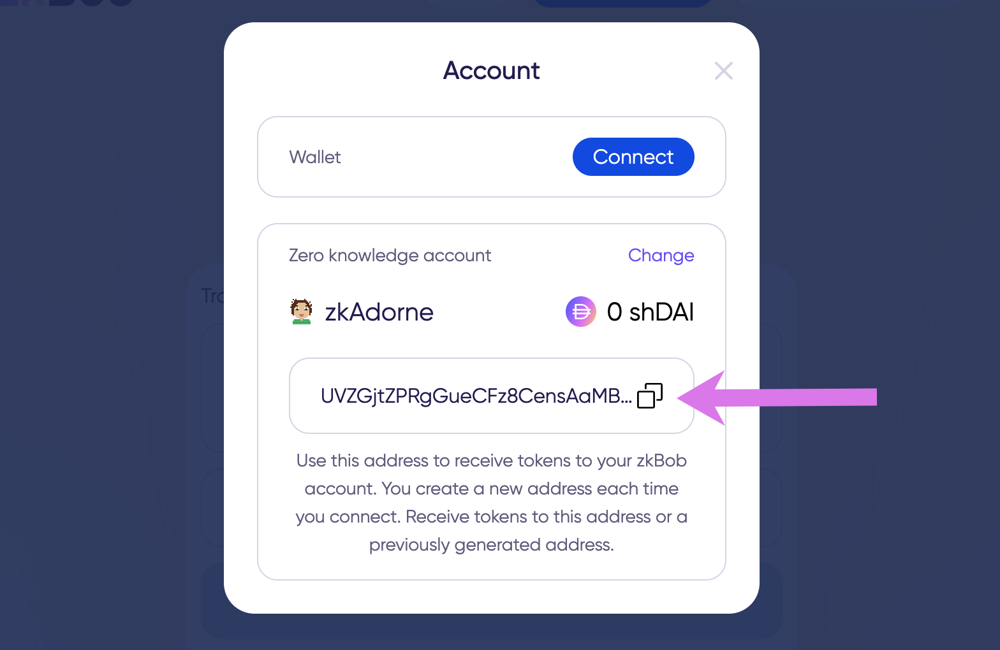
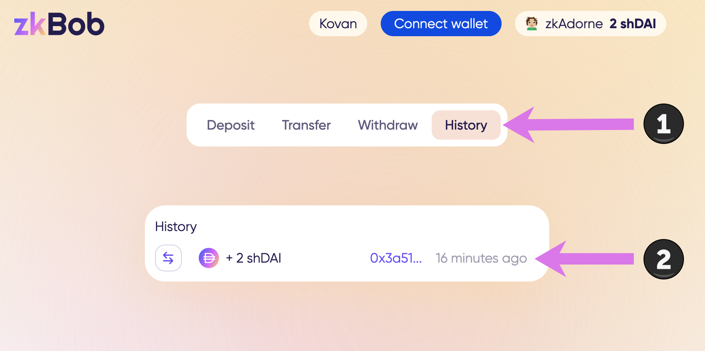

# Generate a Secure Address


All actions are performed on a test application running on Kovan testnet and using test Dai rather than Bob tokens. Instructions will be updated when app is live in production.


If you are receiving funds from another zkBob user, you will want to send them a secure address. A new secure address is generated for each transfer.&#x20;

**It is not possible to link different private addresses to one another or to the primary account.** Only the account owner can confirm ownership of a private address.

Each  zkAddress is encoded in base58 format. For example `5fkW3dXTvA8Kizt1EbuRyjWofuqR4Ud1YTjGgY1r8nGosDeSaUreq6bwfF61jWL`

Any previously generated address can be used indefinitely, so if you provide an address to one party and then generate a new address to provide to a second party, both can be used to receive token transfers.

## Generate a zkAddress

1\) Press the zkAddress button.

2\) Press **Generate receiving address**.

3\) Copy generated address and send to your friend via a private channel of your choice.

4\) Wait for receipt. If your zkBob application remains open, you may need to refresh the page to see the changes. In this case, you will need to re-enter your password to proceed.

Once received, check the history tab to see the transaction, and press the tx hash for more details.

* Tx details in Etherscan: [0x3a510a0b06f6f077283731208da4c53a](https://kovan.etherscan.io/tx/0x3a510a0b06f6f077283731208da4c53ae0548a91ef6aeed066b78b71965a5466)

