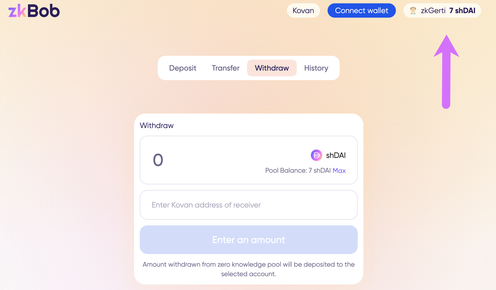
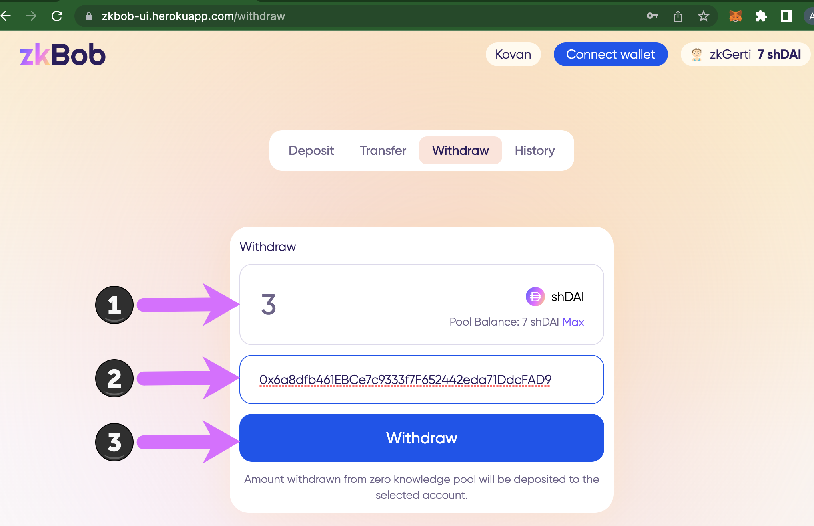
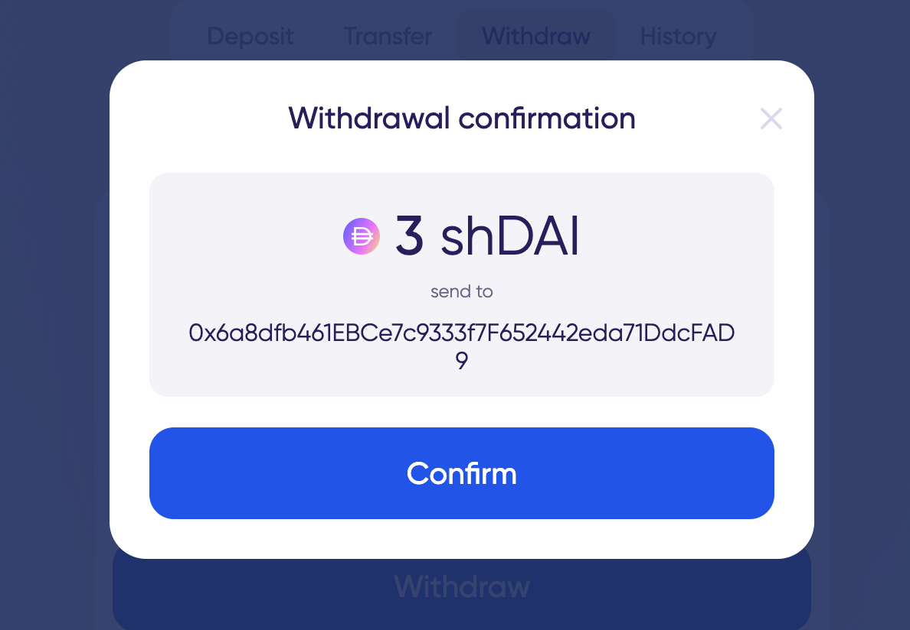
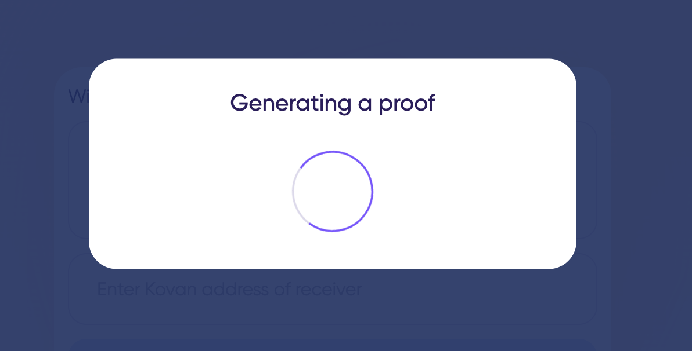
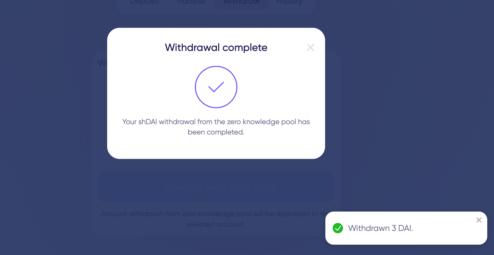
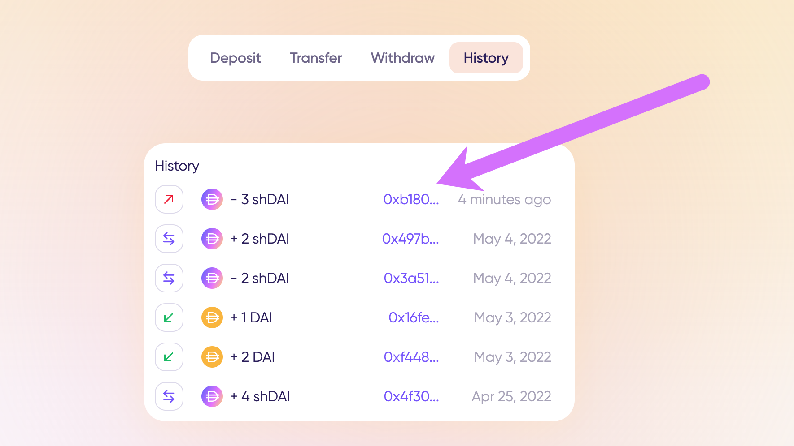
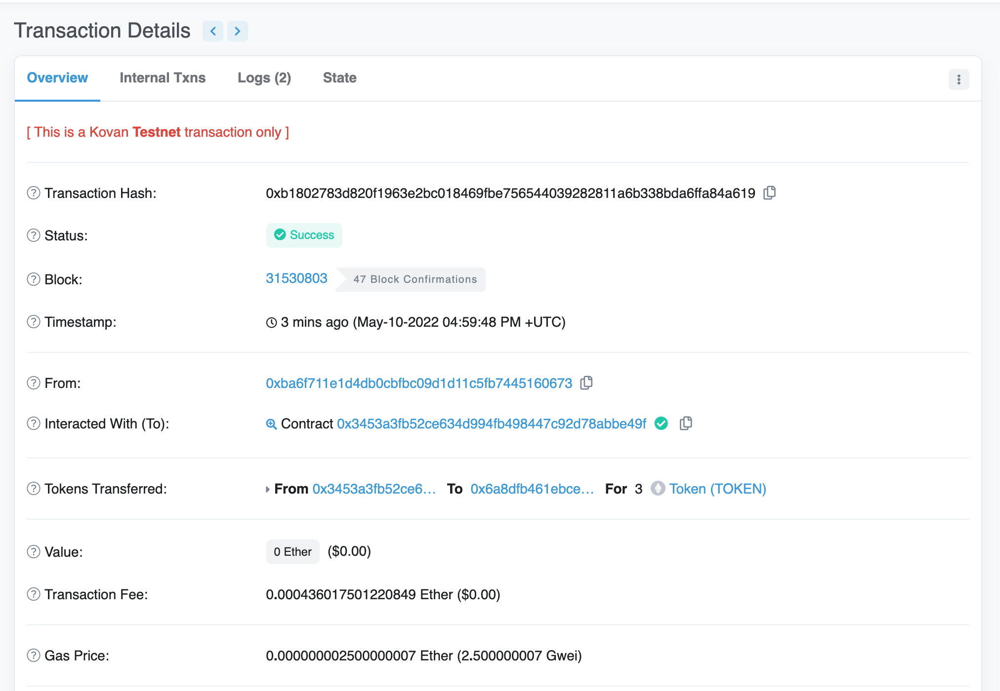

# Withdrawals


All actions are performed on a test application running on Kovan testnet. Instructions will be updated when app is live in production.


Withdrawals to move assets from the zkpool to a web3 0x address. You can specify any account to receive the funds, and do not need to connect your wallet to complete a withdrawal.

1\) Connect your zkAccount.

2\) Specify details.

1. Amount of tokens to withdraw.
2. Receiver's 0x address.
3. Press **Withdraw.**

3\) **Confirm** to proceed with the withdrawal.

4\) Application will generate a proof and confirm withdrawal.

5\) Check the history tab to view your zkAccount withdrawals. Press to check in the block explorer.

Tx: [0xb1802783d820f1963e2bc018469fbe756544039282811a6b338bda6ffa84a619](https://kovan.etherscan.io/tx/0xb1802783d820f1963e2bc018469fbe756544039282811a6b338bda6ffa84a619)

