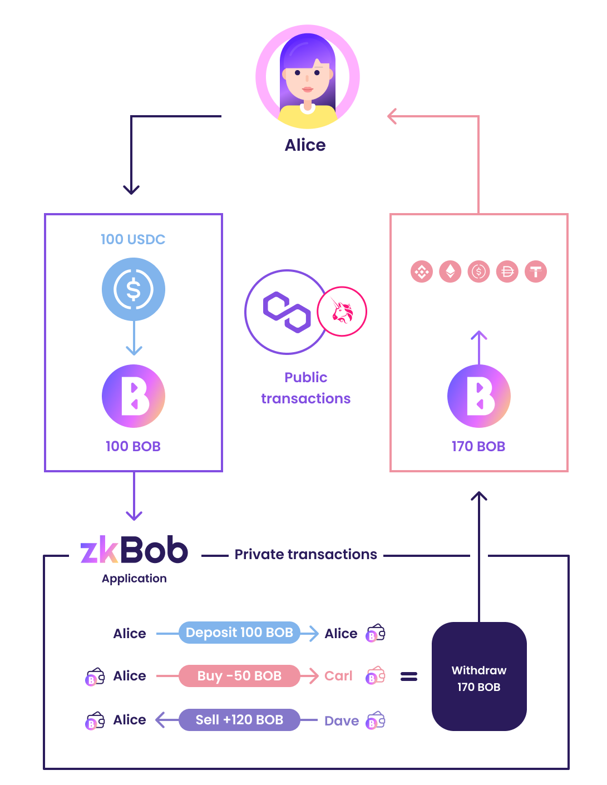

# Vendor Purchasing

Businesses often need to keep the details of their purchases confidential to maintain a competitive advantage. This includes information about the vendors they use and the prices they pay for wholesale goods. With zkBob, these details can be kept private, while transactions can still be referenced as needed for record keeping purposes.

## Generic Use Case: **Alice** 🐇 the Comic Book Collector&#x20;

<figure><figcaption>
Alice uses blockchain for her comic book business
</figcaption></figure>

Alice runs a small business buying and selling comic books. She does a lot of business on the blockchain, but prefers to keep the details of her purchases, sales, and customers private. Luckily, she finds zkBob!

1. Alice uses 100 USDC to purchase 100 BOB stable tokens on Uniswap v3 on Polygon.&#x20;
2. She creates a zkBob account using the private key from an existing Ethereum Externally Owned Account (EOA). She could also create directly from a seed phrase, but chooses to create using MetaMask 🦊.
3. Once the account is connected, Alice deposits her 100 BOB into the zkBob pool.
4. Alice wants to buy an original Marvel comic from Carl.  She messages Carl and he sends her a private address generated in the zkBob app. Alice transfers 50 BOB to Carl within the pool and he mails the Marvel.
5. She is also owed some funds from Dave for a Ghost Rider. She sends him a generated address and he sends her 120 BOB. Transfers are catalogued in the UI for her own private records, but there are no details of the sender, receipient or amounts available publicly.
6. Alice is ready to withdraw, but she waits a few days to allow the anonymity set to grow. Alice then orders a withdrawal to a newly generated EOA.&#x20;
7. After the withdrawal, Alice has a new 0x account with 170 BOB and 0.10 MATIC for transactions. She converts the BOB back to tokens of her choice (Eth, USDC, DAI etc) on Uniswap. There is no way to determine who bought or sold the comics and the prices that were paid.

Alice, Carl and Dave are able to preserve their anonymity and grow their comic collections safely and securely, thanks to zkBob!
