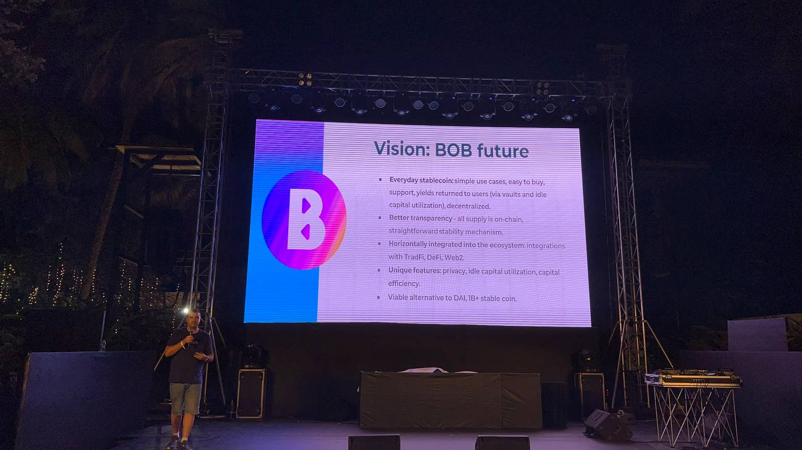

# Conferences & Workshops

The zkBob decentralized team is spreading the word about personal privacy options, compliance features, and zk tech through participation and sponsorship at many blockchain conferences and hackathons. We are partnering with [ETHGlobal](https://ethglobal.com/) to sponsor several hackathons in 2023, and also participating at other conferences when we can.

Below are some highlights from events we've attended. See the [zkBob blog](https://blog.zkbob.com) for more in-depth overviews from these conferences.

## ETHIndia

Kirill ran a workshop for hackers on the zkBob app and how to integrate v1 for this hackathon. Starts at 57:50.



### Gweithering

Igor presented at the [Gweithering](https://www.gweithering.xyz/) , an outside event before ETHIndia put on by our friends at [Biconomy](https://www.biconomy.io/), [Superblock](https://www.superblock.one/), and [Frontier](https://www.frontier.xyz/).&#x20;

<figure><figcaption></figcaption></figure>

## ETHDenver

Andrew spoke on compliant privacy features and enabling personal financial privacy with zkBob.



## ETHTokyo

Kirill presented on BOB and how to integrate zkBob direct deposits into an application. The talk starts at 39:45.



## ETHTaipei

Igor presented on privacy, compliance, and zk proofs.

<figure><figcaption></figcaption></figure>

<figure><figcaption></figcaption></figure>

