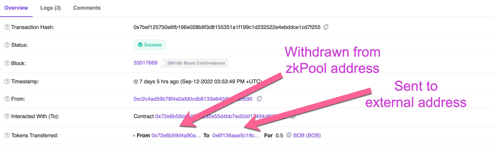
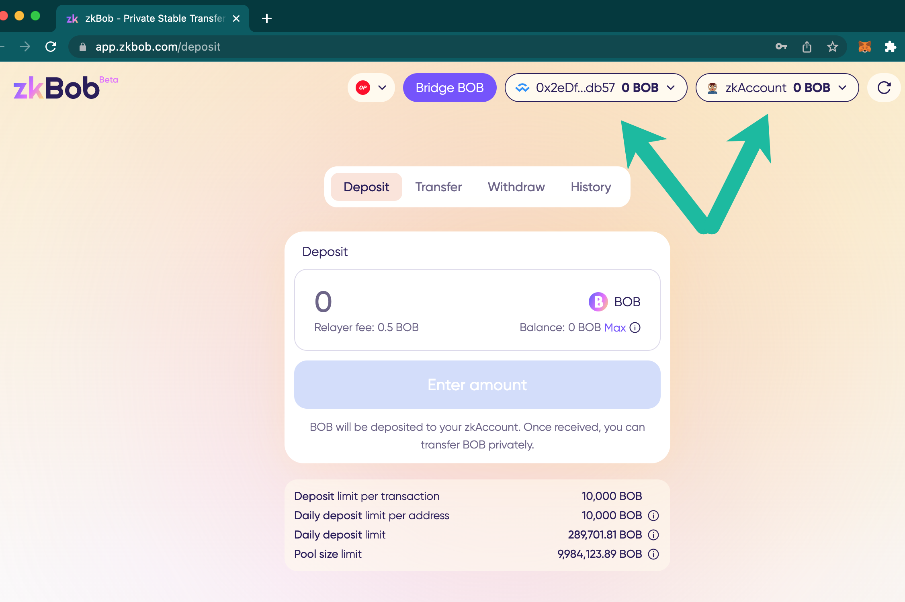
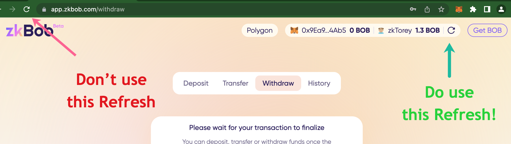
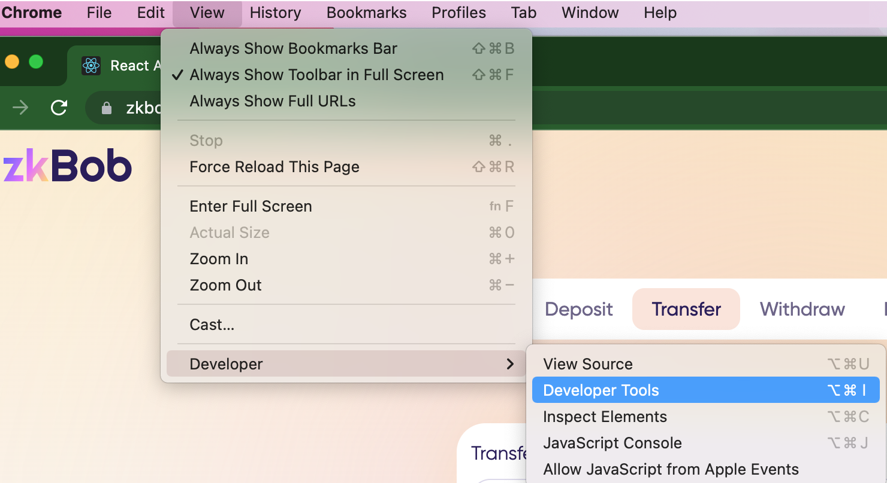
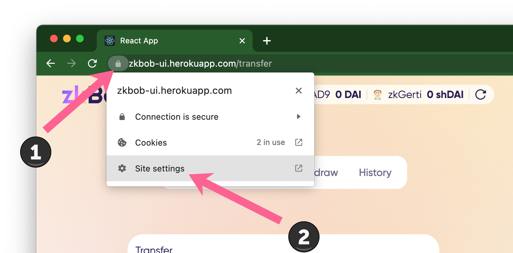
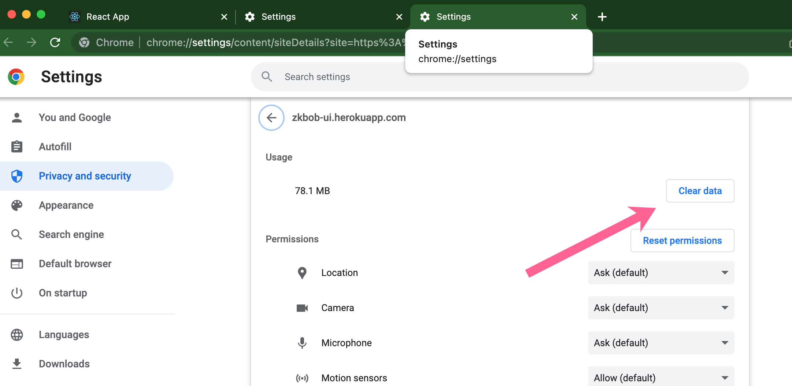

# zkBob FAQ


**General Questions**

* [Who should use zkBob?](faq.md#who-should-use-zkbob)
* [Who should not use zkBob?](faq.md#who-should-not-use-zkbob)
* [Is the code open source?](faq.md#is-the-code-open-source)
* [Who heads development and deployment?](faq.md#who-heads-development-and-deployment)
* [Does zkBob work on mobile?](faq.md#does-zkbob-work-on-mobile-devices)
* [Why does zkBob use the BOB stablecoin?](faq.md#why-does-zkbob-use-the-bob-stablecoin)
* [Do I need MATIC to use zkBob?](faq.md#do-i-need-matic-to-pay-for-transactions)
* [Where can I see zkBob stats?](faq.md#where-can-i-see-zkbob-stats)

**Privacy**

* [How long should I keep my tokens in a zkBob anonymity pool to increase privacy?](faq.md#how-long-should-i-keep-my-tokens-in-a-zkbob-anonymity-pool-to-increase-privacy)
* [Are deposits and withdrawals completely private?](faq.md#are-deposits-into-zkbob-and-withdrawals-from-zkbob-private)
* [Can the zkBob application be compromised and my information made available?](faq.md#can-the-zkbob-application-be-compromised-and-my-information-made-available)

**Accounts and Addresses**

* [I made deposits to 1 zkAccount from multiple 0x addresses on Polygon. Is information tying these deposits to a single zkAccount available in the on-chain data?](faq.md#i-made-deposits-to-1-zkaccount-from-multiple-0x-addresses-on-polygon.-is-information-tying-these-dep)
* [Why are there multiple accounts?](faq.md#why-are-there-multiple-accounts)
* [What is the difference between an account and an address?](faq.md#what-is-the-difference-between-an-account-and-an-address)
* [I generated a new zkBob address, will my old one still work?](faq.md#i-generated-a-new-zkbob-address-will-my-old-one-still-work)
* [What if I lose my password?](faq.md#what-if-i-lose-my-password)
* [Why do I need to keep entering my password?](faq.md#why-do-i-keep-having-to-enter-my-password)
* [Why is my zkBob transaction taking almost a minute to process?](faq.md#why-is-my-zkbob-transaction-taking-almost-a-minute-to-process)
* [I just sent a transactions on zkBob which has not processed yet. Do I need to wait to perform another action (deposit/transfer/withdrawal)?](faq.md#related-i-just-sent-a-transaction-on-zkbob.-why-do-i-have-to-wait-to-perform-another-deposit-transfe)
* [I can't connect to my zkBob account or I am stuck at "Updating Zero Pool State" or "Loading zkAccount."](faq.md#i-cant-connect-to-my-zkbob-account-or-i-am-stuck-at-updating-zero-pool-state-or-loading-zkaccount.)


## Who should use zkBob?

Users should first check their jurisdiction and [make sure they are in compliance](compliance-and-security.md). zkBob is not available to users in some areas.

Eligible users interested in private business transactions (salary payments, vendor payments etc) and people interested in cash-like transactions should consider zkBob. In the offline world, cash can be used for financial privacy. In the blockchain space, zk-based "digital cash" transactions can offer similar privacy.

Some users of zkBob may include:

* Large cryptocurrency holders who want to protect their identity and reduce possible targeting by cyber criminals.
* Individuals or groups who hold many identifying NFTs in their wallets and may want to make a transaction without exposing all of those details (ie communities/DAO/meetup participation etc).
* Business owners who want to pay salaries in stablecoins without displaying amounts and receivers.
* Business owners who do not want to divulge vendor addresses, prices they paid for items, or other business transactions that can put them at competitive risk.
* DAOs or small businesses who want to pay salaries in stable tokens without revealing amount paid to every employee or member.&#x20;
* Everyday users who want a "digital cash" option to transfer and trade for goods and services with one another privately through a shielded pool.&#x20;
* Philanthropists who want to donate to causes anonymously.
* Individuals interested in privacy, zksnarks, or novel auction mechanisms related to [XP functionality](../roadmap/exploratory-features/xp/).

## Who should not use zkBob?

Users is countries where zkBob is prohibited should not use zkBob. Please check the [compliance section](compliance-and-security.md) for more information.

zkBob should not be used for any illegitimate or criminal activity. It should not be used in any way that violates any laws in the jurisdiction of the user, and should not be used by politically exposed individuals or associates of those individuals. Prior to using zkBob, you must acknowledge and accept these terms of usage:

* If acting as an individual you are of legal age (as applicable in the jurisdiction where you live).
* You are not a politically exposed person, that is, a person who is entrusted with any prominent public function, or a politically exposed person who has stepped down from that role.
* You are not an immediate family member or close associate of a politically exposed person or a politically exposed person who has stepped down.
* You are not engaged in money laundering or the financing of terrorism.
* Your access to the application does not violate any rule, law, regulation or directive of the country of your residence and the jurisdiction in which you reside.
* You have not been arrested or convicted of any offense or crime.
* You are willing to provide and verify your identity upon request.

## Is the code open-source?

The underlying code is open-source and anyone can deploy contracts, a relayer, and a cli to perform basic operations. The UI is not currently open-source to avoid simple clones. [Source code is available here](https://github.com/zkbob).&#x20;

## Who heads development and deployment?

zkBob is a decentralized, open-source application with a distributed & decentralized team and no centralized head of development. The app was initiated by the xDai research group in collaboration with [ZeroPool](https://zeropool.network/) and community support. A production instance of zkBob is [deployed on Polygon](https://app.zkbob.com/).

## Does zkBob work on mobile devices?

**zkBob DOES NOT currently work on iPhones and is limited on Android devices.** Proof generation is resource intensive and can be problematic on many mobile devices. We recommend using a desktop/laptop environment for zkBob. We are exploring library updates in the next version which will support parallel processing and other optimizations for mobile.

## Why does zkBob use the BOB stablecoin?

zkBob is designed to use BOB for several reasons. BOB is stable, flexible (multi-chain, multi-collateral), and can be optimized so that users receive additional benefits. For questions related to BOB, please see the [BOB details](../bob-stablecoin/bob-details.md) page.

## Do I need MATIC to pay for transactions?

**No**, all fees are paid in BOB with a stable $0.10 fee per tx! This includes deposits into the protocol, transfers within zkBob, and **withdrawals** from the application.

Withdrawals from zkBob will also result in 0.10 MATIC sent to the receiving address if certain criteria are met. To receive, the address must have a 0 MATIC balance, and the withdrawal amount must be 10 or more BOB.

If you want to purchase BOB in other ways ([Uniswap](../bob-stablecoin/get-bob-on-uniswap-v3.md) or [Metamask swap](../bob-stablecoin/swap-bob-with-metamask-swap.md)), you will need a small amount of MATIC to complete the transaction.

## Where can I see zkBob stats?

zkBob dune analytics dashboard [https://dune.com/maxaleks/zkbob ](https://dune.com/maxaleks/zkbob)is a good place to start. zkBob is also supported by Defillama [https://defillama.com/protocol/zkbob.](https://defillama.com/protocol/zkbob)

## Privacy

## How long should I keep my tokens in a zkBob anonymity pool to increase privacy?

It depends on how large the pool set is and how much activity has happened since your deposit. Looking at the number of deposits since your deposit can provide a rough estimation of safety (though not complete because it does not account for transfers within the protocol). In general, waiting longer to withdraw (several days minimum) increases privacy. It is also useful to withdraw a different amount than the amount deposited to increase privacy.

## Are deposits into zkBob and withdrawals from zkBob private?

Not completely, there is some information which is recorded on chain. It is transparent that an address interacted with the zkBOB application and how much BOB was deposited or withdrawn.

**Deposits:** When you deposit into zkBob, the 0x address on Polygon you deposited from and how much BOB you deposited into the zkBob protocol can be viewed in a block explorer. [Example Transaction](https://polygonscan.com/tx/0xe5269af7e735c45976f0c627cd138dfd000d99b160ae5c5868abcdf3c540f0cb).

<figure><figcaption>
Deposit transaction from an EOA to the zkBob Pool
</figcaption></figure>

**Withdrawals:** When withdrawing to a regular 0x address on Polygon, the address you withdrew to and amount withdrawn from the protocol can be viewed in a block explorer. [Example Transaction](https://polygonscan.com/tx/0x232df7f7a8b8051950323cb9a19450f1cfd1e19fd6618500b081e515e16fe3a4).

<figure><figcaption>
Withdrawal transaction from the zkBob pool to an EOA. 
</figcaption></figure>

## Can the zkBob application be compromised and my information made available?

With zkproof transactions specific identifying information is never recorded (such as sender, receiver, and amount sent) so it is not possible to connect these bits of information within zkBob. However, there are other ways your information may be compromised. To maintain privacy, be aware of the following.

* **Secret phrase / private key discovery**: Never write a secret seed phrase on any internet-connected device. Do not take a screenshot of it. Do not copy and paste it anywhere. Write it on a physical piece of paper and keep somewhere secure.
* **Ip-tracing**: Internet service providers collect logs that can show all ip addresses that connected to an application, including zkBob.&#x20;
* **Transaction inference:** Depositing a specific amount of tokens and then withdrawing that exact amount (especially unconventional amounts in a short timeframe) can create a compelling case for connection. Withdrawing different amounts than deposit amounts, and maintaining funds in the pool for longer periods of time, increases privacy.&#x20;
* **Address trail:** Using the same generated zkAddress for transactions with many different parties creates a connection string which can compromise privacy. It is best to generate a new address for each transfer within the application.
* **Secure address messaging**:  When sending a generated address to another party, carefully choose the application you use (ie telegram, discord etc).  It is best to choose a secure and private channel.
* **Withdrawals**: When withdrawing from the application, sending to a newly generated address without a prior transaction history is the most private method.

## Accounts and Addresses

## I made deposits to 1 zkAccount from multiple `0x` addresses on Polygon. Is information tying these deposits to a single zkAccount available in the on-chain data?    &#x20;

**No.** The only available information available is that the `0x` addresses made a deposit for a specific amount of BOB into the zkBob app. Due to the zk proving mechanisms, zkAccount details are not revealed (only confirmation that the amount was deposited), and thus there is no public record of which zkAccount the funds were deposited to within zkBob.&#x20;

## Why are there multiple accounts?

There are 2 different types of accounts displayed in the interface. One is for transferring funds **to and from zkBob (Wallet account)** and the second is for transferring funds **within zkBob (zkAccount)**.

.png>)

1. **Wallet Account**. This is a standard EOA (Externally owned address) you can connect to fund or withdraw from your zkAccount. It can also be used to generate a zkAccount using the private key from the EOA.&#x20;
2. **zkAccount.** This is the shielded account where you can transact privately with other zkAccount holders. It is auto-named starting with zk (in the example below account name is zkGerti). [More on zkAccounts](../implementation/account-and-notes/accounts.md).

## What is the difference between an account and an address?

\-> **Accounts** are used to perform actions with zkBob. You may use an EOA wallet account to deposit or withdraw, and your zkBob account to initiate deposits, withdrawals, transfers, or view your transaction history.&#x20;

\-> **Addresses** are used for shielded token transfers between users in zkBob. Ideally, a new address is generated for each transfer. It is not possible to link different private addresses to one another or to the primary account. Only the account owner can confirm ownership. Each created address is encoded in base58 format.

Learn more about [generating a receiving address here.](../zkbob-app/generate-a-secure-address.md)

## I generated a new zkBob address, will my old one still work?

Yes, it will still work. You can generate as many addresses as you would like. Each one is encrypted and cannot be connected to one another or to the primary account except by the account owner, and each one will work indefinitely.

## What if I lose my password?

You can restore your account using your original secret seed phrase. Once restored, you will be asked to generate a new password.

## Why do I keep having to enter my password?

Encrypted data is stored in local storage for safety purposes. When the app is refreshed from the browser, the password is needed to decrypt the locally-stored account data. A built-in refresh function lets you update history and balance without needing to refresh the entire application. This is useful to view your current zkaccount state once a transaction has been processed on-chain.&#x20;

The in-app refresh, located next to your zkaccount name, should be used rather than a 'hard refresh' to avoid password re-entry.

<figure><figcaption></figcaption></figure>

## Why is my zkBob transaction taking almost a minute to process?

Several processes are required for a successful transaction. Proof generation takes place on the client side and typically takes 10 seconds or less. Transactions are then processed in parallel rather than sequentially through the relayer, which optimizes the zkBob application. However, once a transaction is submitted to the chain, timing can vary based on blockchain congestion, resulting in some longer transaction times.

## Related: I just sent a transaction on zkBob. Why do I have to wait to perform another deposit/transfer/withdrawal?

For safety purposes and to prevent potential double-spend scenarios, the application waits until a transaction is confirmed before another transaction can be initiated.

## I can't connect to my zkBob account or I am stuck at "Updating Zero Pool State" or "Loading zkAccount."


If you are experiencing these issues on a mobile device please switch to a desktop/laptop. zkBob is currently not supported on mobile.


If you have entered the correct information but your account is not loading you can try clearing the cache and storage. Version updates can sometimes result in artifacts that must be cleared for the latest version to work.&#x20;

Chrome / Firefox are the recommended browsers for the zkBob UI, the following are instructions for refreshing the zkBob app in Chrome.\
\
1\) Open the developer console. \
`Ctrl` `Shift` `J` (Windows)  \
`Cmd` `Option` `J` (Mac)

or in the Chrome menu go to View -> Developer -> Developer Tools

2\) With dev tools open, **right click** the reload symbol and select **Empty Cache and Hard Reload**.

.png>)


If this doesn't fix the issue, proceed to clear site data. **Note this process will clear all local storage and require you to reenter your seed phrase. If you do not have it your account information will be unrecoverable.**


3\) Right click the lock🔒 icon and select **Site Settings**.

4\) Click the **Clear Data** button.

5\) Restore your previous account with your seed phrase and create a new password to re-enter the application.

