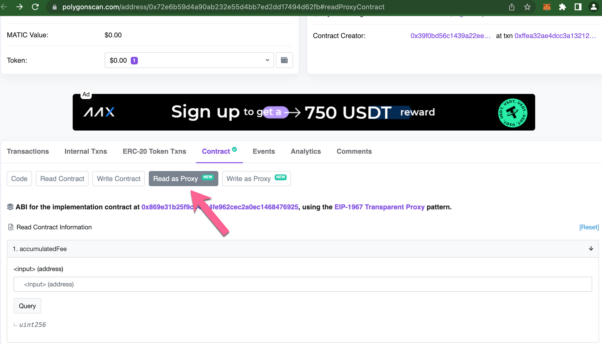
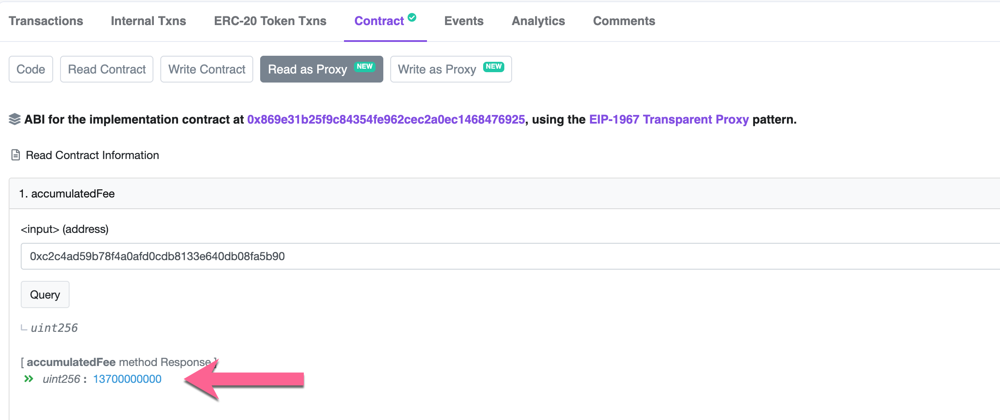

# Fees

A $0.10 stable fee is added to each transaction\* and paid with BOB tokens. You DO NOT need any native (MATIC) tokens to deposit, transfer, or withdraw from zkBob. All tx fees are $0.10 and paid using BOB.

Fees cover the cost of transactions in most situations (_see below_) and can result in a surplus depending on gas and token prices. BOB accumulates with the fee receiver and is periodically withdrawn, swapped for native tokens, and sent to the relayer to subsidize future transaction costs. Relayers do not keep any profits from extra fees - all collected fees are used to support the protocol.&#x20;

\*_In special cases, transactions may incur additional fees when many notes need to be processed at the same time._ [_Learn more_](multi-note-handling.md)_._

### Transaction costs

Exact tx fees are calculated as the cost of the calldata for an operation (deposit, transfer, withdrawal) multiplied by the gas price and the token price. Tx gas examples:

* [zkBob deposit](https://polygonscan.com/tx/0xe9755f83c01171446d305d6a1a6988258d1cddeeed6e9fcce5921357f57fd6fc) 783,638 gas
* [zkBob transfer](https://polygonscan.com/tx/0xb2d823f364906bc8e9a47782ee1950a51025d767ae1dbf1f248c281fe89d975b) 601,357 gas
* [zkBob withdrawal](https://polygonscan.com/tx/0xe6674484cbed0f033899cc78b72c023be8b588efbde4468b946a2c9120c11ef5) 620,679 gas

To calculate a baseline for any operation, we take the highest gas cost (deposit) + 15% buffer = 902,000 gas.

Max Fee baseline = `902,000 * gas price * token price`

Fees can vary significantly based on the gas price and token price at the time of a transaction. In this table, the top row shows example USD equivalent token prices ($0.35 to $1.05) and the left column shows varying gas costs ranging from 30 to 100 gwei. These are multiplied with 902,000 to calculate the cost for a max transaction.

|          | $0.35  | $0.80 | $1.05 |
| -------- | ------ | ----- | ----- |
| 30 gwei  | $0.009 | $0.02 | $0.03 |
| 75 gwei  | $0.02  | $0.05 | $0.07 |
| 100 gwei | $0.03  | $0.07 | $0.1  |

### Fee Collection

Fees are currently collected internally within the pool contract and the `accumulatedFee` method. They can be manually withdrawn by a separate operator account (a specified account called the fee recipient) rather than a primary relayer account. This maintains safety in the protocol as a primary relayer is responsible for sending transactions and should not have the ability to call the `withdrawFee` function.

Once enough BOB has accumulated, it can be withdrawn and swapped for native (MATIC) tokens. These are then sent to the primary relayer to cover gas fees for future operations. &#x20;

### View Accumulated Fees

Anyone can view current fees accumulated by the protocol. This does not represent all fees collected, but only those accumulated since the previous withdrawal.

1\) Go to the [pool proxy contract on Polyscan](https://polygonscan.com/address/0x72e6b59d4a90ab232e55d4bb7ed2dd17494d62fb#readProxyContract) and click the **Read as Proxy** tab.

<figure><figcaption></figcaption></figure>

2\) Query the `accumulatedFee` method using the Relayer (Operator) Address [0xc2c4ad59b78f4a0afd0cdb8133e640db08fa5b90](https://polygonscan.com/address/0xc2c4ad59b78f4a0afd0cdb8133e640db08fa5b90).

<figure><figcaption></figcaption></figure>

3\) Convert the result (in gwei) to USD using [Ethereum Unit Converter](https://eth-converter.com/). Since BOB is a stable token, the Ether amount will be USD equivalent (in the case below $13.70 BOB is currently accumulated in the contract).

<figure><figcaption></figcaption></figure>
