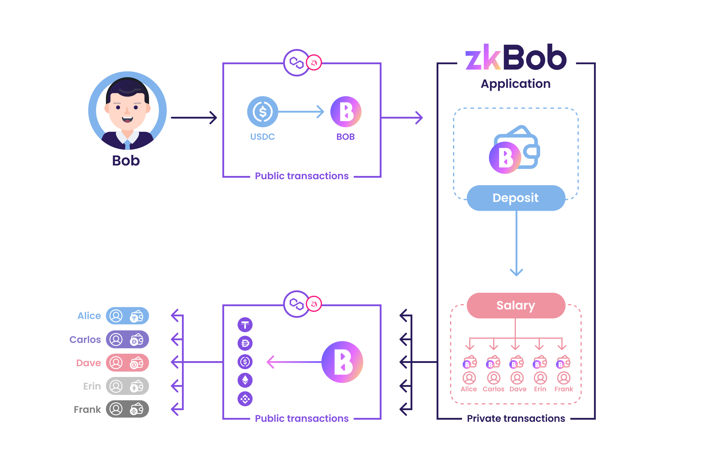

# Employee Salary

Businesses often prefer to keep salary information private. This creates issues for some businesses who want to use blockchain for payments but also want to keep salary information confidential. With zkBob, employers can keep information private and use the blockchain to send salaries.&#x20;

Several prominent projects in the ecosystem are already using zkBob for salary payments. These [Tier 1](../deposit-and-withdrawal-limits.md#tiered-limits) projects are able to deposit higher amounts of BOB into the protocol for sending salary to known employees of the business. Since employees are KYC'd by their employers, this KYC is automatically inherited into the protocol.

Multi-sender functionality and integrations with projects like [Request Finance](https://request.network/en/) make salary processing even easier as more users onboard to zkBob.

## Generic Use Case: Bob :man\_office\_worker: the Business Employer

<figure><figcaption>
Bob pays his employees through zkBob for stability and privacy purposes.
</figcaption></figure>

Bob has 5 employees (Alice, Carlos, Dave, Erin and Frank) he pays monthly with crypto. Bob’s preference is to keep salaries private while still processing them on-chain and using a stable asset for payment. zkBob makes it easy.

1. Bob and his employees each create their own zkBob zkAccounts, using either a seed phrase or web3 wallet private key.
2. Bob swaps his monthly amount of payment in USDC for BOB stable tokens on Uniswap v3 on Polygon.
3. Bob deposits the BOB he receives into the zkBob application.
4. Alice, Carlos, Dave, Erin and Frank each send Bob their zkAddress in a private DM on Slack.
5. Bob transfers BOB to each employee for their monthly salary.
6. Once received (or at a later time to improve anonymity) Alice, Carlos, Dave, Erin and Frank choose to withdraw any amount of BOB into a 0x wallet on Polygon. This can be a brand new address (which is also sent 0.1 MATIC for txs) or an established 0x address.
7. Alice, Carlos, Dave, Erin and Frank can convert their BOB to a coin/token of their choice, and use however they wish (ie send to an exchange, bank, pay with crypto etc). &#x20;
8. The history tab within each zkBob account makes it easy for employees to track and report their own transfers and withdrawals.
9. The process is repeated monthly, with employees DM’ing Bob a newly generated zkAddress at the beginning of each month.&#x20;

## Testimonials: What zkBob payroll users are saying

Employees and employers are anonymous, but here is some feedback we've received.

> “I like getting my salary through zkBob. I can withdraw what I need to Polygon and swap for USDC. Every month I withdraw enough to pay the bills then save the rest in zkBob for whenever I need it.”&#x20;
>
> \-zkEmployee&#x20;

> “I don’t want the whole world to know how much money I make. zkBob keeps my salary private.”&#x20;
>
> \-zkEmployee&#x20;

> “We want to pay our employees with a stablecoin while keeping salary information confidential. Using BOB with zkBob checks all the boxes for fast payments, ease-of-use, low fees and protection for our valued employees.”&#x20;
>
> \-zkEmployer
