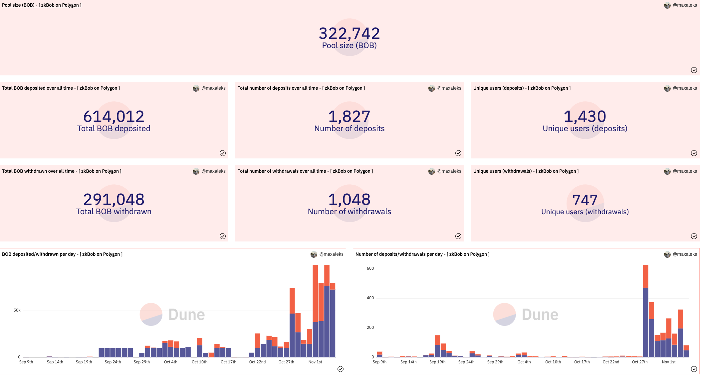

# zkBob Use Statistics

Up to date deposit and withdrawal statistics can be monitored via a Dune Analytics dashboard located at [https://dune.com/zkbob/zkbob](https://dune.com/zkbob/zkbob).  Stats provide a big picture view of zkBob usage but cannot, by nature of the zk mechanisms in place, contain any transfer information (senders, receivers, amounts transferred).&#x20;

Statistics are tracked on multiple chains and include:

* Current Pool Size
* Deposits: Total amount deposited, number of deposits, number of unique depositors
* Withdrawals: Total amount withdrawn, number of withdrawals, number of unique withdrawers
* Daily Usage (deposits and withdrawals)

<figure><figcaption>
Screenshot Nov 4, 2021 
</figcaption></figure>

&#x20;

