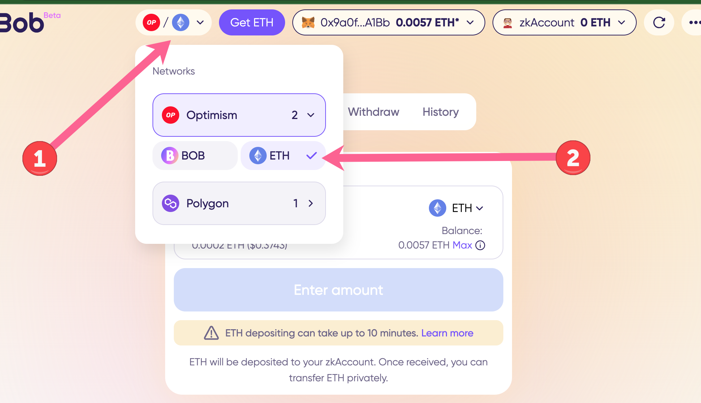
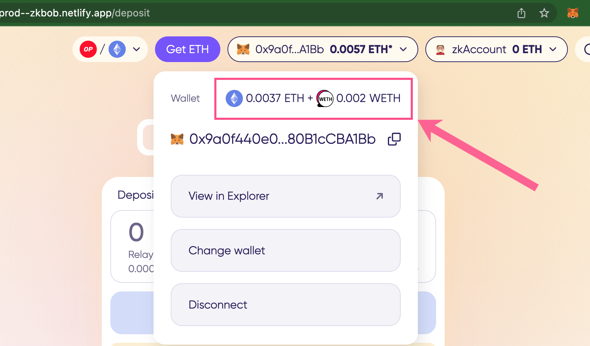
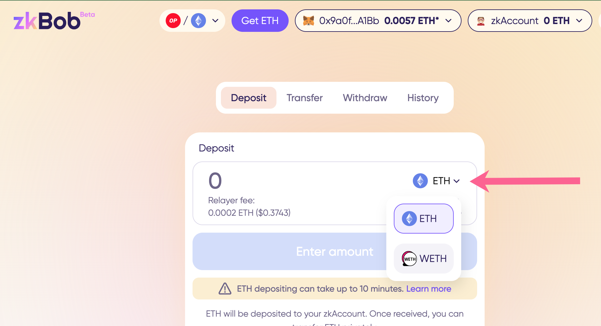

# ETH Pool on Optimism

To access, select Optimism in the Network dropdown and choose the ETH pool.

<figure><figcaption></figcaption></figure>

You can deposit ETH or WETH into the pool.&#x20;

* **ETH** deposits use the [direct deposit](../../zkbob-app/zkbob-direct-deposits.md) functionality, and can take longer to process. _See the_ [_FAQ below_](eth-pool-on-optimism.md#faq) _for more details._
* **WETH** deposits use the standard deposit functionality with proofs constructed locally on your machine.

Note your connected external `0x` account will show your total ETH + WETH balance.&#x20;

<figure><figcaption></figcaption></figure>

When depositing, select ETH or WETH from the token dropdown menu. The amount available to deposit will not be combined, you can only choose to deposit your available ETH or your available WETH with a single transaction.

<figure><figcaption></figcaption></figure>

Once deposited, WETH and ETH both become ETH in the zkAccount.

On withdrawal, select a wallet to receive the ETH from your zkAccount. All withdrawals are processed as ETH, not WETH.

<figure><figcaption></figcaption></figure>

## FAQ

Why can a regular ETH transaction take up to 10 minutes?

\=ETH deposits use the direct deposit functionality, where proofs are constructed remotely. Deposits can also be batched during this process.

This decreases the gas costs for the relayer and for your transactions, but can result in additional time for the transaction to process.&#x20;

What are the deposit and withdrawal limits for the ETH pool?

The default limits are 5 ETH deposited per day/per address with a total of 150 ETH total daily deposits from all addresses. All withdrawal from all users cannot exceed 150 ETH per day. \
\
You can increase your deposit limit to 10 ETH per day with [optional KYC through the Know your Cat protocol](../../zkbob-app/optional-kyc.md).

Can I use KYC to increase my limits?

You can double your deposit limits to 10 WETH/day by using the [Know your Cat protocol for KYC](../../zkbob-app/optional-kyc.md). ETH deposits are not yet available for KYC, but this will be implemented soon. _Note that KYC limit increases are not available in all jurisdictions._&#x20;

Why are fees different for WETH or ETH deposits?

A different mechanism (direct deposits) is used for depositing ETH. It involves sending the transaction to a relayer which creates the proof and the relayer may batch transactions depending on the number of transactions. This results in lower fees for ETH deposits but longer transaction times.

For WETH deposits the token is approved for use by the contract and proofs are constructed locally. Deposits are completed more quickly but may have higher gas costs depending on network usage and congestion.

